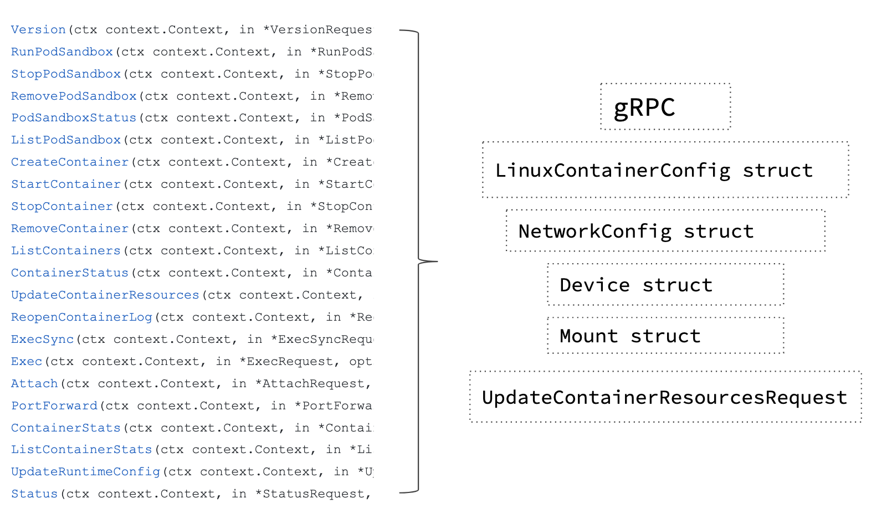
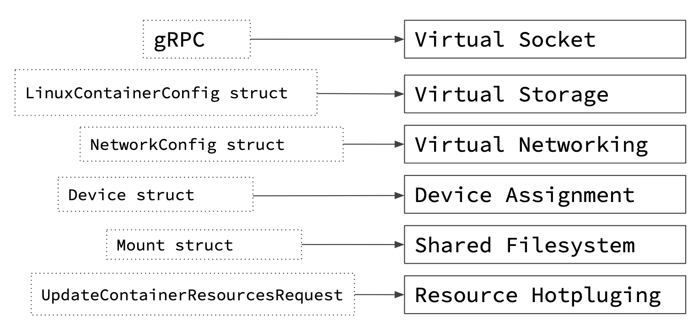

[toc]


# 简单逻辑

kata-containers是基于oci实现, 能通过cri被调用

containerd是runc的另一种实现, 称为runv

containerd调用runv

k8s调用containerd

# 历史架构组成及项目

Intel Clear Containers

​	使用kvmtool替代qemu-kvm, 大幅度降低耗时

runV

​	兼容OCI 的运行时程序


# 架构

https://github.com/kata-containers/kata-containers/tree/main/docs/design


https://github.com/kata-containers/kata-containers/blob/main/docs/design/architecture/README.md


使用轻量级虚拟机 (VM)构建安全的容器运行时，其感觉和性能类似于标准 Linux 容器，但使用硬件虚拟化技术作为第二层防御来提供更强大的工作负载隔离]

使用硬件虚拟化支持

类似runc

# Kata映射虚拟机为容器

Kata 容器是在传统命名空间容器提供的隔离之上创建的第二层隔离。硬件虚拟化接口是这个附加层的基础。Kata 将启动一个轻量级虚拟机，并使用来宾的 Linux 内核来创建容器工作负载，或者在多容器 Pod 的情况下创建工作负载。在 Kubernetes 和 Kata 实现中，沙箱是在 pod 级别进行的。在 Kata 中，这个沙箱是使用虚拟机创建的。

本文档介绍了 Kata Containers 如何将容器技术映射到虚拟机技术，以及如何在 Kata 支持的多个虚拟机管理程序和虚拟机监视器中实现这一点。

## 将容器概念映射到虚拟机技术

Kata 容器的典型部署将通过容器运行时接口 (CRI) 实现在 Kubernetes 中进行。在每个节点上，Kubelet 将与 CRI 实现者（例如 containerd 或 CRI-O）进行交互，而 CRI 实现者又将与 Kata Containers（基于 OCI 的运行时）进行交互。

CRI API，如[Kubernetes CRI-API 存储库](https://github.com/kubernetes/cri-api/)中所定义，意味着 CRI 实现支持一些构造，并最终在 Kata 容器中得到支持。为了通过 CRI 实现器支持完整的[API](https://github.com/kubernetes/cri-api/blob/a6f63f369f6d50e9d0886f2eda63d585fbd1ab6a/pkg/apis/runtime/v1alpha2/api.proto#L34-L110)，Kata 必须提供以下构造：

[](https://github.com/kata-containers/kata-containers/blob/main/docs/design/arch-images/api-to-construct.png)

然后可以将这些构造进一步映射到与虚拟机接口所需的设备：

[](https://github.com/kata-containers/kata-containers/blob/main/docs/design/arch-images/construct-to-vm-concept.png)

最终，这些概念映射到特定的半虚拟化设备或虚拟化技术。

[](https://github.com/kata-containers/kata-containers/blob/main/docs/design/arch-images/vm-concept-to-tech.png)

每个管理程序或 VMM 在处理这些问题的方式或是否处理方面各不相同。

## Kata Containers Hypervisor 和 VMM 支持

Kata Containers[支持多个虚拟机管理程序](https://github.com/kata-containers/kata-containers/blob/main/docs/hypervisors.md)。

下面提供了每个解决方案的详细信息和摘要。

### QEMU/KVM

带有 QEMU 的 Kata Containers 与 Kubernetes 完全兼容。

根据主机架构，Kata Containers 支持各种机器类型，例如`q35`x86 系统、`virt`ARM 系统和`pseries`IBM Power 系统。默认的 Kata Containers 机器类型是`q35`。[`Machine accelerators`](https://github.com/kata-containers/kata-containers/blob/main/docs/design/virtualization.md#machine-accelerators)可以通过编辑运行时文件来更改机器类型及其类型[`configuration`](https://github.com/kata-containers/kata-containers/blob/main/docs/design/architecture/README.md#configuration)。

使用的设备和功能：

- virtio VSOCK 或 virtio 串行
- virtio 块或 virtio SCSI
- [虚拟网](https://www.redhat.com/en/virtio-networking-series)
- virtio fs 或 virtio 9p（推荐：virtio fs）
- VFIO
- 热插拔
- 机器加速器

Kata 容器中使用机器加速器和热插拔来管理资源限制、缩短启动时间并减少内存占用。这些记录如下。

#### 机器加速器

机器加速器是特定于架构的，可用于提高性能并启用机器类型的特定功能。Kata Containers 使用以下机器加速器：

- NVDIMM：此机器加速器特定于 x86，仅受`q35`机器类型支持。 `nvdimm`用于向虚拟机提供根文件系统作为持久内存设备。

#### 热插拔设备

Kata Containers VM 以最少量的资源启动，从而缩短启动时间并减少内存占用。随着容器启动的进行，设备会热插拔到虚拟机。例如，当指定的 CPU 约束包含额外的 CPU 时，可以热添加它们。Kata Containers 支持热添加以下设备：

- Virtio块
- Virtio SCSI
- VFIO
- 中央处理器

### Firecracker/KVM

[Firecracker 构建于rust-VMM](https://github.com/rust-vmm)内的许多 Rust crate 之上，其设备模型非常有限，提供了更轻的占用空间和攻击面，专注于功能即服务之类的用例。因此，带有 Firecracker VMM 的 Kata Containers 支持 CRI API 的子集。Firecracker 不支持文件系统共享，因此仅支持基于块的存储驱动程序。Firecracker 不支持设备热插拔，也不支持 VFIO。因此，Kata Containers with Firecracker VMM 不支持启动后更新容器资源，也不支持设备直通。

使用的设备：

- virtio VSOCK
- 虚拟块
- 虚拟网

### Cloud Hypervisor/KVM

[Cloud Hypervisor](https://github.com/cloud-hypervisor/cloud-hypervisor)基于[rust-vmm](https://github.com/rust-vmm)，旨在为运行现代云工作负载提供更轻的占用空间和更小的攻击面。带有 Cloud Hypervisor 的 Kata Containers 提供了与 Kubernetes 几乎完全的兼容性，与 QEMU 配置相当。从 Kata Containers 1.12 和 2.0.0 版本开始，Cloud Hypervisor 配置支持 CPU 和内存调整大小、设备热插拔（磁盘和 VFIO）、通过 virtio-fs 共享文件系统、基于块的卷、从 VM 映像启动由 pmem 设备和每个 VMM 线程（例如所有 virtio 设备工作线程）的细粒度 seccomp 过滤器支持。请查看[此 GitHub 项目，](https://github.com/orgs/kata-containers/projects/21) 了解正在进行的集成工作的详细信息。

使用的设备和功能：

- virtio VSOCK 或 virtio 串行
- 虚拟块
- 虚拟网
- virtio FS
- virtio pmem
- VFIO
- 热插拔
- seccomp 过滤器
- [HTTP开放API](https://github.com/cloud-hypervisor/cloud-hypervisor/blob/main/vmm/src/api/openapi/cloud-hypervisor.yaml)

### 概括

| 解决方案   | 发布介绍 | 简要总结                                                     |
| ---------- | -------- | ------------------------------------------------------------ |
| 云管理程序 | 1.10     | 上游Cloud Hypervisor具有丰富的功能支持，例如热插拔、VFIO和FS共享 |
| 鞭炮       | 1.5      | 上游 Firecracker，基于 rust-VMM，无 VFIO，无 FS 共享，无内存/CPU 热插拔 |
| QEMU       | 1.0      | 上游 QEMU，支持热插拔和文件系统共享                          |

## 虚拟机管理程序列表

### 介绍

Kata Containers 支持多个虚拟机管理程序。本文档提供了可用虚拟机管理程序的高度概述，并就您可能希望进一步研究哪些虚拟机管理程序提供建议。

> **笔记：**
>
> 本文件不具有规定性或权威性：
>
> - 您可以决定哪些虚拟机管理程序最适合您的用例。
> - 有关更多详细信息，请参阅每个虚拟机管理程序的官方文档。

### 类型

[由于每个虚拟机管理程序提供不同的功能和选项，Kata Containers 为每个虚拟机管理程序](https://github.com/kata-containers/kata-containers/blob/main/src/runtime/README.md#configuration)提供单独的 配置文件 。配置文件包含注释，解释哪些选项可用、它们的默认值以及如何使用每个设置。

> **笔记：**
>
> 在虚拟机管理程序之间切换的最简单方法是创建指向适当的虚拟机管理程序特定配置文件的符号链接。

| 管理程序                                                     | 写于 | 架构               | 类型                                                         | 配置文件                        |
| ------------------------------------------------------------ | ---- | ------------------ | ------------------------------------------------------------ | ------------------------------- |
| [ACRN](https://projectacrn.org/)                             | C    | `x86_64`           | 类型 1（裸机）                                               | `configuration-acrn.toml`       |
| [云管理程序](https://github.com/cloud-hypervisor/cloud-hypervisor) | 锈   | `aarch64`,`x86_64` | 类型 2（[KVM](https://en.wikipedia.org/wiki/Kernel-based_Virtual_Machine)） | `configuration-clh.toml`        |
| [鞭炮](https://github.com/firecracker-microvm/firecracker)   | 锈   | `aarch64`,`x86_64` | 类型 2（[KVM](https://en.wikipedia.org/wiki/Kernel-based_Virtual_Machine)） | `configuration-fc.toml`         |
| [QEMU](http://www.qemu-project.org/)                         | C    | 全部               | 类型 2（[KVM](https://en.wikipedia.org/wiki/Kernel-based_Virtual_Machine)） | `configuration-qemu.toml`       |
| [`Dragonball`](https://github.com/kata-containers/kata-containers/blob/main/src/dragonball) | 锈   | `aarch64`,`x86_64` | 类型 2（[KVM](https://en.wikipedia.org/wiki/Kernel-based_Virtual_Machine)） | `configuration-dragonball.toml` |

### 确定当前配置的虚拟机管理程序

```
$ kata-runtime kata-env | awk -v RS= '/\[Hypervisor\]/' | grep Path
```


### 选择虚拟机管理程序

下表简要总结了虚拟机管理程序之间的一些差异：

| 管理程序                                                     | 概括                         | 特征 | 局限性             | 容器创建速度 | 内存密度 | 用例                             | 评论                           |
| ------------------------------------------------------------ | ---------------------------- | ---- | ------------------ | ------------ | -------- | -------------------------------- | ------------------------------ |
| [ACRN](https://projectacrn.org/)                             | 安全关键和实时工作负载       |      |                    | 出色的       | 出色的   | 嵌入式和物联网系统               | 对于高级用户                   |
| [云管理程序](https://github.com/cloud-hypervisor/cloud-hypervisor) | 低延迟、内存占用小、攻击面小 | 最小 |                    | 出色的       | 出色的   | 高性能现代云工作负载             |                                |
| [鞭炮](https://github.com/firecracker-microvm/firecracker)   | 非常纤细                     | 极少 | 不支持所有设备类型 | 出色的       | 出色的   | 无服务器/FaaS                    |                                |
| [QEMU](http://www.qemu-project.org/)                         | 很多功能                     | 很多 |                    | 好的         | 好的     | 对于大多数用户来说都是不错的选择 |                                |
| [`Dragonball`](https://github.com/kata-containers/kata-containers/blob/main/src/dragonball) | 内置VMM，CPU和内存开销低     | 最小 |                    | 出色的       | 出色的   | 针对大多数容器工作负载进行了优化 | `out-of-the-box`卡塔集装箱体验 |

有关更多详细信息，请参阅[Kata 容器中的虚拟化](https://github.com/kata-containers/kata-containers/blob/main/docs/design/virtualization.md)文档和每个虚拟机管理程序的官方文档。

# 运行时

Kata [Containers 运行时与](https://github.com/kata-containers/kata-containers/blob/main/src/runtime)[OCI](https://github.com/opencontainers) [运行时规范](https://github.com/opencontainers/runtime-spec)兼容 ，因此可以 通过[CRI-O](https://github.com/kubernetes-incubator/cri-o) 和[containerd实现与](https://github.com/containerd/containerd)[Kubernetes 容器运行时接口 (CRI)](https://github.com/kubernetes/community/blob/master/contributors/devel/sig-node/container-runtime-interface.md)无缝协作

Kata Containers 运行时（[`containerd-shim-kata-v2`](https://github.com/kata-containers/kata-containers/blob/main/src/runtime/cmd/containerd-shim-kata-v2)二进制文件）是一个[shimv2](https://github.com/kata-containers/kata-containers/blob/main/docs/design/architecture/README.md#shim-v2-architecture)兼容的运行时。

> **笔记：**
>
> Kata Containers 运行时有时称为 Kata *shim*。这两个术语都是正确的，因为它`containerd-shim-kata-v2` 是一个容器运行时，并且该运行时实现了 containerd shim v2 API。

运行时大量使用 package [`virtcontainers` ，](https://github.com/kata-containers/kata-containers/blob/main/src/runtime/virtcontainers)它提供了一个通用的、与运行时规范无关的、硬件虚拟化的容器库。

运行时负责启动[虚拟机](https://github.com/kata-containers/kata-containers/blob/main/docs/design/architecture/README.md#hypervisor)管理程序 及其 VM，并通过 VSOCK 套接字使用 [基于 ttRPC 的协议与](https://github.com/kata-containers/kata-containers/blob/main/docs/design/architecture/README.md#agent-communications-protocol)[代理](https://github.com/kata-containers/kata-containers/blob/main/docs/design/architecture/README.md#agent)进行通信，VSOCK 套接字在 VM 和主机之间提供通信链接。

该协议允许运行时向代理发送容器管理命令。该协议还用于在容器和容器管理器（例如 CRI-O 或 containerd）之间承载标准 I/O 流 ( `stdout`、`stderr`、 )。`stdin`


## Shim v2 架构

Kata Containers 运行时与 shim v2（“shimv2”）兼容。本节解释这意味着什么。

> **笔记：**
>
> 有关与 Kata 1.x 架构的比较，请参阅 [架构历史文档](https://github.com/kata-containers/kata-containers/blob/main/docs/design/architecture/history.md)。

containerd [运行时 shimv2 架构](https://github.com/containerd/containerd/tree/main/runtime/v2) 或*shim API*架构通过定义兼容运行时实现必须提供的一组 shimv2 API 解决了旧架构的问题。shimv2 架构不是为每个新容器多次调用运行时二进制文件，而是运行运行时二进制文件的单个实例（对于任意数量的容器）。这提高了性能并解决了状态处理问题。

shimv2 API 与 [OCI 运行时](https://github.com/opencontainers/runtime-spec) API 类似，将容器生命周期拆分为不同的动词。容器管理器不是多次调用运行时，而是创建一个套接字并将其传递给 shimv2 运行时。套接字是一个双向通信通道，它使用基于 gRPC 的协议，允许容器管理器向运行时发送 API 调用，运行时使用同一通道将结果返回给容器管理器。

shimv2 架构允许每个虚拟机运行多个容器，以支持需要在 pod 内运行多个容器的容器引擎。

通过新的架构，[Kubernetes](https://github.com/kata-containers/kata-containers/blob/main/docs/design/architecture/kubernetes.md)可以启动 Pod 和 OCI 兼容的容器，每个 Pod 使用一个 [运行时](https://github.com/kata-containers/kata-containers/blob/main/docs/design/architecture/README.md#runtime)shim，而不是`2N+1`shim。`kata-proxy`即使 VSOCK 不可用，也不需要独立的进程。

## 卡塔 1.x 架构

在旧的[Kata 1.x 架构](https://github.com/kata-containers/documentation/blob/master/design/architecture.md)中，Kata[运行时](https://github.com/kata-containers/kata-containers/blob/main/docs/design/architecture/README.md#runtime)是一个名为 的可执行文件`kata-runtime`。容器管理器在创建每个容器时多次调用此可执行文件。每次调用运行时时，都会提供不同的 OCI 命令行动词。这种架构很简单，但由于调用之间处理状态的问题，不太适合创建基于虚拟机的容器。此外，该架构还存在与不断生成运行时二进制文件的新实例以及 不提供 VSOCK 的系统的[Kata shim](https://github.com/kata-containers/shim)和 [Kata 代理进程相关的性能问题。](https://github.com/kata-containers/proxy)

### 架构比较

| 型版本 | Kata运行时进程调用                    | 卡塔垫片工艺      | Kata代理进程（如果没有VSOCK） |
| ------ | ------------------------------------- | ----------------- | ----------------------------- |
| 1.x    | 每个容器有多个                        | 每个容器 1 个连接 | 1                             |
| 2.x    | 每个虚拟机 1 个（托管任意数量的容器） | 0                 | 0                             |

> **笔记：**
>
> - 一台虚拟机可以托管一个或多个容器。
> - “Kata shim 进程”列指的是旧的 [Kata shim](https://github.com/kata-containers/shim)（`kata-shim`二进制）， *而不是*新的 shimv2 运行时实例（`containerd-shim-kata-v2`二进制）。

下图显示了原始架构如何随着 shimv2 的出现而得到简化。

[](https://github.com/kata-containers/kata-containers/blob/main/docs/design/arch-images/shimv2.svg)

## 支持Kubernetes 

[Kubernetes](https://github.com/kubernetes/kubernetes/)或 K8s 是一种流行的开源容器编排引擎。在 Kubernetes 中，一组共享网络、存储、挂载、PID 等资源的容器称为 [pod](https://kubernetes.io/docs/concepts/workloads/pods/)。

一个节点可以有多个 pod，但 Kubernetes 集群中的节点至少只需要运行容器运行时和容器代理（称为 [Kubelet](https://kubernetes.io/docs/concepts/overview/components/#kubelet)）。

Kata Containers 将 Kubelet Pod 表示为虚拟机。

Kubernetes 集群运行一个控制平面，其中调度程序（通常在专用控制平面节点上运行）调用计算 Kubelet。该 Kubelet 实例负责管理节点内 pod 的生命周期，并最终依赖容器运行时来处理执行。Kubelet 架构通过基于专用 gRPC 的容器运行时 [接口 (CRI)](https://github.com/kubernetes/design-proposals-archive/blob/main/node/container-runtime-interface-v1.md)将生命周期管理与容器执行解耦。

换句话说，Kubelet 是一个 CRI 客户端，并期望 CRI 实现来处理接口的服务器端。 [CRI-O](https://github.com/kubernetes-incubator/cri-o)和 [containerd](https://github.com/containerd/containerd/)是依赖 [OCI](https://github.com/opencontainers/runtime-spec)兼容运行时来管理容器实例的 CRI 实现。

Kata Containers 是官方支持的 CRI-O 和 containerd 运行时。有关如何使用 Kubernetes 设置 Kata 容器，请参阅以下指南：

- [如何使用Kata Containers和containerd](https://github.com/kata-containers/kata-containers/blob/main/docs/how-to/containerd-kata.md)
- [使用 Kubernetes 运行 Kata 容器](https://github.com/kata-containers/kata-containers/blob/main/docs/how-to/run-kata-with-k8s.md)


# 运行时容器系统及镜像及系统资源限制

## 基础原理组成

### 根文件系统

本文档使用术语*rootfs*来指代作为顶级目录 (" `/`") 挂载的根文件系统，通常称为*斜杠*。

理解这个术语很重要，因为整个系统使用多个不同的 rootfs（如 [环境](https://github.com/kata-containers/kata-containers/blob/main/docs/design/architecture/README.md#environments)部分中所述）。

### 容器镜像

在[示例命令](https://github.com/kata-containers/kata-containers/blob/main/docs/design/architecture/example-command.md)中，用户通过容器映像名称指定了他们希望运行的容器类型： `ubuntu`。该镜像名称对应一个*容器镜像*，可用于创建具有 Ubuntu Linux 环境的容器。因此，在我们的[示例](https://github.com/kata-containers/kata-containers/blob/main/docs/design/architecture/example-command.md)中，该`sh(1)`命令将在具有 Ubuntu rootfs 的容器内运行。

> **笔记：**
>
> 术语*“容器映像”*很令人困惑，因为所讨论的映像不是**容器**：它只是一组可用于*创建*容器的文件（*映像）。*术语*“容器模板”*会更准确，但术语*“容器映像”*很常用，因此本文档使用标准术语。

就本文档而言， [示例命令行](https://github.com/kata-containers/kata-containers/blob/main/docs/design/architecture/example-command.md)中最重要的部分是用户请求的容器映像。通常，容器管理器将从远程站点*拉取* （下载）容器映像并在本地存储副本。容器管理器使用此本地容器映像来创建[OCI 捆绑包](https://github.com/kata-containers/kata-containers/blob/main/docs/design/architecture/background.md#oci-bundle)，该捆绑包将形成容器运行的环境。创建 OCI 捆绑包后，容器管理器启动一个[运行时](https://github.com/kata-containers/kata-containers/blob/main/docs/design/architecture/README.md#runtime)，该运行时将使用提供的 OCI 捆绑包创建容器。

### OCI 捆绑包

为了理解接下来的内容，重要的是要从高层次上了解 OCI（[开放容器倡议](https://opencontainers.org/)）兼容容器是如何创建的。

OCI 兼容容器是通过获取 [容器映像](https://github.com/kata-containers/kata-containers/blob/main/docs/design/architecture/background.md#container-image)并将嵌入式 rootfs 转换为 [OCI rootfs 包](https://github.com/opencontainers/runtime-spec/blob/main/bundle.md)（或更简单地说，*OCI 包）*来创建的。

OCI 捆绑包是`tar(1)`通常由容器管理器创建的存档，它被传递到 OCI[运行时](https://github.com/kata-containers/kata-containers/blob/main/docs/design/architecture/README.md#runtime)，OCI 运行时将其转换为完整的容器 rootfs。该捆绑包包含两个资产：

- 容器镜像[rootfs](https://github.com/kata-containers/kata-containers/blob/main/docs/design/architecture/background.md#root-filesystem)

  这只是一个文件目录，用于表示容器的 rootfs。

  对于[示例命令](https://github.com/kata-containers/kata-containers/blob/main/docs/design/architecture/example-command.md)，该目录将包含创建最小 Ubuntu 根文件系统所需的文件。

- [OCI 配置](https://github.com/opencontainers/runtime-spec/blob/main/config.md)文件

  这是一个名为 的 JSON 文件`config.json`。

  容器管理器将创建此文件，以便：

  - 该`root.path`值设置为指定容器rootfs的完整路径。

    在[示例](https://github.com/kata-containers/kata-containers/blob/main/docs/design/architecture/example-command.md)中，该值将为`ubuntu`。

  - 该`process.args`数组指定用户希望运行的命令列表。这称为[工作负载](https://github.com/kata-containers/kata-containers/blob/main/docs/design/architecture/README.md#workload)。

    在[示例](https://github.com/kata-containers/kata-containers/blob/main/docs/design/architecture/example-command.md)中，工作负载为`sh(1)`。


## 具体存储

### 限制

Kata Containers与现有标准和运行时[兼容](https://github.com/kata-containers/kata-containers/blob/main/docs/design/architecture/README.md#compatibility)。[从存储的角度来看，这意味着容器工作负载](https://github.com/kata-containers/kata-containers/blob/main/docs/design/architecture/README.md#workload)可以使用的存储量没有限制 。

由于 cgroup 无法设置存储分配限制，因此如果您希望限制容器使用的存储量，请考虑使用现有设施，例如`quota(1)`限制或 [设备映射器](https://github.com/kata-containers/kata-containers/blob/main/docs/design/architecture/storage.md#devicemapper)限制。

### 虚拟SCSI

[如果配置](https://github.com/kata-containers/kata-containers/blob/main/docs/design/architecture/README.md#configuration)了基于块的图形驱动程序， `virtio-scsi`则用于将工作负载映像（例如 ）*共享*`busybox:latest`到虚拟机内的容器环境中。

### 虚拟文件系统

*如果未* [配置](https://github.com/kata-containers/kata-containers/blob/main/docs/design/architecture/README.md#configuration)基于块的图形驱动程序， 则使用[`virtio-fs`](https://virtio-fs.gitlab.io/)( ) 覆盖文件系统安装点来*共享*工作负载映像。代理 使用此安装点作为容器进程的根文件系统[。](https://github.com/kata-containers/kata-containers/blob/main/docs/design/architecture/README.md#agent)`VIRTIO`

对于 virtio-fs，[运行时](https://github.com/kata-containers/kata-containers/blob/main/docs/design/architecture/README.md#runtime)为创建的每个虚拟机启动一个`virtiofsd`守护进程（在主机上下文中运行）。

### 设备映射器

devicemapper 是[一个`snapshotter`](https://github.com/containerd/containerd/tree/main/snapshots/devmapper) 特例。它`snapshotter`使用专用块设备而不是格式化文件系统，并在块级别而不是文件级别进行操作。这些知识用于直接使用底层块设备而不是覆盖文件系统作为容器根文件系统。块设备映射到覆盖层的顶部读写层。`virtio-fs`与使用共享容器文件系统相比，这种方法提供了更好的 I/O 性能。

#### 热插拔

Kata Containers 能够热插拔添加和热插拔删除块设备。这使得在虚拟机启动后启动的容器可以使用块设备。

用户可以通过容器内调用来检查容器是否使用`devicemapper`块设备作为其rootfs 。`mount(8)`如果`devicemapper`使用块设备，根文件系统 ( `/`) 将从 挂载`/dev/vda`。[用户可以通过运行](https://github.com/kata-containers/kata-containers/blob/main/docs/design/architecture/README.md#configuration)时配置禁用底层块设备的直接挂载 。

## 系统总览

以下术语用于描述各种进程运行的不同环境（或上下文）。有必要仔细研究此表以理解以下内容：

| 类型             | 姓名       | 虚拟化  | 集装箱化 | 根文件系统                                                   | Rootfs 设备类型           | 安装类型                                                     | 描述                                                         |
| ---------------- | ---------- | ------- | -------- | ------------------------------------------------------------ | ------------------------- | ------------------------------------------------------------ | ------------------------------------------------------------ |
| 主机             | 主机       | 不`[1]` | 不       | 主机特定                                                     | 主机特定                  | 主机特定                                                     | 由标准的物理非虚拟化系统提供的环境。                         |
| 虚拟机根目录     | 访客虚拟机 | 是的    | 不       | [访客映像](https://github.com/kata-containers/kata-containers/blob/main/docs/design/architecture/guest-assets.md#guest-image)内的 rootfs | 特定于虚拟机管理程序`[2]` | `ext4`                                                       | 在主机系统上创建的第一级（或顶级）VM 环境。                  |
| 虚拟机容器根目录 | 容器       | 是的    | 是的     | 用户请求的 rootfs 类型（[`ubuntu`在示例中](https://github.com/kata-containers/kata-containers/blob/main/docs/design/architecture/example-command.md)） | `kataShared`              | [虚拟文件系统](https://github.com/kata-containers/kata-containers/blob/main/docs/design/architecture/storage.md#virtio-fs) | 在虚拟机内创建的第一级（或顶级）容器环境。基于[OCI 捆绑包](https://github.com/kata-containers/kata-containers/blob/main/docs/design/architecture/background.md#oci-bundle)。 |

**钥匙：**

- `[1]`：为了简单起见，本文档假设主机环境在物理硬件上运行。
- `[2]`：请参阅[DAX](https://github.com/kata-containers/kata-containers/blob/main/docs/design/architecture/README.md#dax)部分。

> **笔记：**
>
> - “root”一词在这里用于表示*顶层，其方式与术语*[rootfs](https://github.com/kata-containers/kata-containers/blob/main/docs/design/architecture/background.md#root-filesystem)类似。
> - 上面使用的术语“第一级”前缀很重要，因为它意味着可以创建多级系统。但是，它们不构成标准 Kata Containers 环境的一部分，因此本文档中不会考虑它们。

[将工作负载](https://github.com/kata-containers/kata-containers/blob/main/docs/design/architecture/README.md#workload)容器化在虚拟机内的原因是：

- 将工作负载与虚拟机环境完全隔离。
- [在pod](https://github.com/kata-containers/kata-containers/blob/main/docs/design/architecture/kubernetes.md)中的容器之间提供更好的隔离。
- 允许通过其 cgroup 限制来管理和监控工作负载。

### 容器创建过程

以下步骤概括地展示了如何使用 containerd 容器管理器创建 Kata Containers 容器：

1. [用户通过运行类似示例命令的](https://github.com/kata-containers/kata-containers/blob/main/docs/design/architecture/example-command.md)命令来请求创建容器。

2. [容器管理器守护进程](https://github.com/kata-containers/kata-containers/blob/main/docs/design/architecture/README.md#runtime)运行 Kata 运行时的单个实例 。

3. Kata 运行时加载其[配置文件](https://github.com/kata-containers/kata-containers/blob/main/docs/design/architecture/README.md#configuration)。

4. 容器管理器在运行时调用一组 shimv2 API 函数。

5. Kata 运行时启动配置的[虚拟机管理](https://github.com/kata-containers/kata-containers/blob/main/docs/design/architecture/README.md#hypervisor)程序。

6. [虚拟机管理程序使用来宾资产](https://github.com/kata-containers/kata-containers/blob/main/docs/design/architecture/guest-assets.md#guest-assets)创建并启动（*引导*）VM ：

   - Hypervisor [DAX将](https://github.com/kata-containers/kata-containers/blob/main/docs/design/architecture/README.md#dax)[guest 映像](https://github.com/kata-containers/kata-containers/blob/main/docs/design/architecture/guest-assets.md#guest-image)共享 到 VM 中，成为 VM [rootfs](https://github.com/kata-containers/kata-containers/blob/main/docs/design/architecture/background.md#root-filesystem)（安装在`/dev/pmem*`设备上），这称为[VM root 环境](https://github.com/kata-containers/kata-containers/blob/main/docs/design/architecture/README.md#environments)。

   - 虚拟机管理程序使用[virtio FS将](https://github.com/kata-containers/kata-containers/blob/main/docs/design/architecture/storage.md#virtio-fs)[OCI 包](https://github.com/kata-containers/kata-containers/blob/main/docs/design/architecture/background.md#oci-bundle)安装到 VM rootfs 内的容器特定目录中。

     这个容器特定的目录将成为 [容器rootfs](https://github.com/kata-containers/kata-containers/blob/main/docs/design/architecture/README.md#environments)，称为 [容器环境](https://github.com/kata-containers/kata-containers/blob/main/docs/design/architecture/README.md#environments)。

7. 该[代理](https://github.com/kata-containers/kata-containers/blob/main/docs/design/architecture/README.md#agent)作为 VM 启动的一部分启动。

8. 运行时调用代理的`CreateSandbox`API 来请求代理创建容器：

   1. 代理 在包含[容器 rootfs 的容器特定目录中创建](https://github.com/kata-containers/kata-containers/blob/main/docs/design/architecture/README.md#environments)[容器环境](https://github.com/kata-containers/kata-containers/blob/main/docs/design/architecture/README.md#environments)。

      容器环境将[工作](https://github.com/kata-containers/kata-containers/blob/main/docs/design/architecture/README.md#workload)负载托管在 [容器 rootfs](https://github.com/kata-containers/kata-containers/blob/main/docs/design/architecture/README.md#environments)目录中。

   2. 代理在容器环境内生成工作负载。

   > **笔记：**
   >
   > - Agent创建的容器环境相当于 [`runc`](https://github.com/opencontainers/runc)OCI运行时创建的容器环境；[Linux cgroup 和命名空间由来宾内核](https://github.com/kata-containers/kata-containers/blob/main/docs/design/architecture/guest-assets.md#guest-kernel)在 VM 内创建 ，以将工作负载与创建容器的 VM 环境隔离开来。请参阅[环境](https://github.com/kata-containers/kata-containers/blob/main/docs/design/architecture/README.md#environments)部分以了解这样做的原因。
   > - 有关代理启动方式的详细信息，请参阅[访客映像部分。](https://github.com/kata-containers/kata-containers/blob/main/docs/design/architecture/guest-assets.md#guest-image)

9. 容器管理器将容器的控制权返回给运行`ctr`命令的用户。

> **笔记：**
>
> 此时，容器正在运行并且：
>
> - [工作负载](https://github.com/kata-containers/kata-containers/blob/main/docs/design/architecture/README.md#workload)进程（[`sh(1)`在示例中）在](https://github.com/kata-containers/kata-containers/blob/main/docs/design/architecture/example-command.md)[容器环境](https://github.com/kata-containers/kata-containers/blob/main/docs/design/architecture/README.md#environments)中运行。
> - 用户现在可以与工作负载交互（使用[`ctr`示例中的命令](https://github.com/kata-containers/kata-containers/blob/main/docs/design/architecture/example-command.md)）。
> - 在虚拟机内运行的 [代理](https://github.com/kata-containers/kata-containers/blob/main/docs/design/architecture/README.md#agent)正在监视[工作负载](https://github.com/kata-containers/kata-containers/blob/main/docs/design/architecture/README.md#workload)进程。
> - 运行[时](https://github.com/kata-containers/kata-containers/blob/main/docs/design/architecture/README.md#runtime)正在等待代理的`WaitProcess`API 调用完成。


## Agent 的 Systemd Cgroup

众所周知，我们可以通过两种方式与 cgroup 进行交互：**`cgroupfs`**和**`systemd`**。前者是通过读写cgroup`tmpfs`文件来实现的`/sys/fs/cgroup`，后者是通过请求systemd配置一个瞬态单元来完成的。Kata代理**`cgroupfs`**默认使用，除非你传递参数`--systemd-cgroup`。

### 用法

对于systemd，kata代理根据( )`linux.cgroupsPath`提供的以下格式标准配置cgroup 。如果您不提供有效的，kata 代理会将其视为.`runc``[slice]:[prefix]:[name]``linux.cgroupsPath``"system.slice:kata_agent:<container-id>"`

> 这里的 slice 是一个 systemd 切片，容器放置在该切片下面。如果为空，则默认为 system.slice，除非使用 cgroup v2 并创建无根容器，在这种情况下它默认为 user.slice。
>
> 请注意，切片可以包含破折号来表示子切片（例如 user-1000.slice 是正确的表示法，表示`subslice`user.slice 的 a），但它不能包含斜杠（例如 user.slice/user-1000.slice 是无效的）。
>
> 的切片`-`代表根切片。
>
> 接下来，前缀和名称用于组成单位名称，即`<prefix>-<name>.scope`，除非名称有`.slice`后缀，在这种情况下前缀将被忽略并按原样使用名称。

### 支持的属性

`linux.resources`kata代理会将of中的参数翻译`config.json`成systemd单元属性，并将其发送到systemd进行配置。`linux.resources`由于 systemd 支持有限的属性，因此仅应用以下参数。顺便说一下，我们将简单地将混合模式视为传统模式。

- 中央处理器

  - v1

  | 运行时规范资源 | 系统属性名称 |
  | -------------- | ------------ |
  | `cpu.shares`   | `CPUShares`  |

  - v2

  | 运行时规范资源           | 系统属性名称                 |
  | ------------------------ | ---------------------------- |
  | `cpu.shares`             | `CPUShares`                  |
  | `cpu.period`             | `CPUQuotaPeriodUSec`（v242） |
  | `cpu.period`&`cpu.quota` | `CPUQuotaPerSecUSec`         |

- 记忆

  - v1

  | 运行时规范资源 | 系统属性名称  |
  | -------------- | ------------- |
  | `memory.limit` | `MemoryLimit` |

  - v2

  | 运行时规范资源               | 系统属性名称    |
  | ---------------------------- | --------------- |
  | `memory.low`                 | `MemoryLow`     |
  | `memory.max`                 | `MemoryMax`     |
  | `memory.swap`&`memory.limit` | `MemorySwapMax` |

- PID系统

  | 运行时规范资源 | 系统属性名称 |
  | -------------- | ------------ |
  | `pids.limit `  | `TasksMax`   |

- 中央处理器组

  | 运行时规范资源 | 系统属性名称                 |
  | -------------- | ---------------------------- |
  | `cpuset.cpus`  | `AllowedCPUs`（v244）        |
  | `cpuset.mems`  | `AllowedMemoryNodes`（v244） |

### 系统接口

`session.rs`和`system.rs`in`src/agent/rustjail/src/cgroups/systemd/interface`是由 自动生成的`zbus-xmlgen`，它是 提供的一个附带工具，用于`zbus`从 生成 Rust 代码`D-Bus XML interface descriptions`。生成这两个文件的具体命令如下：

```
// system.rs
zbus-xmlgen --system org.freedesktop.systemd1 /org/freedesktop/systemd1
// session.rs
zbus-xmlgen --session org.freedesktop.systemd1 /org/freedesktop/systemd1
```


`cgroups/systemd`目前使用`system.rs`while的实现`session.rs`将来可用于构建无根容器。

### 参考

- [runc - systemd cgroup 驱动程序](https://github.com/opencontainers/runc/blob/main/docs/systemd.md)
- [systemd.resource-control — 资源控制单元设置](https://www.freedesktop.org/software/systemd/man/systemd.resource-control.html)

# 运行网络

容器通常位于它们自己的（可能是共享的）网络命名空间中。在容器生命周期的某个时刻，容器引擎将设置该命名空间以将容器添加到与主机网络隔离的网络中。

为了为容器设置网络，容器引擎调用网络插件。网络插件通常会创建一个虚拟以太网 ( `veth`) 对，将该对的一端添加`veth`到容器网络命名空间中，而该对的另一端`veth`添加到主机网络命名空间中。

这是一种非常以名称空间为中心的方法，因为许多虚拟机管理程序或 VM 管理器 (VMM) 等`virt-manager`无法处理`veth` 接口。通常，[`TAP`](https://www.kernel.org/doc/Documentation/networking/tuntap.txt) 接口是为虚拟机连接而创建的。

为了克服典型容器引擎期望与虚拟机之间的不兼容性，Kata Containers 网络透明地将`veth` 接口与`TAP`使用[流量控制](https://man7.org/linux/man-pages/man8/tc.8.html)的接口连接起来：

[](https://github.com/kata-containers/kata-containers/blob/main/docs/design/arch-images/network.png)

部署 TC 过滤规则后，容器网络和虚拟机之间就会创建重定向。例如，网络插件可以将设备 放置 `eth0`在容器的网络命名空间中，该命名空间是 VETH 设备的一端。Kata Containers 将为 VM 创建一个 Tap 设备`tap0_kata`，并设置一个 TC 重定向过滤器以将流量从`eth0`的入口重定向到`tap0_kata`的出口，并设置第二个 TC 过滤器以将流量从`tap0_kata`的入口重定向到`eth0`的出口。

Kata Containers 维护对 MACVTAP 的支持，这是 Kata 中使用的早期实现。通过这种方法，Kata 创建了一个 MACVTAP 设备来直接连接该`eth0`设备。TC-filter 是默认设置，因为它允许更简单的配置、更好的 CNI 插件兼容性以及与 MACVTAP 相当的性能。

由于相对于 TC-filter 和 MACVTAP 缺乏性能，Kata Containers 已弃用对 Bridge 的支持。

Kata Containers 支持 [CNM](https://github.com/moby/libnetwork/blob/master/docs/design.md#the-container-network-model) 和[CNI](https://github.com/containernetworking/cni)进行网络管理。

## 网络热插拔

Kata Containers 开发了一组网络子命令和 API，用于添加、列出和删除访客网络端点以及操作访客路由表。

下图说明了 Kata Containers 网络热插拔工作流程。

[](https://github.com/kata-containers/kata-containers/blob/main/docs/design/arch-images/kata-containers-network-hotplug.png)


# 卡塔3.0架构

## 概述

在云原生场景中，对容器启动速度、资源消耗、稳定性和安全性的需求不断增加，这些都是当前 Kata Containers 运行时相对于其他运行时面临的挑战。为了实现这一目标，我们提出了一个可靠的、经过现场测试且安全的 Rust 版本的 kata 运行时。

此外，我们还提供以下设计：

- `Dragonball`带有内置沙盒的交钥匙解决方案
- 异步 I/O 以减少资源消耗
- 适用于多种服务、运行时和虚拟机管理程序的可扩展框架
- 沙箱和容器相关资源的生命周期管理

### 选择 Rust 的理由

我们选择 Rust 是因为它被设计为一种注重效率的系统语言。与 Go 相比，Rust 进行了各种设计权衡，以获得良好的执行性能，并采用创新技术，与 C 或 C++ 相比，为常见内存错误（缓冲区溢出、无效指针、范围错误）提供合理的保护）、错误检查（确保错误得到处理）、线程安全、资源所有权等等。

当用 Rust 重写 Kata Containers 访客代理时，这些好处在我们的项目中得到了验证。我们明显看到基于 Rust 的实现显着减少了内存使用量。

## 设计

### 建筑学

[](https://github.com/kata-containers/kata-containers/blob/main/docs/design/architecture_3.0/images/architecture.png)

### 内置虚拟机管理器

#### 当前 Kata 2.x 架构

[](https://github.com/kata-containers/kata-containers/blob/main/docs/design/architecture_3.0/images/not_built_in_vmm.png) 如图所示，runtime和VMM是独立的进程。运行时进程分叉VMM进程并通过进程间RPC进行交互。通常，进程交互比进程内的同级进程消耗更多的资源，并且会导致相对较低的效率。同时还要考虑资源运维成本。例如，在异常情况下执行资源回收时，任何进程的异常都必须被其他进程检测到并激活相应的资源回收进程。如果有额外的进程，恢复就变得更加困难。

#### 如何支持内置VMM

我们提供`Dragonball`Sandbox，通过将VMM的功能集成到Rust库中来启用内置VMM。我们可以使用该库来执行VMM相关的功能。由于运行时和 VMM 位于同一进程中，因此在消息处理速度和 API 同步方面有好处。它还可以保证运行时和VMM生命周期的一致性，减少资源回收和异常处理维护，如图： [](https://github.com/kata-containers/kata-containers/blob/main/docs/design/architecture_3.0/images/built_in_vmm.png)

### 异步支持

#### 为什么需要异步

**Async 已经在稳定的 Rust 中，允许我们编写异步代码**

- 异步显着降低了 CPU 和内存开销，特别是对于具有大量 IO 密集型任务的工作负载
- Rust 中的异步是零成本的，这意味着您只需为使用的内容付费。具体来说，可以使用async，无需堆分配和动态调度，这大大提高了效率
- 有关更多信息（请参阅[为什么异步？](https://rust-lang.github.io/async-book/01_getting_started/02_why_async.html)和[异步 Rust 的状态](https://rust-lang.github.io/async-book/01_getting_started/03_state_of_async_rust.html)）。

**如果使用 Sync Rust 实现 kata-runtime 可能会出现几个问题**

- 新 TTRPC 连接的线程过多
  - TTRPC 线程：收割者线程(1) + 侦听器线程(1) + 客户端处理程序(2)
- 使用新容器添加 3 个 I/O 线程
- 在同步模式下，实现超时机制具有挑战性。例如TTRPC API交互中，超时机制很难与Golang一致

#### 如何支持异步

kata-runtime 由 TOKIO_RUNTIME_WORKER_THREADS 控制运行 OS 线程，默认为 2 个线程。对于TTRPC和容器相关的线程`tokio`统一运行在线程中，相关依赖需要切换为Async，如Timer、File、Netlink等。借助Async，我们可以轻松支持no-block I /O 和计时器。目前，我们仅将异步用于 kata 运行时。内置的VMM保留了OS线程，因为它可以保证线程可控。

**对于N个tokio工作线程和M个容器**

- 同步运行时（OS线程和`tokio`任务都是OS线程但没有`tokio`工作线程）OS线程数：4 + 12*M
- 异步运行时（只有操作系统线程是操作系统线程）操作系统线程数：2 + N

```
├─ main(OS thread)
├─ async-logger(OS thread)
└─ tokio worker(N * OS thread)
  ├─ agent log forwarder(1 * tokio task)
  ├─ health check thread(1 * tokio task)
  ├─ TTRPC reaper thread(M * tokio task)
  ├─ TTRPC listener thread(M * tokio task)
  ├─ TTRPC client handler thread(7 * M * tokio task)
  ├─ container stdin io thread(M * tokio task)
  ├─ container stdout io thread(M * tokio task)
  └─ container stderr io thread(M * tokio task)
```


### 可扩展的框架

Kata 3.x运行时通过服务、运行时、虚拟机管理程序的扩展进行设计，并结合配置来满足不同场景的需求。目前服务提供了注册机制，支持多种服务。服务可以通过消息与运行时交互。此外，运行时处理程序还处理来自服务的消息。为了满足支持多个运行时和虚拟机管理程序的二进制文件的需求，启动必须通过配置获取运行时处理程序类型和虚拟机管理程序类型。

[](https://github.com/kata-containers/kata-containers/blob/main/docs/design/architecture_3.0/images/framework.png)

### 资源管理器

在我们的例子中，将会有多种资源，并且每种资源都有多个子类型。特别是对于`Virt-Container`，资源的每个子类型都有不同的操作。并且可能存在依赖关系，例如share-fs rootfs和share-fs卷将使用share-fs资源将文件共享到VM。目前，network和share-fs被视为沙箱资源，而rootfs、volume和cgroup被视为容器资源。此外，我们为每个资源抽象了一个公共接口，并使用子类操作来评估不同子类型之间的差异。 [](https://github.com/kata-containers/kata-containers/blob/main/docs/design/architecture_3.0/images/resourceManager.png)