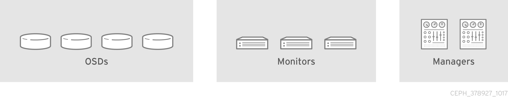
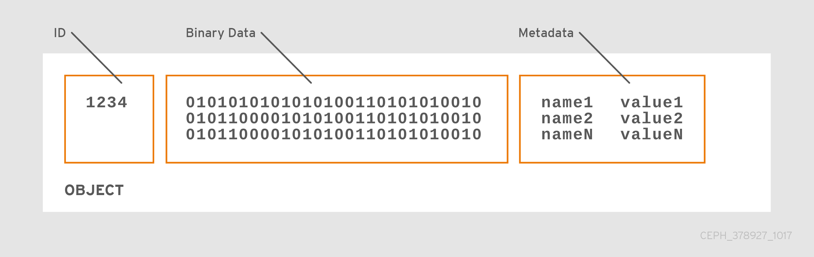
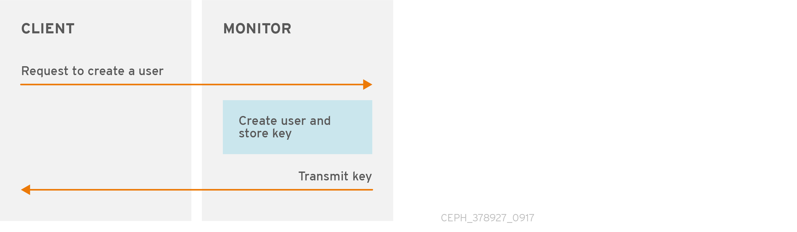
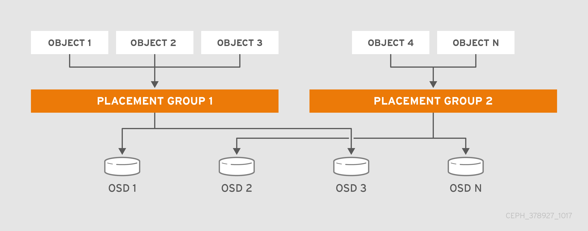
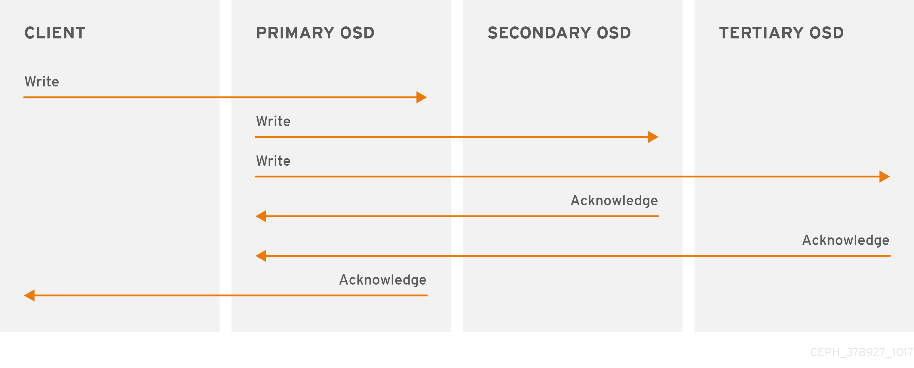
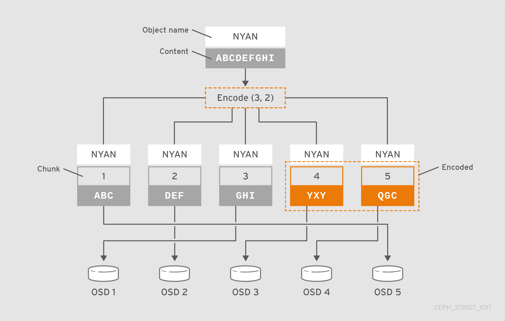
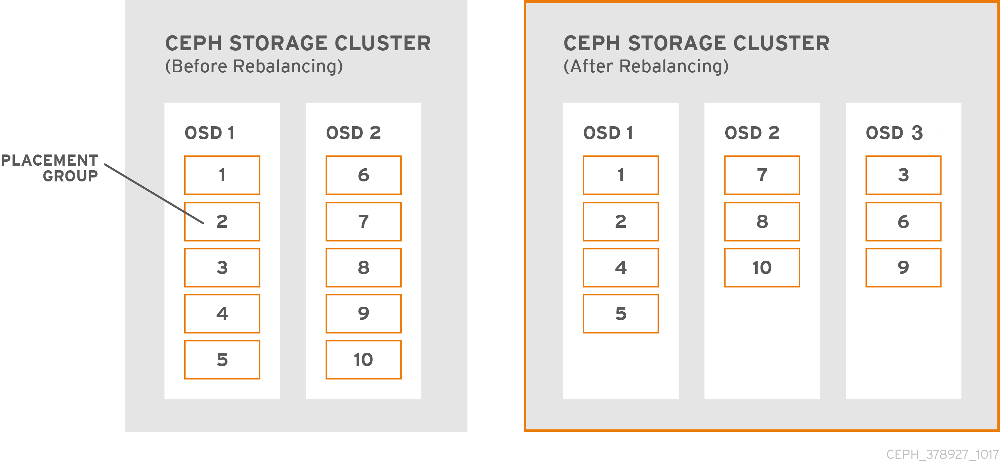
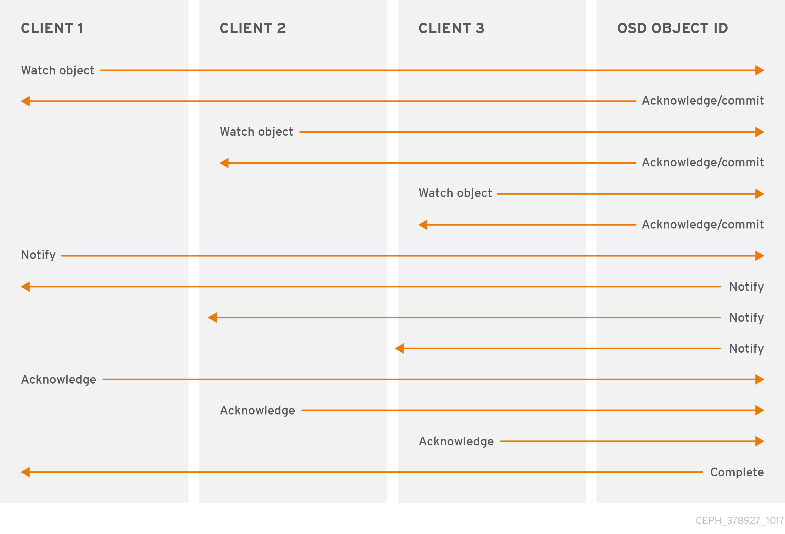
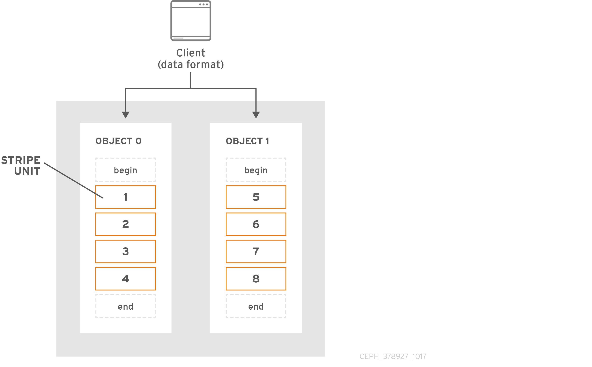
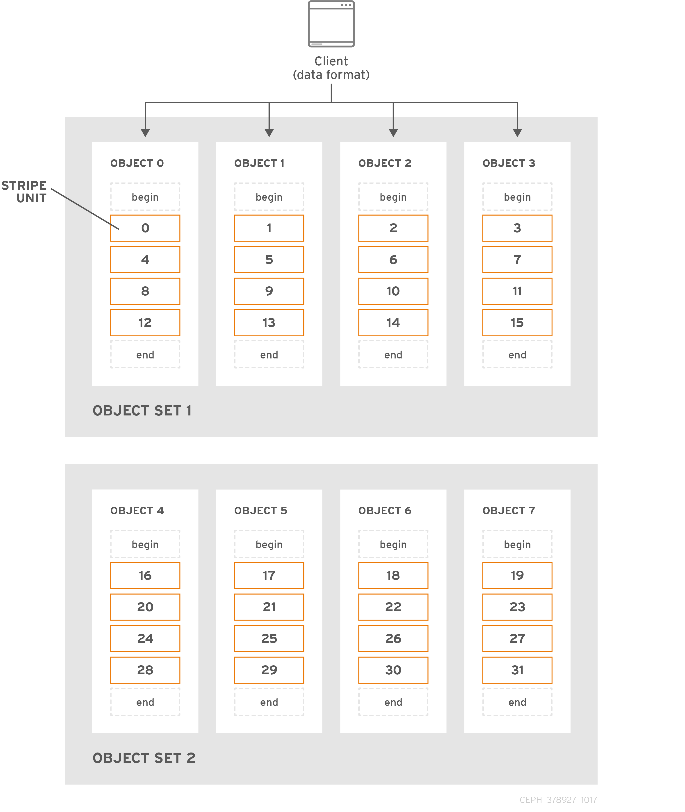

# 架构指南

RED HAT CEPH STORAGE 4

## 红帽 Ceph 存储架构指南

**摘要**

本文档提供 Ceph 存储群集及其客户端的架构信息。

红帽承诺替换我们的代码、文档和网页属性中存在问题的语言。我们从这四个术语开始： master、slave、blacklist 和 whitelist。这些更改将在即将发行的几个发行本中逐渐实施。详情请查看 [CTO Chris Wright 信息](https://www.redhat.com/en/blog/making-open-source-more-inclusive-eradicating-problematic-language)。

------

# 第 1 章 Ceph 架构

红帽 Ceph 存储集群是分布式数据对象存储，其设计能够提供卓越的性能、可靠性和可扩展性。分布式对象存储是存储的未来，因为它们包含非结构化的数据，并且客户端可以同时使用现代对象接口和传统接口。

例如：

- 采用多种语言的 API（C/C++、Java、Python）
- RESTful 接口(S3/Swift)
- 块设备接口
- 文件系统接口

红帽 Ceph 存储集群的强大功能可以转变您组织的 IT 基础架构和管理大量数据的能力，特别是对于 RHEL OSP 等云计算平台而言。红帽 Ceph 存储集群提供 **卓越的** 可扩展性 - 数十个客户端访问 PB 级的数据，甚至更多。

每个 Ceph 部署的核心都是红帽 Ceph 存储集群。它由三种类型的守护进程组成：

- **Ceph OSD 守护进程：** Ceph OSD 代表 Ceph 客户端存储数据。此外，Ceph OSD 利用 Ceph 节点的 CPU、内存和网络来执行数据复制、纠删代码、重新平衡、恢复、监控和报告功能。
- **Ceph 监控器：** Ceph 监控器维护红帽 Ceph 存储集群映射的主副本和红帽 Ceph 存储群集的当前状态。监控器需要高度一致性，并使用 Paxos 来确保对红帽 Ceph 存储集群状态达成一致。
- **Ceph 管理器：** Ceph 管理器维护有关放置组、处理元数据和主机元数据的详细信息，以取代 Ceph monitor - 大规模显著提高性能。Ceph 管理器处理许多只读 Ceph CLI 查询的执行，如放置组统计信息。Ceph 管理器还提供 RESTful 监控 API。

[](https://access.redhat.com/webassets/avalon/d/Red_Hat_Ceph_Storage-4-Architecture_Guide-zh-CN/images/93d12b23fd00b518ae491aabd594a464/Ceph_Architecture-Guide_378927_1017_01.png)

Ceph 客户端接口从红帽 Ceph 存储集群读取数据并写入数据。客户端需要以下数据与 Red Hat Ceph Storage 集群通信：

- Ceph 配置文件或集群名称（通常为 `ceph`）和 monitor 地址
- 池名称
- 用户名和 secret 密钥的路径。

Ceph 客户端维护对象 ID 以及存储对象的池名称。但是，它们不需要维护对象到 OSD 索引或与集中式对象索引通信来查找对象位置。为存储和检索数据，Ceph 客户端访问 Ceph monitor 并检索红帽 Ceph 存储集群映射的最新副本。然后，Ceph 客户端向 `librados` 提供对象名称和池名称，后者计算对象的放置组和 Primary OSD，以使用 CRUSH（可扩展哈希下的受控复制）算法存储和检索数据。Ceph 客户端连接到可以执行读写操作的 Primary OSD。客户端和 OSD 之间没有中间服务器、代理或总线。

当 OSD 存储数据时，它将从 Ceph 客户端接收数据 - 无论客户端是 Ceph 块设备、Ceph 对象网关、Ceph 文件系统或其他接口，并且将数据存储为对象。

注意

对象 ID 在整个集群中唯一，而不仅仅是 OSD 的存储介质。

Ceph OSD 将所有数据存储为扁平命名空间中的对象。没有目录层次结构。对象具有集群范围的唯一标识符、二进制数据和元数据，由一组名称/值对组成。

[](https://access.redhat.com/webassets/avalon/d/Red_Hat_Ceph_Storage-4-Architecture_Guide-zh-CN/images/182cc38c2bbfaf8210141716fa9b9554/Ceph_Architecture-Guide_378927_1017_03.png)

Ceph 客户端定义客户端数据格式的语义。例如，Ceph 块设备将块设备镜像映射到集群中存储的一系列对象。

注意

由唯一 ID、数据和名称/值对等元数据组成的对象可以同时表示结构化和非结构化数据，以及传统和领先数据存储接口。

# 第 2 章 核心 Ceph 组件

红帽 Ceph 存储集群可以具有大量 Ceph 节点，以限制可扩展性、高可用性和性能。每个节点利用非专有硬件和智能 Ceph 守护进程，它们相互通信：

- 写入和读取数据
- 压缩数据
- 通过复制或纠删代码数据来确保持久性
- 监控并报告群集运行状况，也称为"休眠"
- 动态重新分发数据，也称为"回填"
- 确保数据完整性；以及，
- 从故障中恢复.

在读取和写入数据的 Ceph 客户端接口中，红帽 Ceph 存储集群看起来像存储数据的简单池。但是，`librados` 和存储集群以对客户端接口完全透明的方式执行许多复杂的操作。Ceph 客户端和 Ceph OSD 都使用 CRUSH（可扩展哈希下的受控复制）算法。以下小节详细介绍了 CRUSH 如何使 Ceph 无缝执行这些操作。

## 2.1. 先决条件

- 对分布式存储系统有基本了解.

## 2.2. Ceph 池

Ceph 存储集群将数据对象存储在名为"Pools"的逻辑分区中。 Ceph 管理员可以为特定类型的数据创建池，如块设备、对象网关，或者仅将一组用户从另一组分隔开。

从 Ceph 客户端的角度来看，存储集群非常简单。当 Ceph 客户端使用 I/O 上下文读取或写入数据时，它 **始终** 连接到 Ceph 存储集群中的存储池。客户端指定池名称、用户和密钥，因此池似乎充当对其数据对象访问控制的逻辑分区。

实际上，Ceph 池不仅仅是用于存储对象数据的逻辑分区。池在 Ceph 存储集群分发和存储数据方面扮演着重要角色。但是，这些复杂的操作对 Ceph 客户端完全透明。

Ceph 池定义：

- **池类型：** 在 Ceph 的早期版本中，池只是维护对象的多个深度副本。如今，Ceph 可以维护对象的多个副本，也可以使用纠删代码来确保持久性。数据持久性方法为池范围，在创建池后不会更改。池类型定义创建池时的数据持久性方法。池类型对客户端完全透明。
- **放置组：** 在字节规模的存储集群中，Ceph 池可能会存储数百万个数据对象或更多内容。Ceph 必须处理许多类型的操作，包括通过副本或纠删代码区块实现数据持久性，通过清理或 CRC 检查、复制、重新平衡和恢复来处理数据完整性。因此，逐个对象管理数据会带来可扩展性和性能瓶颈。Ceph 通过将池划分为放置组来解决这一瓶颈。CRUSH 算法计算用于存储对象的 PG，并计算 PG 的操作集合。CRUSH 将每个对象放入 PG。然后，CRUSH 将每个 PG 存储在一组 OSD 中。系统管理员在创建或修改池时设置 PG 数。
- **CRUSH 规则集：** CRUSH 扮演另一个重要角色：CRUSH 可以检测故障域和性能域。CRUSH 可以按照存储介质类型识别 OSD，并将 OSD 分层组织到节点、机架和行中。CRUSH 支持 Ceph OSD 在故障域之间存储对象副本。例如，对象的副本可能存储在不同的服务器机房、isles、机架和节点中。如果集群大部分失败，如机架，集群仍然可以处于降级状态，直到集群恢复为止。

此外，CRUSH 允许客户端将数据写入特定类型的硬件，如 SSD、含有 SSD 日志的硬盘驱动器，或者在与数据相同的驱动器上使用日志。CRUSH 规则集确定池的故障域和性能域。管理员在创建池时设置 CRUSH 规则集。

注意

管理员 **CANNOT** 在创建池后更改池的规则集。

- **持久性：** 在提前扩展存储群集中，硬件故障是一种预期，而非例外。当使用数据对象表示更大粒度存储接口（如块设备）时，为该大型粒度接口丢失一个或多个数据对象可能会破坏大粒度存储实体的完整性 - 或许使其不可用。因此数据丢失不可容忍。Ceph 通过两种方式提供高数据持久性：
  - 副本池将存储使用 CRUSH 故障域的对象的多个深度副本，以物理方式将一个数据对象副本与另一个数据对象进行隔离。也就是说，副本分布到单独的物理硬件。这增加了硬件故障期间的持久性。
  - 纠删代码池将每个对象存储为 `K+M` 块，其中 `K` 代表数据区块，`M` 代表编码区块。总和表示用于存储对象的 OSD 数量，`M` 值则表示在 `M` 数量 OSD 出现故障时可能出现故障的 OSD 数量，仍会恢复数据。

从客户端的角度来看，Ceph 优异且简单。客户端只是从池读取和写入到池。但是，池在数据持久性、性能和高可用性方面扮演着重要角色。

## 2.3. Ceph 身份验证

为了识别用户并防止中间人攻击，Ceph 提供了验证用户和守护进程的 `cephx` 身份验证系统。

注意

`cephx` 协议不为通过网络传输的数据或 OSD 中存储的数据进行数据加密寻址。

cephx 使用共享密钥进行身份验证，这意味着客户端和 monitor 集群都具有客户端的机密密钥的副本。认证协议使双方能够相互证明自己有一份密钥副本，而无需实际披露它。这提供了相互身份验证，这意味着集群确定用户拥有 secret 密钥，并且用户确定集群有 secret 密钥的副本。

**cephx**

`cephx` 身份验证协议的工作方式与 Kerberos 类似。

用户/actor 调用 Ceph 客户端来联系 monitor。与 Kerberos 不同，每个 monitor 都可以验证用户的身份并分发密钥，因此使用 `cephx` 时不会出现单点故障或瓶颈。监控器返回一个类似于 Kerberos ticket 的身份验证数据结构，其中包含用于获取 Ceph 服务的会话密钥。此会话密钥本身使用用户的永久机密密钥加密，因此只有用户能够从 Ceph 监视器请求服务。然后，客户端使用 session 键从 monitor 请求所需的服务，而 monitor 为客户端提供一个票据，它将向实际处理数据的 OSD 验证客户端的身份验证。Ceph 监视器和 OSD 共享机密，因此客户端可以将监控器提供的票据用于集群中的任何 OSD 或元数据服务器。与 Kerberos 一样，`cephx` 票据过期，因此攻击者无法使用已过期的票据或会话密钥。这种身份验证形式将阻止有权访问通信介质的攻击者在另一用户的身份下创建虚假消息或更改其他用户的合法消息，只要用户的机密密钥在过期之前不会被泄露。

要使用 `cephx`，管理员必须首先设置用户。在下图中，`client.admin` 用户从命令行调用 `ceph auth get-or-create-key` 来生成用户名和 secret 密钥。Ceph 的 `auth` 子系统生成用户名和密钥，使用 monitor 存储副本，并将用户的机密传回 `client.admin` 用户。这意味着客户端和 monitor 共享一个 secret key。

注意

`client.admin` 用户必须以安全的方式向用户提供用户 ID 和 secret 密钥。

[](https://access.redhat.com/webassets/avalon/d/Red_Hat_Ceph_Storage-4-Architecture_Guide-zh-CN/images/a33b550b888300b3568a79304601cc66/Ceph_Architecture-Guide_378927_1017_08.png)

## 2.4. Ceph 放置组

在群集中存储数百万对象并单独管理它们需要占用大量资源。因此，Ceph 使用放置组(PG)使管理大量对象变得更加高效。

PG 是池的子集，提供一系列对象。Ceph 将池划分为一系列 PG。然后，CRUSH 算法取 cluster map 和集群的状态来考虑，并将 PG 均匀和伪地分发到集群中的 OSD。

它的工作方式如下所示：

在系统管理员创建池时，CRUSH 会为池创建用户定义的 PG 数量。通常，PG 数量应当是比较精细的数据子集。例如，每个池每个 OSD 100 个 PG 意味着每个 PG 包含大约 1% 的池数据。

当 Ceph 需要将 PG 从一个 OSD 移到另一个 OSD 时，PG 数量会影响到性能。如果池中 PG 数量过多，Ceph 将同时移动大量的数据，网络负载会对集群的性能造成负面影响。如果池中的 PG 数量过多，Ceph 在移动少量数据时会占用太多 CPU 和 RAM，从而对集群的性能造成负面影响。有关计算 PG 数量以达到最佳性能的详细信息，请参阅 [PG Count](https://access.redhat.com/documentation/en-us/red_hat_ceph_storage/3/html/storage_strategies_guide/placement_groups_pgs#pg_count)。

Ceph 通过存储对象的副本或存储对象的纠删代码区块来确保数据丢失。由于 Ceph 将对象的对象或纠删代码区块存储在 PG 中，Ceph 会针对对象的每个副本或对象的每个纠删代码区块，将每一 PG 复制到一组 OSD 中，称为"Acting Set"。系统管理员可以确定池中的 PG 数量，以及副本或纠删代码区块的数量。不过，CRUSH 算法计算特定 PG 的操作集中有哪些 OSD。

CRUSH 算法和 PG 使 Ceph 动态。对 cluster map 或集群状态的更改可能会导致 Ceph 自动从一个 OSD 将 PG 移到另一个 OSD。

以下是几个示例：

- **扩展群集：** 添加新主机及其 OSD 到集群时，集群映射会改变。由于 CRUSH 均匀且伪随机地将 PG 分发到整个群集中的 OSD，因此添加新主机及其 OSD 表示 CRUSH 将重新分配池的一些 PG 到这些新 OSD。这意味着系统管理员不必手动重新平衡集群。此外，这意味着新 OSD 包含的数据量与其他 OSD 大致相同。这也意味着新 OSD 不包含新写入的 OSD，从而防止集群中的"hot spots"。
- **OSD Fails：当 OSD** 出现故障时，集群的状态会发生变化。Ceph 暂时丢失了其中一个副本或纠删代码区块，因此需要再制作另一个副本。如果执行集合中的 Primary OSD 失败，则执行集合中的下一个 OSD 将成为主 OSD，CRUSH 计算新的 OSD 来存储额外的副本或纠删代码区块。

通过在数百至数千 PG 的上下文中管理数百万对象，Ceph 存储集群可以有效地增加、缩小和从故障中恢复。

对于 Ceph 客户端，通过 `librados` 的 CRUSH 算法使得读取和写入对象的过程非常简单。Ceph 客户端只是将对象写入到池，或者从池中读取对象。操作集合中的 Primary OSD 可以代表 Ceph 客户端将对象的副本或纠删代码区块写入次要 OSD。

如果 cluster map 或集群状态发生变化，OSD 存储 PG 的 CRUSH 计算也会改变。例如，Ceph 客户端可以将对象 `foo` 写入池 `bar`。CRUSH 会将对象分配到 PG `1.a`，并将它存储在 `OSD 5` 中，分别在 `OSD 10` 和 `OSD 15` 上制作副本。如果 `OSD 5` 失败，集群状态会改变。当 Ceph 客户端从池 `bar` 读取对象 `foo` 时，通过 `librados` 的客户端将自动从 `OSD 10` 中检索对象，作为新的 Primary OSD 动态检索。

在编写和读取对象时，通过 `librados` 的 Ceph 客户端直接连接到操作集合中的 Primary OSD。由于 I/O 操作不使用集中式代理，因此 Ceph 通常不会有网络超额订阅的问题。

下图显示了 CRUSH 如何将对象分配到 PG 和 PG 到 OSD。CRUSH 算法将 PG 分配到 OSD，使得操作集中的每一 OSD 都在单独的故障域中，这通常意味着 OSD 始终位于单独的服务器主机上，有时也会位于单独的机架中。

[](https://access.redhat.com/webassets/avalon/d/Red_Hat_Ceph_Storage-4-Architecture_Guide-zh-CN/images/b3369ea22c749d4586a98d9ad96565e3/Ceph_Architecture-Guide_378927_1017_04.png)

## 2.5. Ceph CRUSH 规则集

Ceph 将 CRUSH 规则集分配到池。当 Ceph 客户端在池中存储或检索数据时，Ceph 会识别 CRUSH 规则集、规则集中的规则，以及用于存储和检索数据的规则中的顶级 bucket。在 Ceph 处理 CRUSH 规则时，它会标识包含对象的 PG 的 Primary OSD。这使得客户端能够直接连接 OSD，访问 PG，以及读取或写入对象数据。

若要 map PG 到 OSD，CRUSH map 定义 bucket 类型层次结构列表。bucket 类型列表位于所生成的 CRUSH map 的 `types` 下。创建 bucket 层次结构的目的是通过其故障域和/或性能域（如驱动器类型、主机、机箱、机架、机架、电源分配单元、pod、行、室和数据中心）隔离 laf 节点。

除了代表 OSD 的 leaf 节点外，其他层次结构是任意的。如果默认类型不符合其要求，管理员可以根据自己的需求对其进行定义。CRUSH 支持为 Ceph OSD 节点建模的有向无环图，通常采用层次结构。因此，Ceph 管理员可以在单个 CRUSH map 中支持包含多个根节点的多个层次结构。例如，管理员可以创建表示较高成本 SSD 的层次结构，以获得高性能，并使用 SSD 日志创建成本更低的硬盘驱动器，以获得中等性能。

## 2.6. Ceph 输入/输出操作

Ceph 客户端从 Ceph 监控器检索"Cluster map"，绑定至池，并在池中 PG 中的对象上执行输入/输出(I/O)。池的 CRUSH 规则集和 PG 数量是 Ceph 如何放置数据的主要因素。借助最新版本的 cluster map，客户端知道集群中的所有 monitor 和 OSD，以及它们的当前状态。**然而，客户端不知道对象位置。**

客户端唯一需要的输入是对象 ID 和池名称。很简单：Ceph 将数据存储在指定的池中。当客户端希望将指定对象存储在池中时，它会取对象名称、哈希代码、池中 PG 数量和池名称作为输入；然后，CRUSH（可扩展哈希下的复制）计算 PG 的 ID，以及 PG 的 Primary OSD。

Ceph 客户端使用下列步骤来计算 PG ID。

1. 客户端输入池名称和对象 ID。例如 `pool = liverpool` 和 `object-id = john`。
2. CRUSH 取对象 ID 并散列它。
3. CRUSH 计算 PG 数的哈希模数，以获取 PG ID。例如： `58`。
4. CRUSH 计算与 PG ID 对应的Primary OSD。
5. 客户端获取给定池名称的池 ID。例如，池"liverpool"是池号 `4`。
6. 客户端将池 ID 前缀到 PG ID。例如： `4.58`。
7. 客户端通过直接与操作集合中的 Primary OSD 通信来执行对象操作，如写入、读取或删除。

在会话期间，Ceph 存储集群的拓扑和状态相对稳定。通过 `librados` 为 Ceph 客户端提供计算对象位置的能力要比要求客户端通过 chatty 会话查询存储集群来进行每个读/写操作的查询。CRUSH 算法允许客户端计算对象 *的存储* 位置，并使 **客户端能够直接联系操作集合中的Primary OSD，** 以在对象中存储或检索数据。由于高级规模的集群具有数千个 OSD，通过客户端和 Ceph OSD 之间的订阅来联网并不是个大问题。如果集群状态发生变化，客户端只需从 Ceph monitor 请求对 cluster map 的更新。

对于 Red Hat Ceph Storage 2 及更早的发行版本，当集群映射增长过大时，非常大的集群中的守护进程可能会遇到较低的性能。例如，具有 10000 个 OSD 的群集可能每个 OSD 有 100 个 PG，从而能高效地为群集映射分发数据且有多个 epoch。因此，守护进程将在带有非常大集群的 Red Hat Ceph Storage 2 中使用更多 CPU 和 RAM。对于 Red Hat Ceph Storage 3 及更新的版本，守护进程会像 Red Hat Ceph Storage 2 及更早的版本一样接收集群的当前状态。但是，Ceph Manager（`ceph-mgr`守护进程）现在处理 PG 上的查询，从而显著提高性能。

重要

红帽建议在具有数千 OSD 的大型集群中使用 Red Hat Ceph Storage 3 及更新的版本。

## 2.7. Ceph 复制

与 Ceph 客户端一样，Ceph OSD 可以联系 Ceph 监视器，以检索 cluster map 的最新副本。Ceph OSD 也使用 CRUSH 算法，但它们使用它来计算对象副本的存储位置。在典型的写入场景中，Ceph 客户端使用 CRUSH 算法来计算对象的操作集合中的 PG ID 和 Primary OSD。当客户端将对象写入Primary OSD 时，Primary OSD 找到它应当存储的副本数。该值可在 `osd_pool_default_size` 设置中找到。然后，Primary OSD 采用对象 ID、池名称和 cluster map，并使用 CRUSH 算法计算执行集合的次要 OSD 的 ID。Primary OSD 将对象写入次要 OSD。当Primary OSD 从次要 OSD 收到确认，Primary OSD 本身完成其写操作时，它确认对 Ceph 客户端执行成功的写入操作。

[](https://access.redhat.com/webassets/avalon/d/Red_Hat_Ceph_Storage-4-Architecture_Guide-zh-CN/images/4f46f59117b86334f7910b9bccc926c4/Ceph_Architecture-Guide_378927_1017_05.png)

Ceph OSD 守护进程可以代表 Ceph 客户端执行数据复制，从而减轻 Ceph 客户端不受这一职责影响，同时确保高可用性和数据安全性。

注意

Primary OSD 和次要 OSD 通常配置为位于单独的故障域中。CRUSH 计算次要 OSD 的 ID，并考虑故障域。

**数据复制**

在复制存储池中，Ceph 需要对象的多个副本才能在降级状态下运行。理想情况下，Ceph 存储集群使得客户端能够读取和写入数据，即使操作的集合中的一个 OSD 出现故障。因此，Ceph 默认为对象制作三个副本，并且至少清理两个副本以进行写入操作。即使两个 OSD 出现故障，Ceph 仍然会保留数据。但是，它会中断写入操作。

在纠删代码池中，Ceph 需要在多个 OSD 之间存储对象的区块，以便它在降级状态下运行。与复制池类似，理想情况下，纠删代码池使得 Ceph 客户端能够在降级状态读取和写入。

重要

红帽支持 *k* 和 *m* 的以下 *jerasure* 编码值：

- k=8 m=3
- k=8 m=4
- k=4 m=2

## 2.8. Ceph 纠删代码

Ceph 可以加载许多纠删代码算法中的一种。最早且最常用的是 `Reed-Solomon` 算法。纠删代码实际上是一个正向错误修正(FEC)代码。EFC 代码将 `K` 块的消息转换为较长的消息，称为 `N` 块的 'code word'，因此 Ceph 可以从 `N` 块的子集恢复原始消息。

更具体地说，`N = K+M`，变量 `K` 是原始数据块量。变量 `M` 代表纠删代码算法添加的额外或冗余块，以提供避免故障的保护。变量 `N` 是纠删代码过程后创建的块总数。`M` 的值只是 `N-K`，这意味着算法从 `K` 原始数据区块计算 `N-K` 冗余区块。这种方法可确保 Ceph 可以访问所有原始数据。系统可以应对任意 `N-K` 失败。例如，在 16 `N` 配置的 10 `K` 或纠删代码 `10/16` 中，纠删代码算法在 10 个基本块 `K` 中增加了六个额外的块。例如，在 `M = K-N` 或 `16-10 = 6` 配置中，Ceph 会将 16 个区块 `N` 分布到 16 个 OSD。即使 6 个 OSD 出现故障，也可以从 10 验证的 `N` 块重建原始文件，确保红帽 Ceph 存储集群不会丢失数据，从而确保高度容错。

与复制池一样，在纠删代码池中，Primary OSD 接收所有写入操作。在复制池中，Ceph 会制作 PG 中 PG 中集合中次要 OSD 中每个对象的深度副本。对于纠删代码，进程略有不同。纠删代码池将每个对象存储为 `K+M` 块。它被分成 `K` 数据区块和 `M` 编码区块。该池的大小配置为具有 `K+M` 大小，以便 Ceph 将 OSD 中的每个区块存储在执行集合中。Ceph 将块的排名存储为对象的属性。Primary OSD 负责将载荷编码到 `K+M` 块中，并将它们发送到其他 OSD。Primary OSD 还负责维护 PG 日志的权威版本。

例如，在典型的配置中，系统管理员会创建一个纠删代码池来使用五个 OSD 并保留其中两个 OSD 的丢失。也就是说，(`K+M = 5`)如此。`M = 2`

当 Ceph 将包含 `ABCDEFGHI` 的对象 **NYAN** 写入到池中时，纠删编码算法只需将内容分为三个数据区块，只需将内容分为三个：* `ABC`、* `DEF` * `GHI`。如果内容长度不是 `K` 的倍数，算法将固定内容。这个函数还会创建两个编码块：第四个编码块 `YXY`，第五个块为 `GQC`。Ceph 将每个区块存储在操作集合中的 OSD 上，它将区块存储在具有相同名称 **NYAN** 但驻留在不同的 OSD 上的对象中。除名称外，算法必须将创建块的顺序保留为对象 `shard_t` 的属性。例如，Cunk 1 包含 `ABC`，Ceph 存储在 **OSD5 中**，而块 4 包含 `YXY`，Ceph 则存储在 **OSD3 中**。

[](https://access.redhat.com/webassets/avalon/d/Red_Hat_Ceph_Storage-4-Architecture_Guide-zh-CN/images/afc739873d4d949911d664ebaba3e28e/Ceph_Architecture-Guide_378927_1017_06.png)

在恢复场景中，客户端尝试读取纠删代码池中的对象 **NYAN**，方法是读取块 1 到 5。OSD 告知缺少块 2 和 5 的算法。这些缺失的区块称为 'erasures'。例如，Primary OSD 无法读取第 5 块，因为 **OSD4** 已经过时，无法读取第 2 块，因为 **OSD2** 是最慢的，而且其区块没有考虑。但是，当算法有三个块时，它会读取三个块：块 1 包含 `ABC`，块 3 包含 `GHI` 和块 4 包含 `YXY`。然后，它会重建对象 `ABCDEFGHI` 的原始内容，以及包含 `GQC` 的块 5 的原始内容。

将数据拆分为不同的块，与对象放置无关。CRUSH 规则集和纠删代码池 profile 一起决定 OSD 上块的放置。例如，在纠删代码 profile 中使用 Locally Repairable Code(`lrc`)插件可创建额外的区块，需要较少的 OSD 从中恢复。例如，在 `lrc` 配置文件配置 `K=4 M=2 L=3` 中，算法会创建六个区块(`K+M`)，就像 `jerasure` 插件一样，但本地性值(`L=3`)要求该算法在本地创建两个更多区块。该算法会创建额外的块，如 `(K+M)/L`。如果包含块 0 的 OSD 失败，可以通过使用区块 1、2 和第一个本地区块来恢复这一区块。在这种情况下，算法仅需要 3 个区块进行恢复，而不是 5。

注意

使用纠删代码池可禁用对象存储。

**其它资源**

- 有关 CRUSH、纠删代码配置集和插件的更多信息，请参阅红帽 Ceph [存储 4 的存储策略指南](https://access.redhat.com/documentation/en-us/red_hat_ceph_storage/4/html-single/storage_strategies_guide/)。
- 有关对象映射的详情，请参阅 [Object Map](https://access.redhat.com/documentation/zh-cn/red_hat_ceph_storage/4/html-single/architecture_guide/{architecture-guide}#arch-obj-map_arch) 部分。

## 2.9. Ceph ObjectStore

`ObjectStore` 为 OSD 的原始块设备提供低级别接口。当客户端读取或写入数据时，它会与 `ObjectStore` 接口交互。Ceph 写入操作本质上是 ACID 事务：即，它们提供 **原子性**、**一致性**、**隔离** **和持久性**。`ObjectStore` 确保 `Transaction` 提供 **原子性**。`ObjectStore` 还处理对象语义。存储集群中存储的对象具有唯一标识符、对象数据和元数据。因此 `ObjectStore` 通过确保 Ceph 对象语义正确来提供 `Consistency`。`ObjectStore` 另外，在写操作上调用 `Sequencer` 来提供 ACID 事务的 **隔离** 部分，以确保 Ceph 写入操作按顺序进行。相反，OSD 复制或纠删代码功能提供了 ACID 事务的可达 **性** 组件。因为 `ObjectStore` 是存储介质的低级别接口，所以它还提供性能统计。

Ceph 实施多种具体存储数据的方法：

- **FileStore：** 利用文件系统存储对象数据的生产级别实施。
- **BlueStore：** 利用原始块设备存储对象数据的生产评级实施。
- **Memstore：** 一种开发人员实施，用于直接在 RAM 中测试读/写操作。
- **K/V 存储：** 一种供 Ceph 使用键/值数据库的内部实施。

因为管理员通常只解决 `BlueStore`，因此以下小节将只详细描述这些实现。

## 2.10. Ceph BlueStore

`BlueStore` 是 Ceph 的下一代存储实施。由于存储设备的市场现在包括固态驱动器或 SSD，以及 PCI Express 或 NVMe 上的非易失性内存，它们在 Ceph 中使用表明 `FileStore` 存储实施存在一些限制。虽然 `FileStore` 有很多改进来促进 SSD 和 NVMe 存储，但其他限制仍然存在。其中，不断增加的放置组仍在计算成本上仍然比较昂贵，双重写入罚款仍然存在。虽然 `FileStore` 与块设备中的文件系统交互，`BlueStore` 消除了该间接层，并直接使用原始块设备进行对象存储。`BlueStore` 在小分区中使用非常轻量的权重 `BlueFS` 文件系统作为其 k/v 数据库。`BlueStore` 消除了代表放置组的目录的范式，即代表元数据的对象和文件 XATTR 的文件。`BlueStore` 同时消除了 `FileStore` 的双重写责任，因此写入操作几乎是大多数工作负载中的 `BlueStore` 快两倍。

`BlueStore` 将数据存储为：

- **对象数据：** 在 `BlueStore` 中，Ceph 直接将对象存储为原始块设备中的块。存储对象数据的原始块设备部分不包含文件系统。文件系统的省略消除了一层间接数据，因而提高了性能。但是，大多数 `BlueStore` 性能的改进来自于块数据库和 write-ahead 日志。
- **Block Database：** 在 `BlueStore` 中，块数据库处理对象语义以确保 **一致性**。对象的唯一标识符是块数据库中的键。块数据库中的值包含一系列块地址，它们引用存储的对象数据、对象的放置组和对象元数据。块数据库可能位于存储对象数据的同一原始块设备的 `BlueFS` 分区中，或者可能会驻留在单独的块设备中，通常是当主块设备是硬盘时，SSD 或 NVMe 将提高性能。块数据库比 `FileStore` 提供很多改进，即 `BlueStore` 的键/值语义不受文件系统 XATTR 的限制。`BlueStore` 可能会在块数据库中快速将对象分配给其他放置组，而不用将文件从一个目录移动到另一个目录的开销，如 `FileStore` 中的情况所示。`BlueStore` 同时还引入了新功能。块数据库可以存储存储的对象数据及其元数据的校验和，允许对每个读取进行完整数据校验和操作，这比通过定期清理来检测位轮转更高效。`BlueStore` 可以压缩对象，并且块数据库可以存储用于压缩对象的算法，确保读取操作选择适当的解压缩算法。
- write **-ahead Log：** 在 `BlueStore` 中，write-ahead 日志确保了 **原子性**，类似于 `FileStore` 的日志记录功能。与 `FileStore` 类似，`BlueStore` 记录每个事务的所有方面。但是，`BlueStore` 写日志或 WAL 可以同时执行这个功能，这消除了 `FileStore` 的双重写入后果。因此，`BlueStore` 的速度几乎是大多数工作负载的写入操作中的 `FileStore` 速度的两倍。BlueStore 可以将 WAL 部署到用于存储对象数据的同一设备上，或者它可以在另一个设备上部署 WAL，通常是当主块设备是硬盘，并且 SSD 或 NVMe 来提高性能时。

注意

只有单独的设备比主存储设备更快时，将块数据库或 write-ahead 日志存储在单独的块设备中才有帮助。例如，SSD 和 NVMe 设备通常比 HDD 快。由于工作负载的不同，将块数据库和 WAL 放置到单独的设备上也可能具有性能优势。

## 2.11. Ceph 自我管理操作

Ceph 集群自动执行许多自我监控和管理操作。例如，Ceph OSD 可以检查集群运行状况，并且向 Ceph 监视器报告。通过使用 CRUSH 将对象分配到 PG 和 PG 到一组 OSD，Ceph OSD 可以使用 CRUSH 算法来重新平衡集群或动态从 OSD 故障中恢复。

## 2.12. Ceph heartbeat

Ceph OSD 加入群集，并向 Ceph 监控报告其状态。在最低级别上，Ceph OSD 状态为 `up` 或 `down`，这表示它是否正在运行并且能够服务 Ceph 客户端请求。如果 Ceph OSD 是 `down`，并且 Ceph 存储集群是 `in`，则此状态可能表示 Ceph OSD 的故障。例如，如果 Ceph OSD 没有运行，它会使 Ceph OSD 崩溃，Ceph OSD 无法通知 Ceph 监控器它是 `down`。Ceph 监控器可以定期 ping Ceph OSD 守护进程，以确保其正在运行。不过，心跳也让 Ceph OSD 能够确定相邻的 OSD 是否是 `down`，以更新 cluster map 并将其报告到 Ceph 监控器。这意味着 Ceph 监控器可以保持轻量的权重进程。

## 2.13. Ceph 对等

Ceph 将 PG 的副本存储在多个 OSD 上。PG 的每个副本都有一个状态。这些 OSD"peer"或互相检查以确保它们就 PG 的每个副本的状态达成一致。对等问题通常会自行解决。

注意

当 Ceph 监视器在存储 PG 的 OSD 状态上达成一致时，这并不表示 PG 具有最新的内容。

当 Ceph 将 PG 存储在一组操作的 OSD 中时，将它们指代 *为主* OSD 和*次要* 等。按照惯例，Pri *mary* 是操作 *集合中* 的第一个 OSD。存储 PG 的第一个副本的 *Primary* 负责协调该放置组的 peering 进程。*Primary* 是 ONLY **OSD**，它将接受客户端发起的写入作为主要 PG 的给定 PG 的对象。

*Acting Set* 是一系列 OSD，它们负责存储 PG。*活动集合* 可以指当前负责 PG 的 Ceph OSD 守护进程，或者从某些 epoch 起负责特定放置组的 Ceph OSD 守护进程。

作为操作集合一部分的 Ceph OSD 守护进程 *可能* 并不总是为 `up`。当操作 *集合中* 的 OSD 是 `up` 时，它属于 *Up Set*。*Up Set 是一种* 重要区别，因为 Ceph 可以在 OSD 出现故障时重新 map PG 到其他 Ceph OSD。

注意

在包含 `osd.25`、`osd.32` 和 `osd.61` 的 PG 的操作 *集合中*，第一个 OSD 是主要 OSD `osd.25`。如果该 OSD 失败，则 *第二个* `osd.32` 成为 *主要* 节点，Ceph 将从 *Up Set* 中删除 `osd.25`。

## 2.14. Ceph 重新平衡和恢复

当管理员添加 Ceph OSD 到 Ceph 存储集群时，Ceph 将更新 cluster map。这会更改 cluster map 也会改变对象放置，因为修改后的群集映射也会更改 CRUSH 计算的输入。CRUSH 平均放置数据，但随机放置.因此，当管理员添加新 OSD 时，只有少量数据移动。数据量通常是新 OSD 的数量划分为集群中的数据总量。例如，在具有 50 个 OSD 的集群中，在添加 OSD 时可能会移动 1/50th 或 2% 的数据。

下图说明了重新平衡过程，其中部分（但不是所有）PG 从示意图中现有的 OSD 1 和 2 迁移到示意图中的新 OSD OSD 3。即使重新平衡，CRUSH 仍然稳定。许多 PG 保留在原始配置中，每个 OSD 都会添加一些容量，因此新的 OSD 在集群重新平衡后不会出现负载高峰。

[](https://access.redhat.com/webassets/avalon/d/Red_Hat_Ceph_Storage-4-Architecture_Guide-zh-CN/images/e99c1b80084cf6ca6f015792a789c3cf/Ceph_Architecture-Guide_378927_1017_07.png)

## 2.15. Ceph 数据完整性

作为维护数据完整性的一部分，Ceph 提供了许多机制来防止损坏的磁盘扇区和位轮转。

- **清理：** Ceph OSD 守护进程可以在 PG 中清理对象。也就是说，Ceph OSD 守护进程可以将一个 PG 中的对象元数据与其存储在其他 OSD 上的放置组中的副本进行比较。scrubbing- 通常执行 daily-catches 错误或存储错误。Ceph OSD 守护进程还通过比较对象中对位的数据执行深度清理。深度清理- 通常每周执行一次 - 损坏的扇区在轻型清理中不明显。
- **CRC Checks：** 在红帽 Ceph 存储 4 中使用 `BlueStore` 时，Ceph 可以通过在写入操作上执行正常冗余检查(CRC)来确保数据完整性；然后在块数据库中存储 CRC 值。在读取操作上，Ceph 可以从 block 数据库检索 CRC 值，并将它与检索的数据生成的 CRC 进行比较，以确保数据即时的完整性。

## 2.16. Ceph 高可用性

除了 CRUSH 算法启用的高可扩展性外，Ceph 还必须维护高可用性。这意味着 Ceph 客户端必须能够读取和写入数据，即使集群处于降级状态或监视器失败时也是如此。

## 2.17. 集群 Ceph 监控器

Ceph 客户端必须先联系 Ceph monitor 来获取 cluster map 的最新副本，然后才能读取或写入数据。红帽 Ceph 存储群集可通过单个监控器运行；但是，这会带来单点故障。也就是说，如果 monitor 停机，Ceph 客户端将无法读取或写入数据。

为了提高可靠性和容错能力，Ceph 支持监控器群集。在 Ceph 监控的集群中，延迟和其他故障可能会导致一个或多个监视器落于群集的当前状态。因此，Ceph 必须在各种监控实例之间就存储集群的状态达成一致。Ceph 始终使用大多数 monitor 和 Paxos 算法在监控器之间就存储群集的当前状态建立共识。Ceph 监控节点需要 NTP 来防止时钟偏移。

存储管理员通常部署具有奇数个监视器的 Ceph，从而确定大部分的运行效率。例如，大多数可能为 1、2:3、3:5、4:6 等。

# 第 3 章 Ceph 客户端组件

Ceph 客户端在呈现数据存储接口的方式上存在重大差异。Ceph 块设备提供像物理存储驱动器一样挂载的块存储。Ceph 网关提供具有 S3 兼容和 Swift 兼容 RESTful 接口的对象存储服务，以及自己的用户管理。但是，所有 Ceph 客户端都使用可靠的自主分布式对象存储(RADOS)协议与红帽 Ceph 存储群集交互。

它们都有相同的基本需求：

- Ceph 配置文件和 Ceph 监控地址。
- 池名称。
- 用户名和 secret 密钥的路径。

Ceph 客户端往往遵循一些类似的补丁程序，如 object-watch-notify 和 striping。以下小节介绍了 Ceph 客户端中使用的 RADOS、librados 和常见模式。

## 3.1. 先决条件

- 对分布式存储系统有基本了解.

## 3.2. Ceph 客户端原生协议

现代应用需要具有异步通信功能的简单对象存储接口。Ceph 存储群集提供具有异步通信功能的简单对象存储接口。该界面在集群中提供对对象的直接并行访问。

- 池操作
- 快照
- 读/写对象
  - 创建或删除
  - 整个对象或字节范围
  - 附加或中继
- 创建/设置/获取/删除 XATTRs
- create/Set/Get/Remove Key/Value Pairs
- 复合操作和双机语义

## 3.3. Ceph 客户端对象监视和通知

Ceph 客户端可以注册对象的持久兴趣，并保持与 Primary OSD 的会话开启。客户端可向所有观察者发送通知消息和载荷，并在观察者收到通知时收到通知。这使得客户端能够将任何对象用作同步/通信通道。

[](https://access.redhat.com/webassets/avalon/d/Red_Hat_Ceph_Storage-4-Architecture_Guide-zh-CN/images/5326828ed0c9f0b064386fe00ac943d6/Ceph_Architecture-Guide_378927_1017_09.png)

## 3.4. Ceph 客户端 Mandatory Exclusive Locks

强制独占锁是一种将 RBD 锁定到单个客户端的功能（如果存在多个挂载）。当多个挂载的客户端尝试写入同一对象时，这有助于解决写入冲突的情况。此功能基于上一节中解释的 `object-watch-notify` 构建。因此，编写时，如果一个客户端首先在对象上建立专用锁定，另一个已挂载的客户端将在写入之前首先检查对等对象是否已在对象上放置锁定。

启用此功能后，一次只能有一个客户端修改 RBD 设备，特别是在 `snapshot create/delete` 等操作期间更改内部 RBD 结构时。它还为失败的客户端提供了一些保护。例如，如果虚拟机看起来不响应，并且您在其他位置使用同一磁盘启动副本，则第一个虚拟机将在 Ceph 中列入黑名单，并且无法损坏新磁盘。

默认不启用强制独占锁定。在创建镜像时，您必须使用 `--image-feature` 参数显式启用它。

**示例**


```none
[root@mon ~]# rbd create --size 102400 mypool/myimage --image-feature 5
```

在这里，数字 `5` 是 `1` 和 `4` 的总结，`1` 启用分层支持和 `4` 启用专用锁定支持。因此，上述命令将创建一个 100 GB rbd 镜像，启用分层和专用锁定。

强制独占锁也是 `object map` 的先决条件。如果没有启用专用锁定支持，则无法启用对象映射支持。

强制独占锁也可用于镜像的一些基础。

## 3.5. Ceph 客户端对象映射

对象映射是一项在客户端写入 rbd 镜像时跟踪后备 RADOS 对象是否存在的功能。发生写入时，这种写入将转换为后备 RADOS 对象内的偏移。启用对象映射功能后，会跟踪这些 RADOS 对象的存在。因此，我们可以知道对象是否存在。对象映射保存在 librbd 客户端上的内存中，这样它可以避免在 OSD 中查询它所知道不存在的对象。换句话说，对象映射是实际存在的对象的索引。

对象映射对于某些操作很有用，viz：

- 调整大小
- export
- Copy
- flatten
- 删除
- 读

缩小调整大小的操作就像删除尾随对象的部分删除一样。

导出操作知道要从 RADOS 请求哪些对象。

复制操作知道存在哪些对象，需要复制。它不必迭代潜在的数百个可能的对象。

flatten 操作为所有父对象执行复制操作到克隆，以便克隆可以与父级分离，即，可以删除从子克隆到父快照的引用。因此，仅针对存在的对象执行复制，而不是所有潜在的对象。

删除操作仅删除镜像中存在的对象。

读取操作会跳过它已知不存在的对象的读取。

因此，对于调整大小、仅缩小、导出、复制、扁平和删除等操作，这些操作将需要对所有潜在受影响的 RADOS 对象发出操作，无论它们是否存在。启用对象映射后，如果对象不存在，则不需要发布该操作。

例如，如果有一个 1 TB 稀疏 RBD 镜像，它可以有数百个和数千个后备 RADOS 对象。如果没有启用对象映射的删除操作，则需要对镜像中的每个潜在对象发出 `remove object` 操作。但是，如果启用了对象映射，它只需要为存在的对象发出 `remove object` 操作。

对象映射对没有实际对象但从父对象获取对象的克隆而言具有价值。存在克隆的映像时，克隆最初没有对象，并且所有读取都将重定向到父映像。因此，对象映射可以像没有对象映射一样提高读取，首先需要为克隆向 OSD 发出读取操作；出现故障时，它会向父级发出另一个读取 - 启用对象映射。它跳过了它不知道不存在的对象的读取。

默认情况下不启用对象映射。在创建镜像时，您必须使用 `--image-features` 参数显式启用它。另外，`Mandatory Exclusive Locks` 是 `object map` 的先决条件。如果没有启用专用锁定支持，则无法启用对象映射支持。要在创建镜像时启用对象映射支持，请执行：


```none
[root@mon ~]# rbd -p mypool create myimage --size 102400 --image-features 13
```

在这里，数字 `13` 是 `1`、`4` 和 `8` 的总结，其中 `1` 启用分层支持，`4` 支持专用锁定支持，`8` 支持对象映射支持。因此，上述命令将创建一个 100 GB rbd 镜像，启用分层、专用锁定和对象映射。

## 3.6. Ceph 客户端数据分条

存储设备存在吞吐量限制，这会影响性能和可扩展性。因此存储系统通常支持分条 - 探究多个存储设备之间的连续信息片段，以提高吞吐量和性能。最常见的数据分条形式来自 RAID。RAID 类型与 Ceph 的条带最相似，是 RAID 0 或 的条状卷。 Ceph 的条带化提供了 RAID 0 条带的吞吐量、n 路 RAID 镜像的可靠性以及快速恢复。

Ceph 提供三种类型的客户端：Ceph 块设备、Ceph 文件系统和 Ceph 对象存储。Ceph 客户端将其数据从它所提供的表示格式转换为用户，如块设备镜像、RESTful 对象、Ceph 文件系统目录，再转换为 Ceph 存储集群中存储的对象。

提示

Ceph 存储集群中的对象 Ceph 存储并未分条。Ceph 对象存储、Ceph 块设备和 Ceph 文件系统将其数据分条到多个 Ceph 存储集群对象上。使用 `librados` 直接写入 Ceph 存储集群的 Ceph 客户端必须执行条带操作，并为自己执行并行 I/O 来获取这些优势。

最简单的 Ceph 分条格式涉及 1 个对象的条带计数。Ceph 客户端将分条单元写入到 Ceph 存储群集对象，直到对象达到最大容量，然后为额外的数据分条创建另一个对象。最简单的分条形式可能足以满足小型块设备映像 S3 或 Swift 对象的需要。但是，这种简单形式无法充分利用 Ceph 在放置组之间分布数据的能力，因此不会大幅提高性能。下图描述了最简单的分条形式：

[](https://access.redhat.com/webassets/avalon/d/Red_Hat_Ceph_Storage-4-Architecture_Guide-zh-CN/images/8409e8eddee5ed4d43fc01ffd8a6a552/Ceph_Architecture-Guide_378927_1017_10.png)

如果您预计大映像大小（如 S3 或 Swift 对象（视频）），您可能会看到通过将客户端数据分条到对象集中的多个对象实现可观的读/写性能提升。当客户端并行将分条单元写入其对应对象时，会产生显著的写入性能。由于对象映射到不同的 PG 并且进一步 map 到不同的 OSD，因此每次写入操作都会以最大写入速度并行进行。写入单个磁盘会受到头移动的限制，例如：每个寻道 6ms 和带宽（例如 100MB/s）。通过将该写入分散到多个对象（映射到不同的放置组和 OSD），Ceph 可以减少每个驱动器的寻道数量，并合并多个驱动器的吞吐量，从而实现更快的写入或读取速度。

注意

条带独立于对象副本。由于 CRUSH 在 OSD 之间复制对象，条带会自动复制。

在下图中，客户端数据在由 4 个对象组成的对象集合（下图中的`object set 1` ）之间剥离，其中第一个条带单元在 `object 0` 中是 `stripe unit 0`，第四个条带单元在 `object 3` 中是 `stripe unit 3`。编写第四个分条后，客户端将确定对象集是否已满。如果对象集未满，客户端将开始再次向第一个对象写入条带，请参阅下图中的 `object 0`。如果对象集已满，客户端会创建一个新对象集，请参见以下示意图中的 `object set 2`，并开始写入第一个条带，在新对象集合的第一个对象中，条带单元为 16，请参阅下图中的 `object 4`。

[](https://access.redhat.com/webassets/avalon/d/Red_Hat_Ceph_Storage-4-Architecture_Guide-zh-CN/images/006a3b6815be04697ee2bd8b67272230/Ceph_Architecture-Guide_378927_1017_11.png)

三个重要变量决定了 Ceph 如何对数据进行分条：

- **对象大小：** Ceph 存储群集中的对象具有最大可配置大小，如 2 MB 或 4 MB。对象大小应当足以容纳许多条带单元，并且应该是条带单元的倍数。重要信息：红帽建议使用 16 MB 的安全值。
- **条带 Width：** 条带有可配置的单元大小，例如 64 KB。Ceph 客户端将其写入到对象的数据分成大小相等的条带单元，但最后一个条带单元除外。分条宽度应该是对象大小的一个部分，以便对象可以包含许多条带单元。
- stripe **Count：Ceph 客户端在由条带** 数决定的一系列对象上写入一系列分条单元。对象系列称为对象集。Ceph 客户端写入对象集中的最后一个对象后，它将返回到对象集中的第一个对象。

重要

在将集群投入生产之前，测试条带配置的性能。您在您剥离数据并将其写入对象后，CANNOT 会更改这些条带参数。

Ceph 客户端拥有分条数据以分条单元并将分条单元映射到对象后，Ceph 的 CRUSH 算法会将对象映射到 PG，放置组映射到 Ceph OSD 守护进程，然后对象作为文件存储在存储磁盘上。

注意

由于客户端写入到单个池，所有数据分条到对象都会映射到同一个池中的 PG。因此，它们使用相同的 CRUSH map 和相同的访问控制。