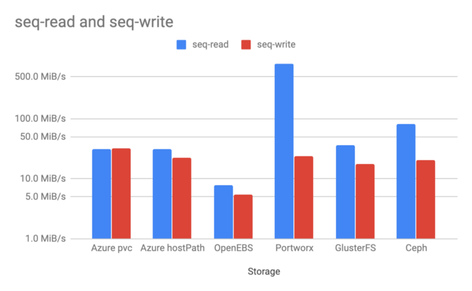

# Kubernetes 存储性能对比

最近更新于 2019 年 12 月 29 日 10 分钟阅读时长 [1 Comment](https://blog.fleeto.us/post/kubernetes-storage-performance-comparison/#disqus_thread) [译文](https://blog.fleeto.us/post/kubernetes-storage-performance-comparison/)

原文：[Kubernetes Storage Performance Comparison](https://medium.com/vescloud/kubernetes-storage-performance-comparison-9e993cb27271)

作者：[Jakub Pavlík](https://medium.com/@pupapaik)

如果你正在运行 Kubernetes，你可能正在使用，或者准备使用动态供给的块存储[卷](https://kubernetes.io/docs/concepts/storage/#types-of-volumes)，而首当其冲的问题就是为集群选择合适的存储技术。这个事情并不能用一个简单的测试来做出简单的回答，告诉你目前市面上最好的技术是什么。存储技术的选择过程中，集群上运行的负载类型是一个重要的输入。对于裸金属集群来说，需要根据实际用例进行选择，并集成到自己的硬件之中。公有云中的托管 K8s，例如 AKS、EKS 或者 GKE，都具有开箱可用的块存储能力，然而这也不见得就是最好的选择。有很多因素需要考虑，比如说公有云的 StorageClass 的故障转移时间太长。例如在 一个针对 AWS EBS 的故障测试中，加载了卷的 Pod 用了[超过五分钟](https://blog.rook.io/run-your-own-high-performance-ebs-wherever-kubernetes-runs-798a136bd808)才成功的在另一个节点上启动。Portworx 或者 OpenEBS 这样的云原生存储产品，正在尝试解决这类问题。

本文的目标是使用最常见的 Kubernetes 存储方案，进行基本的性能对比。我觉得在 Azure AKS 上使用下列后端：

- AKS 原生 Storageclass：Azure native premium
- 使用 cStor 后端的 OpenEBS
- Portworx
- Heketi 管理的 Gluster
- Rook 管理的 Ceph

现在我们来介绍每种存储后端，并交代一下安装过程，然后进入 AKS 测试环境进行测试，最后得出结果。

## 存储

这一节中介绍测试中用到的存储方案，包含安装过程以及该方案的优缺点。

### Azure 原生 StorageClass

我选择这一方案的动机是以此作为所有测试的基线。这个方案**应该**提供最佳性能。Azure 动态的创建托管磁盘，并把它们映射到 K8s 的虚拟机中，最终成为 Pod 的存储卷。

这个方案很方便，什么多余的步骤都不需要。创建一个新的 AKS 集群之后，就自动提供了两个预定义的 StorageClass，分别是 `default` 和 `managed-premium`，premium 使用的是基于 SSD 的高性能低延迟磁盘。

```shell
$ kubectl get storageclasses
NAME                PROVISIONER                AGE
default (default)   kubernetes.io/azure-disk   8m
managed-premium     kubernetes.io/azure-disk   8m

$ kubectl get pvc
NAME              STATUS    VOLUME                                     CAPACITY   ACCESS MODES   STORAGECLASS      AGE
dbench-pv-claim   Bound     pvc-e7bd34a4-1dbd-11e9-8726-ae508476e8ad   1000Gi     RWO            managed-premium   10s

$ kubectl get po
NAME           READY     STATUS              RESTARTS   AGE
dbench-w7nqf   0/1       ContainerCreating   0          29s
```

#### 优点

AKS 开箱即用。

#### 缺点

故障转移非常缓慢，有时需要十分钟以后，存储卷才能重新挂载到不同节点上的 Pod 里。

### OpenEBS

对我来说 OpenEBS 是个全新事物，因此我很有兴趣做他的测试。他提出了一个新的 [Container Attached Storage（容器挂载存储）](https://docs.openebs.io/docs/next/conceptscas.html#advantages-of-cas)概念，这是一个基于微服务的存储控制器，以及多个基于微服务的存储副本。他和 Portworx 同样，属于云原生存储分类的成员。

它是一个完全开源的方案，目前提供两种后端——Jiva 和 cStor。我最开始选择的是 Jiva，后来切换到 cStor。cStor 有很多长处，例如他的控制器和副本被部署到单一的 OpenEBS 所在的命名空间之中，能够管理原始磁盘等。每个 K8s 卷都有自己的存储控制器，能在节点存储容量的许可范围内对存储进行扩展。

#### 在 AKS 上运行

在 AKS 上的安装非常容易。

1. 连接到所有 K8s 节点上，安装 iSCSI，这是因为他需要使用 iSCSI 协议在 K8s 节点之间进行 Pod 和控制器的连接。

   ```shell
   apt-get update
   apt install -y open-iscsi
   ```

2. 使用一个 YAML 定义在 K8s 集群上完成部署：

   ```shell
   kubectl apply -f https://openebs.github.io/charts/openebs-operator-0.8.0.yaml
   ```

3. 下一步，OpenEBS 控制器发现了节点中的所有磁盘。但是我必须手工标识出我附加的 AWS 托管磁盘。

   ```shell
   $ kubectl get disk
   NAME                                      AGE
   disk-184d99015253054c48c4aa3f17d137b1     5m
   disk-2f6bced7ba9b2be230ca5138fd0b07f1     5m
   disk-806d3e77dd2e38f188fdaf9c46020bdc     5m
   ```

4. 然后把这些磁盘加入 StoragePoolClaim，这个对象会在 StorageClass 中进行引用：

   ```yaml
   ---
   apiVersion: storage.k8s.io/v1
   kind: StorageClass
   metadata:
     name: openebs-custom
     annotations:
       openebs.io/cas-type: cstor
       cas.openebs.io/config: |
         - name: StoragePoolClaim
           value: "cstor-disk"
   provisioner: openebs.io/provisioner-iscsi
   ---
   apiVersion: openebs.io/v1alpha1
   kind: StoragePoolClaim
   metadata:
     name: cstor-disk
   spec:
     name: cstor-disk
     type: disk
     maxPools: 3
     poolSpec:
       poolType: striped
     disks:
       diskList:
       - disk-2f6bced7ba9b2be230ca5138fd0b07f1
       - disk-806d3e77dd2e38f188fdaf9c46020bdc
       - disk-184d99015253054c48c4aa3f17d137b1
   ```

完成这些步骤之后，就可以用 K8s 的 PVC 来动态的创建存储卷了。

#### 优点

- 开源
- Maya 在资源使用的可视化方面做得非常好。可以在 K8s 中部署多个服务，方便的为集群的各方面数据设置监控和日志。对于排错工作来说，这十分重要。
- CAS 概念：我非常欣赏这一概念，我相信这是未来的趋势。
- OpenEBS 社区：在社区中我的任何问题都能在几分钟内得到解决。Slack 上的团队非常有帮助。

#### 缺点

- 不成熟：OpenEBS 还很年轻，目前还没有发布稳定版。核心团队还在进行后端的优化，未来几个月里会对性能做出很大提升。
- Kubelet 和存储控制器之间的 iSCSI 连接是通过 K8s Service 进行的，这在 Tungsten Fabric 之类的 CNI 插件环境中可能会出问题。
- 需要在 K8s 节点上安装额外的软件（iSCSI），这对于托管集群来说非常不便。

注：OpenEBS 团队对我的案例场景进行了调整：

https://github.com/kmova/openebs/tree/fio-perf-tests/k8s/demo/dbench

### Portworx

Portworx 是另一个面向 Kubernetes 的容器原生存储方案，它专注于高度分布式的环境。这是一个主机可寻址的存储，每个卷都直接映射到挂在的主机上。他提供了基于应用 I/O 类型的自动微调能力。[官方网站](https://portworx.com/makes-portworx-unique/)提供了更多信息。不幸的是，它也是本文中唯一的非开源产品。然而它提供了 3 节点的免费试用。

#### 在 AKS 上运行

在 AKS 上的安装同样简单，我用了他们[网站](https://docs.portworx.com/portworx-install-with-kubernetes/cloud/azure/aks/2-deploy-px/#generate-the-specs)提供的生成器。

1. 选择基于 Portworx 的 ETCD，指定 K8s 版本为 1.11.4。

2. 因为我用了 Azure CNI，因此必须把数据网卡设置为 `azure0`。否则 Portworx 会使用 docker bridge 的 IP 地址，而非 VM 网卡。

3. 最后网站会生成渲染完成的 YAML 文件。

4. 提交后，会看到节点上运行的 Portworx Pod：

   ```shell
   $ kubectl get pods -o wide -n kube-system -l name=portworx
   NAME             READY     STATUS    RESTARTS   AGE       IP          NODE                       NOMINATED NODE
   portworx-g9csq   1/1       Running   0          14m       10.0.1.66   aks-agentpool-20273348-2   <none>
   portworx-nt2lq   1/1       Running   0          14m       10.0.1.4    aks-agentpool-20273348-0   <none>
   portworx-wcjnx   1/1       Running   0          14m       10.0.1.35   aks-agentpool-20273348-1   <none>
   ```

为 PVC 创建一个 StorageClass，定义高优先级，以及三个副本：

```yaml
root@aks-agentpool-20273348-0:~# kubectl get storageclass -o yaml portworx-sc
apiVersion: storage.k8s.io/v1
kind: StorageClass
metadata:
  creationTimestamp: 2019-01-28T21:10:28Z
  name: portworx-sc
  resourceVersion: "55332"
  selfLink: /apis/storage.k8s.io/v1/storageclasses/portworx-sc
  uid: 23455e40-2341-11e9-bfcb-a23b1ec87092
parameters:
  priority_io: high
  repl: "3"
provisioner: kubernetes.io/portworx-volume
reclaimPolicy: Delete
volumeBindingMode: Immediate
```

#### 优点

- 部署方便：生成器包含配置细节。
- 不像 Ceph 和 Glusterfs 那样需要进行额外配置。
- 云原生存储：公有云和裸金属都可以运行。
- 存储级别感知和应用感知的 I/O 微调。

#### 缺点

- 闭源：商业解决方案

### GlusterFS Heketi

GlusterFS 是知名的开源存储方案，是由 Redhat 提供的开源存储方案。[Heketi](https://github.com/gluster/gluster-kubernetes#glusterfs-native-storage-service-for-kubernetes) 是 GlusterFS 的 RESTful 卷管理界面。它提供了易用的方式为 GlusterFS 卷提供了动态供给的功能。如果没有 Heketi 的辅助，就只能手工创建 GlusterFS 卷并映射到 K8s PV 了。关于 GlusterFS 的更多信息，请阅读[官方文档](https://docs.gluster.org/en/latest/Install-Guide/Overview/)。

#### 在 AKS 上运行

根据 Heketi 的[快速入门](https://github.com/gluster/gluster-kubernetes/blob/master/docs/setup-guide.md#deployment)文档进行部署。

1. 参照[样例](https://github.com/gluster/gluster-kubernetes/blob/master/deploy/topology.json.sample)，创建一个包含磁盘和主机名的拓扑文件。

2. Heketi 主要的开发和测试都在基于 RHEL 的操作系统上，我在 AKS 上使用 Ubuntu 主机时，出现了内核模块路径错误的问题，我提交了一个 [PR](https://github.com/gluster/gluster-kubernetes/pull/557) 来修正这个问题。

   ```
   +++ b/deploy/kube-templates/glusterfs-daemonset.yaml
   @@ -67,7 +67,7 @@ spec:
              mountPath: "/etc/ssl"
              readOnly: true
            - name: kernel-modules
   -          mountPath: "/usr/lib/modules"
   +          mountPath: "/lib/modules"
              readOnly: true
            securityContext:
              capabilities: {}
   @@ -131,4 +131,4 @@ spec:
              path: "/etc/ssl"
          - name: kernel-modules
            hostPath:
   -          path: "/usr/lib/modules"
   +          path: "/lib/modules"
   ```

3. 我在 AKS 环境中遇到的另一个问题是一个非空磁盘，所以我用 `wipefs` 为 glusterfs 进行清理。这个磁盘并未用过。

   $ wipefs -a /dev/sdc /dev/sdc: 8 bytes were erased at offset 0x00000218 (LVM2_member): 4c 56 4d 32 20 30 30 31

4. 最后运行 `gk-deploy -g -t topology.json`，会在每个节点上运行 Heketi 控制器管理之下的 GlusterFS Pod。

   ```shell
   $ kubectl get po -o wide
   NAME                     READY   STATUS    RESTARTS IP        NODE                       NOMINATED NODE
   glusterfs-fgc8f          1/1     Running   0       10.0.1.35  aks-agentpool-20273348-1
   glusterfs-g8ht6          1/1     Running   0       10.0.1.4   aks-agentpool-20273348-0
   glusterfs-wpzzp          1/1     Running   0       10.0.1.66  aks-agentpool-20273348-2
   heketi-86f98754c-n8qfb   1/1     Running   0       10.0.1.69  aks-agentpool-20273348-2
   ```

然后我遇到了新问题。K8s 控制面无法使用 Heketi 的 `restURL`。我测试了一下 kube dns 的记录，pod IP 和 svc IP 都没有生效。最后只能手工使用 Heketi CLI 来创建存储卷。

```shell
$ export HEKETI_CLI_SERVER=http://10.0.1.69:8080
$ heketi-cli volume create --size=10 --persistent-volume --persistent-volume-endpoint=heketi-storage-endpoints | kubectl create -f -
persistentvolume/glusterfs-efb3b155 created

$ kubectl get pv
NAME                 CAPACITY   ACCESS MODES   RECLAIM POLICY   STATUS      CLAIM     STORAGECLASS   REASON    AGE
glusterfs-efb3b155   10Gi       RWX            Retain           Available
```

然后把现存 PV 映射为 PVC，加载给测试工具进行测试。

```yaml
kind: PersistentVolumeClaim
apiVersion: v1
metadata:
  name: glusterfs-efb3b155
spec:
  accessModes:
    - ReadWriteMany
  storageClassName: ""
  resources:
    requests:
      storage: 10Gi
  volumeName: glusterfs-efb3b155
$ kubectl get pvc
NAME                 STATUS    VOLUME               CAPACITY   ACCESS MODES   STORAGECLASS   AGE
glusterfs-efb3b155   Bound     glusterfs-efb3b155   10Gi       RWX                           36m
```

Heketi 的更多输出：

```shell
$ gluster volume info vol_efb3b15529aa9aba889d7900f0ce9849

Volume Name: vol_efb3b15529aa9aba889d7900f0ce9849
Type: Replicate
Volume ID: 96fde36b-e389-4dbe-887b-baae32789436
Status: Started
Snapshot Count: 0
Number of Bricks: 1 x 3 = 3
Transport-type: tcp
Bricks:
Brick1: 10.0.1.66:/var/lib/heketi/mounts/vg_5413895eade683e1ca035760c1e0ffd0/brick_cd7c419bc4f4ff38bbc100c6d7b93605/brick
Brick2: 10.0.1.35:/var/lib/heketi/mounts/vg_3277c6764dbce56b5a01426088901f6d/brick_6cbd74e9bed4758110c67cfe4d4edb53/brick
Brick3: 10.0.1.4:/var/lib/heketi/mounts/vg_29d6152eeafc57a707bef56f091afe44/brick_4856d63b721d794e7a4cbb4a6f048d96/brick
Options Reconfigured:
transport.address-family: inet
nfs.disable: on
performance.client-io-threads: off

$ kubectl get svc
NAME                       TYPE        CLUSTER-IP       EXTERNAL-IP   PORT(S)    AGE
heketi                     ClusterIP   192.168.101.75   <none>        8080/TCP   5h
heketi-storage-endpoints   ClusterIP   192.168.103.66   <none>        1/TCP      5h

$ kubectl get endpoints
NAME                       ENDPOINTS                            AGE
heketi                     10.0.1.69:8080                       5h
heketi-storage-endpoints   10.0.1.35:1,10.0.1.4:1,10.0.1.66:1   5h
kubernetes                 172.31.22.152:443                    1d
root@aks-agentpool-20273348-0:~# kubectl get endpoints heketi-storage-endpoints -o yaml
apiVersion: v1
kind: Endpoints
metadata:
  creationTimestamp: 2019-01-29T15:14:28Z
  name: heketi-storage-endpoints
  namespace: default
  resourceVersion: "142212"
  selfLink: /api/v1/namespaces/default/endpoints/heketi-storage-endpoints
  uid: 91f802eb-23d8-11e9-bfcb-a23b1ec87092
subsets:
- addresses:
  - ip: 10.0.1.35
  - ip: 10.0.1.4
  - ip: 10.0.1.66
  ports:
  - port: 1
    protocol: TCP
```

#### 优点

- 久经考验的存储方案。
- 比 Ceph 轻量。

#### 缺点

- Heketi 在公有云上表现不佳。在私有云上表现良好，安装会方便一些。
- 并非为结构化数据设计，例如 SQL 数据库。然而可以使用 GlusterFS 为数据库提供备份和恢复支持。

### Ceph Rook

我在 OpenStack 私有云上尝试过安装和运行 Ceph。它需要为特定硬件定制参数，根据数据类型设计 pg 组、SSD 分区和 CRUSH 图等。所以第一次听说在 3 节点的 K8s 集群上运行 Ceph 的时候，我不太相信它能工作。结果 Rook 的编排工具让我印象深刻，它把所有的步骤和 K8s 的编排能力结合在一起，让安装变得非常简便。

#### 在 AKS 上运行

Rook 的缺省安装无需任何特定步骤，如果没什么高级配置，会非常简单。

1. 我使用的是 [Ceph 快速入门指南](https://github.com/rook/rook/blob/master/Documentation/ceph-quickstart.md#ceph-storage-quickstart)

2. 为 AKS 配置 `FLEXVOLUME_DIR_PATH`，这是因为它需要 `/etc/kubernetes/volumeplugins/`，而不是 Ubuntu 中缺省的 `/usr/libexec`，没有这个步骤，Kubelet 就[无法加载 PVC](https://github.com/rook/rook/issues/1790#issuecomment-402574647) 了。

   ```
   diff --git a/cluster/examples/kubernetes/ceph/operator.yaml b/cluster/examples/kubernetes/ceph/operator.yaml
   index 73cde2e..33f45c8 100755
   --- a/cluster/examples/kubernetes/ceph/operator.yaml
   +++ b/cluster/examples/kubernetes/ceph/operator.yaml
   @@ -431,8 +431,8 @@ spec:
            # - name: AGENT_MOUNT_SECURITY_MODE
            #   value: "Any"
            # Set the path where the Rook agent can find the flex volumes
   -        # - name: FLEXVOLUME_DIR_PATH
   -        #  value: "<PathToFlexVolumes>"
   +        - name: FLEXVOLUME_DIR_PATH
   +          value: "/etc/kubernetes/volumeplugins"
            # Set the path where kernel modules can be found
            # - name: LIB_MODULES_DIR_PATH
            #  value: "<PathToLibModules>"
   ```

3. 还要在 `deviceFilter` 中指定要使用的设备，这里是 `/dev/sdc`。

   ```
   diff --git a/cluster/examples/kubernetes/ceph/cluster.yaml b/cluster/examples/kubernetes/ceph/cluster.yaml
   index 48cfeeb..0c91c48 100755
   --- a/cluster/examples/kubernetes/ceph/cluster.yaml
   +++ b/cluster/examples/kubernetes/ceph/cluster.yaml
   @@ -227,7 +227,7 @@ spec:
      storage: # cluster level storage configuration and selection
        useAllNodes: true
        useAllDevices: false
   -    deviceFilter:
   +    deviceFilter: "^sdc"
        location:
        config:
   ```

4. 安装之后，创建一个 Ceph block pool，以及 StorageClass，使用如下配置。

   ```yaml
   apiVersion: ceph.rook.io/v1
   kind: CephBlockPool
   metadata:
     name: replicapool
     namespace: rook-ceph
   spec:
     failureDomain: host
     replicated:
       size: 3
   ---
   apiVersion: storage.k8s.io/v1
   kind: StorageClass
   metadata:
      name: rook-ceph-block
   provisioner: ceph.rook.io/block
   parameters:
     blockPool: replicapool
     clusterNamespace: rook-ceph
     fstype: xfs
   reclaimPolicy: Retain
   ```

5. 最后使用部署[工具](https://github.com/rook/rook/blob/master/Documentation/ceph-toolbox.md)进行检查。

   ```plain
   ceph status
   cluster:
   id:     bee70a10-dce1-4725-9285-b9ec5d0c3a5e
   health: HEALTH_OK
   
   services:
   mon: 3 daemons, quorum c,b,a
   mgr: a(active)
   osd: 3 osds: 3 up, 3 in
   
   data:
   pools:   0 pools, 0 pgs
   objects: 0  objects, 0 B
   usage:   3.0 GiB used, 3.0 TiB / 3.0 TiB avail
   pgs:
   
   [root@aks-agentpool-27654233-0 /]#
   [root@aks-agentpool-27654233-0 /]#
   [root@aks-agentpool-27654233-0 /]# ceph osd status
   +----+--------------------------+-------+-------+--------+---------+--------+---------+-----------+
   | id |           host           |  used | avail | wr ops | wr data | rd ops | rd data |   state   |
   +----+--------------------------+-------+-------+--------+---------+--------+---------+-----------+
   | 0  | aks-agentpool-27654233-0 | 1025M | 1021G |    0   |     0   |    0   |     0   | exists,up |
   | 1  | aks-agentpool-27654233-1 | 1025M | 1021G |    0   |     0   |    0   |     0   | exists,up |
   | 2  | aks-agentpool-27654233-2 | 1025M | 1021G |    0   |     0   |    0   |     0   | exists,up |
   +----+--------------------------+-------+-------+--------+---------+--------+---------+-----------+
   ```

#### 优点

- 在大型生产环境上的健壮存储系统。
- Rook 很好的简化了生命周期管理。

#### 缺点

- 复杂：更加重量级，也不太适合在公有云上运行。在私有云上的运行可能更加合适。

## AKS 测试环境

我用 3 个虚拟机创建了基本的 Azure AKS 集群。为了连接到 Premium SSD 上，我只能使用 type E 以上级别的虚拟机。因此我选择了 [Standard_E2s_v3](https://docs.microsoft.com/en-us/azure/virtual-machines/windows/sizes-memory#esv3-series)，其上配备了 2 vCPU 以及 16GB 的内存。


在 AKS 集群所在的资源足中，可以看到所有的虚拟机、网络接口等资源。在这里创建 3 个 1TB 的 Premium SSD 存储，并手工挂载到每个虚拟机上。


这样在每个实例上，我都有 1TB 的空磁盘。Azure 的页面上，根据我们选择的虚拟机和磁盘尺寸来看，性能应该有 5000 IOPS 以及 200MB/s 的吞吐量。最后一节会显示我们的真实结果。


## 性能结果

> 注意：每种存储的结果并不能作为独立的评估结果，但是其比较情况是可以参考的。有很多种对比测试的方法，这是最简单的一种。

为了运行测试，我决定使用现成的测试工具 [Dbench](https://github.com/logdna/dbench)，它是一个 k8s 的 YAML 文件，会使用 [FIO](https://github.com/axboe/fio) 运行 8 个测试用例。可以在 Dockerfile 中[指定不同测试](https://github.com/logdna/dbench/blob/master/docker-entrypoint.sh)：

- 随机读写带宽。
- 随机读写 IOPS。
- 读写延迟。
- 顺序读写。
- 混合读写 IOPS。

所有测试的结果可以在 [Github](https://gist.github.com/pupapaik/76c5b7f124dbb69080840f01bf71f924) 上找到。

### 随机读写带宽

随机读写测试表明，GlusterFS、Ceph 以及 Portworx 的读取性能比 AWS 本地盘的 `hostPath` 快了几倍。读缓存是罪魁祸首。GlusterFS 和 Portworx 的写入更快，其效率直逼本地磁盘。


### 随机读写 IOPS

随机 IOPS 测试中，Portworx 和 Ceph 表现最好。Portworx 在写入方面获得了接近 Azure 原生 PVC 的 IOPS。


### 读写延迟

延迟测试的结果比较有趣，Azure 原生 PVC 比多数其它存储都差。Portworx 和 Ceph 表现最好。写入方面，GlusterFS 要优于 Ceph。OpenEBS 的延迟相对来说非常的高。


### 顺序读写

顺序读写的结果和前面的随机测试差不多，然而 Cpeh 在读取方面比 GlusterFS 快了一倍多。写入结果基本一致，只有 OpenEBS 表现奇差。




### 混合读写 IOPS

最后一个测试用例检查的是混合读写情况下的 IOPS，Portworx 和 Ceph 都给出了优于 Azure 原生 PVC 的结果。


## 结论

本文展示了一个简单的存储对比，使用未经性能优化的多种存储提供的存储卷进行测试和比较。建议关注本文所述方法，不建议直接采用结果进行判断。

忽略 Azure 的原生 PVC 或 `hostPath`，我们可以得出如下测试结果：

- Portworx 是 AKS 上最快的容器存储。
- Ceph 是私有云集群上最快的开源存储后端。对公有云来说，其操作太过复杂，这些多余的复杂性并没有能提供更好的测试表现。
- OpenEBS 的概念很棒，但是其后端需要更多优化。