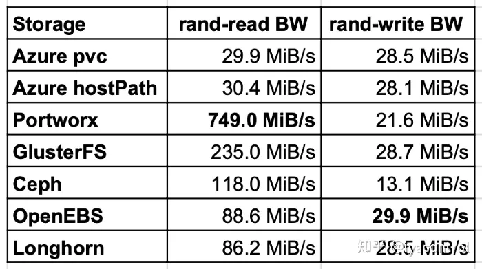
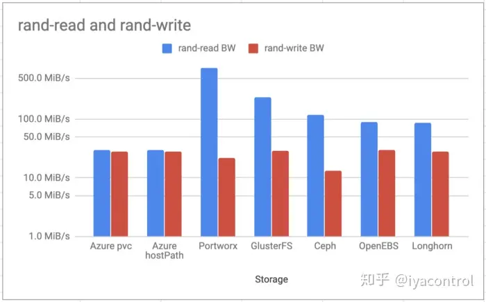
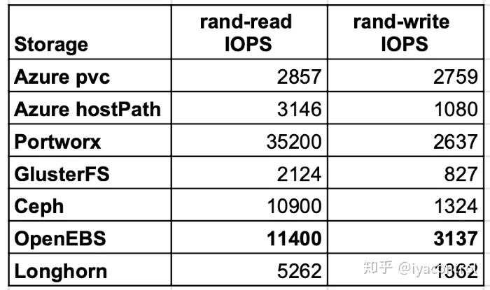
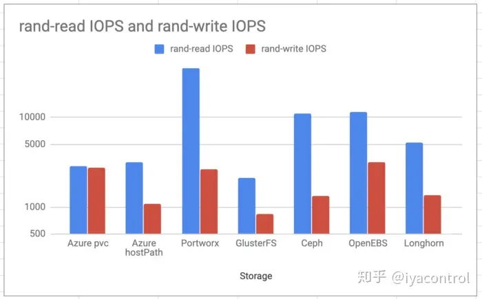
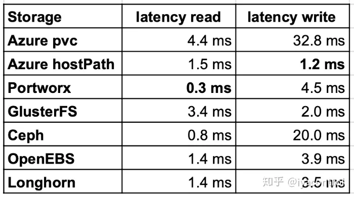
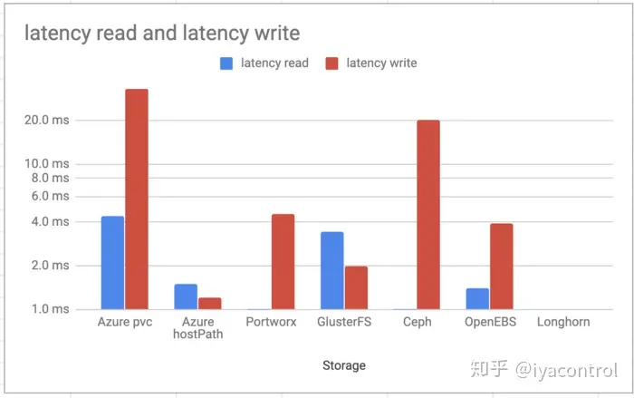
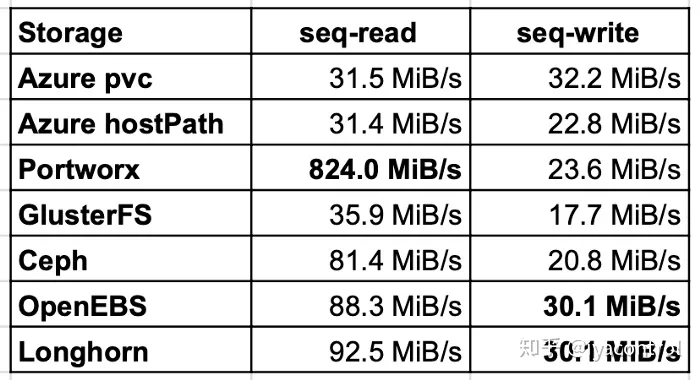
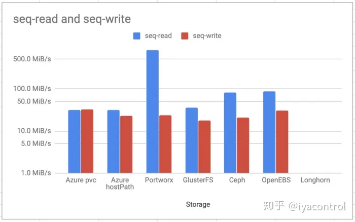
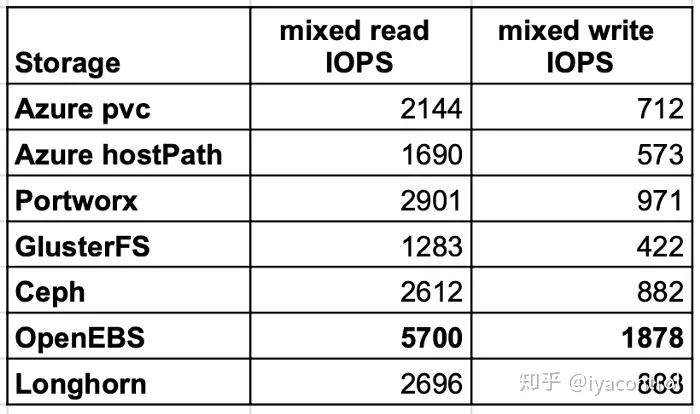
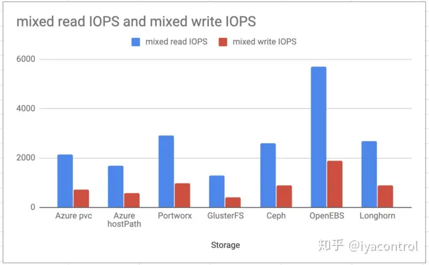

21 人赞同了该文章

本文主要评估Kubernetes最常见的存储解决方案，并进行基本性能测试。目前 CNCF 存储全景图下，已经囊括了45种左右的存储解决方案。本文主要涵盖以下几种存储解决方案：

- Azure pvc
- Azure hostPath
- Portworx
- GlusterFS
- Ceph
- OpenEBS
- Longhorn

## 性能测试

> 各个存储性能测试的结果无法单独评估，必须将测量结果相互比较。有多种执行比较测试的方法，这是最简单的方法之一。

为了运行测试，使用称为 [Dbench](https://link.zhihu.com/?target=https%3A//github.com/logdna/dbench) 的负载测试器，该仓库提供了测试所需的部署清单和镜像。

本文测试内容包括以下5种存储测试场景：

- 随机读写带宽
- 随机读写IOPS
- 读写延迟
- 顺序读/写
- 混合读/写IOPS

### 随机读写带宽

随机读测试表明，GlusterFS，Ceph和Portworx的读取性能比Azure本地磁盘上的主机路径好几倍。 OpenEBS和Longhorn的性能几乎是本地磁盘的两倍。原因是读取了缓存。对于OpenEBS，写入速度最快，但是Longhorn和GlusterFS的值也几乎与本地磁盘相同。

### 随机读写IOPS

随机IOPS测试中，Portworx和OpenEBS表现最好。OpenEBS在写入方面的IOPS比本地Azure PVC更好，这在技术上几乎是不可能的。它很可能与在测试用例运行的不同时间处的Azure存储负载有关。

### 读写延迟

LongHorn和OpenEBS的读延迟几乎是PortWorx的两倍。这仍然不错，因为Azure pvc比大多数其他经过测试的存储要慢。OpenEBS和Longhorn上写入的延迟更好。 GlusterFS仍然比其他存储更好。

### 顺序读/写

顺序读/写测试显示的结果与随机测试相似，但是Ceph的读性能比GlusterFS高2倍。写入结果几乎都处于同一水平，OpenEBS和Longhorn达到了相同的水平。

### 混合读/写IOPS

最后一个测试用例验证了混合读写IOPS，在读写方面，OpenEBS交付的速度几乎是PortWorx或Longhorn的两倍。

## 结论

在选择存储解决方案时，请仅将结果作为标准之一，不要仅根据本文的数据做出最终判断。

- Portworx和OpenEBS是AKS最快的容器存储。
- 围绕NVMe的稳健设计，OpenEBS似乎已成为最好的开源容器存储选项之一。
- 对于简单的块存储用例，Longhorn绝对是有效的选择，它与OpenEBS Jiva后端非常相似。

当然，这只是评估容器存储的一种方法。其他需要关注的部分还包括弹性和稳定性。

PS：本文属于翻译，[原文](https://link.zhihu.com/?target=https%3A//medium.com/volterra-io/kubernetes-storage-performance-comparison-v2-2020-updated-1c0b69f0dcf4)

发布于 2020-12-15 20:05

Kubernetes

分布式存储

Ceph