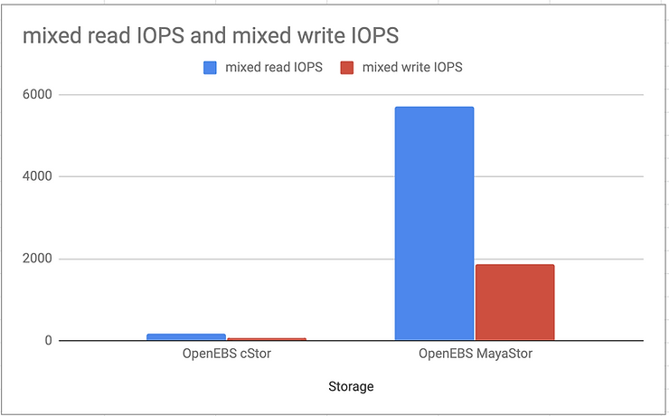

- 极客盖伊

  

- 

- - 2021 年 10 月 8 日
  - 
  - 2 分钟阅读

# Kubernetes持久存储性能测试

更新日期：6 月 22 日

***重要提示：单个存储性能测试的结果无法独立评估，但测量结果必须相互比较。执行比较测试的方法有多种，这是最简单的方法之一。\***

<iframe class="D-FLw" title="远程内容" allow="fullscreen" allowfullscreen="" src="https://6b1da63c-da3d-46bc-a2f0-9226f874885d.usrfiles.com/html/db9376e69cfa487ea0fa0b912ae51a4f_v1.html" style="-webkit-tap-highlight-color: rgba(0, 0, 0, 0); box-sizing: inherit; background: transparent; border: 0px; margin: 0px; outline: 0px; padding: 0px; vertical-align: baseline; height: 280px; overflow: hidden; width: 740px;"></iframe>

为了进行验证，我使用了完全相同的实验室，其中包含 Azure AKS 3 节点集群和附加到每个实例的 1TB 高级 SSD 托管磁盘。[详细信息您可以在之前的博客](https://medium.com/volterra-io/kubernetes-storage-performance-comparison-9e993cb27271)中找到。

为了运行我们的测试，我决定使用名为[Dbench](https://github.com/logdna/dbench)的相同负载测试器。这是 pod 的 K8s 部署清单，其中运行[FIO（](https://github.com/axboe/fio)带有 8 个测试用例的灵活 IO 测试器）。测试在Docker 镜像的[入口点](https://github.com/logdna/dbench/blob/master/docker-entrypoint.sh)指定：

- 随机读/写带宽
- 随机读/写IOPS
- 读/写延迟
- 顺序读/写
- 混合读/写 IOPS

一开始，我运行了 Azure PVC 测试以获得与去年进行比较的基线。结果几乎相同，因此我们可以假设条件保持不变，并且我们将使用相同的存储版本获得相同的数字。

## **随机读/写带宽**

随机读取测试表明，GlusterFS、Ceph 和 Portworx 的读取性能比 Azure 本地磁盘上的主机路径好几倍。OpenEBS 和 Longhorn 的性能几乎比本地磁盘好两倍。原因是读取缓存。OpenEBS 的写入速度最快，但 Longhorn 和 GlusterFS 也获得了与本地磁盘几乎相同的值。

<iframe class="D-FLw" title="远程内容" allow="fullscreen" allowfullscreen="" src="https://6b1da63c-da3d-46bc-a2f0-9226f874885d.usrfiles.com/html/db9376e69cfa487ea0fa0b912ae51a4f_v1.html" style="-webkit-tap-highlight-color: rgba(0, 0, 0, 0); box-sizing: inherit; background: transparent; border: 0px; margin: 0px; outline: 0px; padding: 0px; vertical-align: baseline; height: 280px; overflow: hidden; width: 740px;"></iframe>

## **随机读/写IOPS**

随机 IOPS 显示 Portworx 和 OpenEBS 的最佳结果。这次 OpenEBS 的写入 IOPS 甚至比本机 Azure PVC 还要好，这在技术上几乎是不可能的。最有可能的是与测试用例运行不同时间的 Azure 存储负载有关。

<iframe class="D-FLw" title="远程内容" allow="fullscreen" allowfullscreen="" src="https://6b1da63c-da3d-46bc-a2f0-9226f874885d.usrfiles.com/html/db9376e69cfa487ea0fa0b912ae51a4f_v1.html" style="-webkit-tap-highlight-color: rgba(0, 0, 0, 0); box-sizing: inherit; background: transparent; border: 0px; margin: 0px; outline: 0px; padding: 0px; vertical-align: baseline; height: 280px; overflow: hidden; width: 740px;"></iframe>

## **读/写延迟**

延迟读取获胜者与上次相同。LongHorn 和 OpenEBS 的数量几乎是 PortWorx 的两倍。这仍然不错，因为本机 Azure PVC 比大多数其他测试的存储要慢。然而，OpenEBS 和 Longhorn 上写入期间的延迟更好。GlusterFS 仍然优于其他存储。

##  

## **顺序读/写**

顺序读/写测试显示与随机测试相似的结果，但 Ceph 的读取性能比 GlusterFS 好 2 倍。写入结果几乎都处于同一水平，OpenEBS 和 Longhorn 达到了相同的水平。

<iframe class="D-FLw" title="远程内容" allow="fullscreen" allowfullscreen="" src="https://6b1da63c-da3d-46bc-a2f0-9226f874885d.usrfiles.com/html/db9376e69cfa487ea0fa0b912ae51a4f_v1.html" style="-webkit-tap-highlight-color: rgba(0, 0, 0, 0); box-sizing: inherit; background: transparent; border: 0px; margin: 0px; outline: 0px; padding: 0px; vertical-align: baseline; height: 280px; overflow: hidden; width: 740px;"></iframe>

##  

## **混合读/写 IOPS**

最后一个测试用例验证了混合读/写 IOPS，其中 OpenEBS 在读和写方面的性能几乎比 PortWorx 或 Longhorn 高出两倍。

<iframe class="D-FLw" title="远程内容" allow="fullscreen" allowfullscreen="" src="https://6b1da63c-da3d-46bc-a2f0-9226f874885d.usrfiles.com/html/db9376e69cfa487ea0fa0b912ae51a4f_v1.html" style="-webkit-tap-highlight-color: rgba(0, 0, 0, 0); box-sizing: inherit; background: transparent; border: 0px; margin: 0px; outline: 0px; padding: 0px; vertical-align: baseline; height: 280px; overflow: hidden; width: 740px;"></iframe>

## **结论**

本文展示了开源项目在一年内可以发生多么显着的变化！作为演示，我们来看看在完全相同的环境下 OpenEBS cStor 和 OpenEBS MayaStor 之间的 IOPS 比较。

请以结果作为您选择存储的标准之一，不要仅根据我的博客数据做出最终判断。从测试中我们可以得出结论：

- Portworx 和 OpenEBS 是 AKS 最快的容器存储。
- OpenEBS 似乎成为最好的开源容器存储选项之一，具有围绕 NVMe 的强大设计。
- 对于简单的块存储用例来说，Longhorn 绝对是一个有效的选择，它与 OpenEBS Jiva 后端非常相似。

当然，这只是查看容器存储选择的一种方法。有趣的部分还包括扩展性和稳定性。