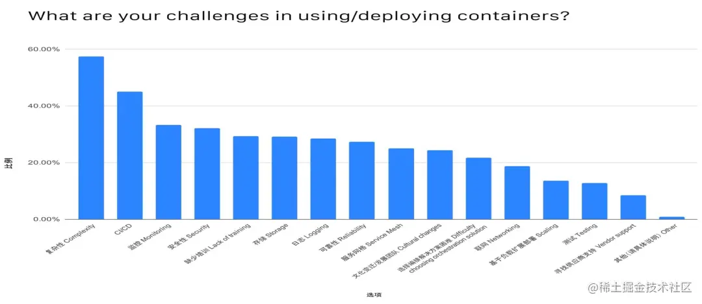

# 在云原生场景下构建企业级存储方案

[青云技术社区](https://juejin.cn/user/4451276781001799/posts)

2021-06-23 12:21493

# 引言

随着云原生技术日益普及的今天，在 Kubernetes 上运行无状态应用已经非常成熟，平滑扩展能力也很强，但对于有状态的应用，数据需要持久化存储，这还有很大提升的空间，面临着很多挑战。

# 云原生存储的挑战

 上图是 CNCF 对于“在使用/部署容器的过程中遇到的挑战”做出的调查报告。根据报告的结果，可以总结出云原生存储遇到的挑战表现在以下几个方面：

易用性：存储服务部署、运维复杂，云原生化程度低，缺少与主流编排平台整合。

高性能：大量应用 IO 访问，IOPS 需求高，低时延，性能成为应用运行效率瓶颈。

高可用：云原生存储已经应用到生产环境，需要高可靠/高可用，不能出现单点故障。

敏捷性：PV 快速创建、销毁、平滑的扩展/收缩，PV 随 Pod 迁移而快速迁移等。

# 常见云原生存储解决方案

Rook-Ceph：Rook-Ceph 是一个可以提供 Ceph 集群管理能力的 Operator，使用底层云原生容器管理，调度和编排平台提供的功能来执行其职责。

OpenEBS：OpenEBS 存储控制器本身就运行在容器中。OpenEBS Volume 由一个或多个以微服务方式运行的容器组成。

### 优势

1.与云原生编排系统的融合，具有很好的容器数据卷接入能力。

2.完全开源，社区较为活跃，网络资源、使用资料丰富，容易入手。

### 劣势

Rook-Ceph 不足：

性能差：IO 性能、吞吐、时延等方面都表现欠佳，很难应用在高性能服务场景。

维护成本高：虽然部署、入门简单，但组件多，架构复杂，排错困难，一旦运行中出现问题解决起来非常棘手，需要有很强的技术团队加以保障。

OpenEBS-hostpath 不足：没有高可用功能，单点故障。

OpenEBS-zfs-localpv 不足：在磁盘上安装 zfs，然后在 zfs上 创建 vol，也是没有高可用功能。

因此多在企业内部测试环境，很少用于持久化关键应用数据，部署到生产环境中。