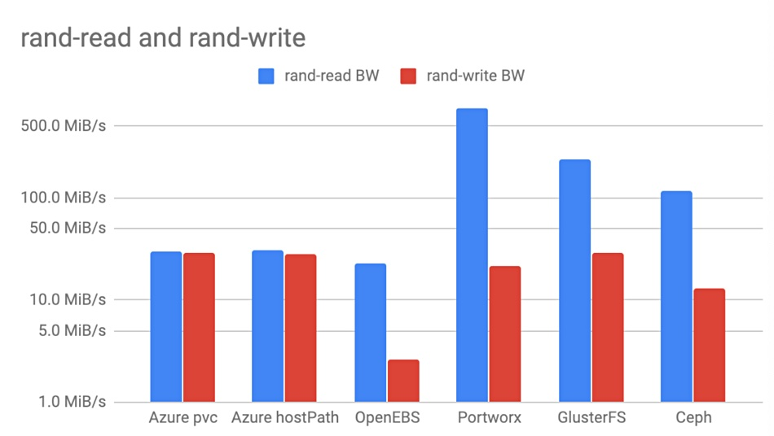
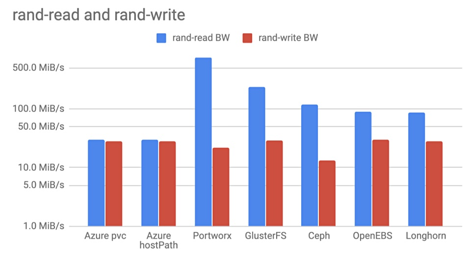
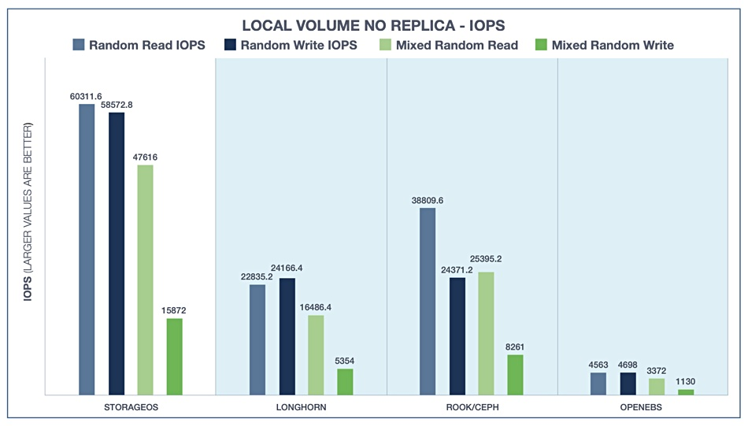
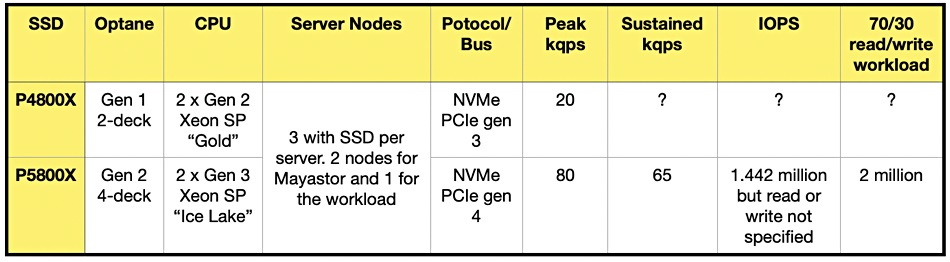
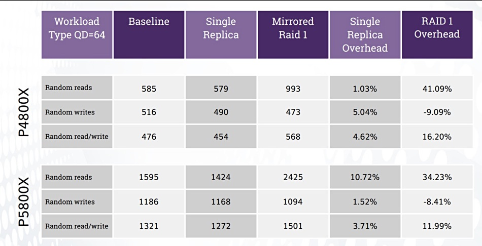

[家](https://blocksandfiles.com/) [集装箱储存](https://blocksandfiles.com/category/container-storage/) 英特尔表示，Mayastor 是最快的开源存储。那么这些...

- [集装箱储存](https://blocksandfiles.com/category/container-storage/)
- [集装箱](https://blocksandfiles.com/category/containers/)
- [闪光](https://blocksandfiles.com/category/flash/)
- [NVME](https://blocksandfiles.com/category/nvme/)

# 英特尔表示，Mayastor 是最快的开源存储。那么数字在哪里呢？

经过

 [克里斯·梅勒](https://blocksandfiles.com/author/chris-mellor/)

\-

2021 年 3 月 8 日

英特尔[宣称](https://mayadata.io/assets/pdf/product/intel-and-mayadata-benchmarking-of-openEBS-mayastor.pdf)“OpenEBS Mayastor 是 Kubernetes 最快的开源存储”，但该文档缺乏任何可以与其他 Kubernetes 存储产品（例如开源 Ceph 和 Gluster 或专有[Portworx](https://blocksandfiles.com/2020/09/16/pure-storage-plans-portworx-acquisition/)和 StorageOS）进行比较的细节。

Mayastor 与 Portworx 一样，都是容器附加存储 (CAS) 的一个示例。容器附加存储背后的想法是，存储控制器由 Kubernetes 编排——就像它编排容器一样——而不是通过到外部阵列的链接。数据本身是通过容器访问的，而不是通过平台外的共享存储系统。MayaData 正在开发的开源 OpenEBS CAS 软件在 Kubernetes 内运行，并使用任何 Kubernetes 堆栈为容器编排开源存储设施。

[MayaData](https://blocksandfiles.com/2020/02/04/mayadata-gets-funding-datacore-technology-and-resell-boost-for-its-kubernetes-storage/)首席执行官 Evan Powell[写道](https://www.cncf.io/blog/2018/04/19/container-attached-storage-a-primer/)：“容器附加存储的默认部署模式是超融合，数据保存在本地，然后复制到其他主机，这还有其他好处……采用容器附加存储的第二个原因是许多企业和组织的战略决策以避免锁定。”

## 存储引擎

MayaData 为 OpenEBS 开发了不同的存储引擎。它将存储引擎定义为 Kubernetes 编排容器的持久卷的数据平面组件。cStor（容器存储）引擎于 2018 年随 OpenEBS v0.7 一起推出。它提供 iSCSI 块存储并支持快照、克隆和精简配置。到 2019 年，如果云原生应用程序处于生产状态并且需要存储级复制，OpenEBS 推荐使用 cStor。

<iframe id="google_ads_iframe_/6978/BlocksAndFiles_2" name="google_ads_iframe_/6978/BlocksAndFiles_2" title="第 3 方广告内容" width="300" height="250" scrolling="no" marginwidth="0" marginheight="0" frameborder="0" role="region" aria-label="广告" tabindex="0" data-load-complete="true" data-google-container-id="3" style="box-sizing: border-box; max-width: 100%; border: 0px; vertical-align: bottom;"></iframe>

Mayastor 于 2019-2020 年开发，旨在采用为 cStor 开发的工作流程并通过使用 NVMe-oF 概念使其更快。这样做的目的是提高 IOPS 能力并降低延迟。Mayastor 于 11 月进入 Beta 测试，尚未以生产就绪状态发布。

[CAS 性能测试场景正在断断续续地发展，而 OpenEBS 本身也处于 beta 测试阶段，在StorageOS](https://blocksandfiles.com/2021/03/05/data-storage-news-digest-container-storage/)和 Volterra 测试中都处于落后位置。

## 沃尔泰拉测试

云原生平台服务供应商 Volterra 的 Jakub Pavlik于 2019 年 2 月针对 Portworx、Gluster、Ceph 和 Azure 容器存储测试了[cStor引擎的性能，所有这些引擎都在 Azure 公共云中运行。](https://medium.com/volterra-io/kubernetes-storage-performance-comparison-9e993cb27271)

*2019 年 2 月使用 cStor 进行 Volterra 测试。*

正如随机读写 IO 图表所示，OpenEBS cStor 的表现最差。它的得分为 23.1/2.6 MiB/秒（24.2/2.7 MB/秒），而 Portworx 的得分为 749/21.6 MiB/秒（785.4/22.6 MB/秒）。它还具有最低的 IOPS 和最长的延迟。

Pavlik在去年 9 月[重新进行了测试，但使用了 Mayastor 而不是 cStor。](https://medium.com/volterra-io/kubernetes-storage-performance-comparison-v2-2020-updated-1c0b69f0dcf4)它提供了 88.6/29.9 MiB/秒（92.3/31.4 MB/秒）的随机读/写吞吐量。他还测试了 Rancher Labs 的 Longhorn，如图所示；

*2020 年 9 月使用 Mayastor 进行 Volterra 测试。*

这些测试不能直接与 StorageOS 测试进行比较，但表明 OpenEBS Mayastor 的性能水平与 Longhorn 和 Ceph 大致相似，而不是像 cStor 后端那样远远落后。

## 存储操作系统

OpenEBS 的 cStor 在比较 Ceph、Gluster、Portworx 和 StorageOS 的 StorageOS 基准测试中表现最差。

该测试使用的是 cStor，而不是后来更快的 Mayastor。

## 英特尔和傲腾

MayaData-Intel 联合[文档](https://mayadata.io/assets/pdf/product/intel-and-mayadata-benchmarking-of-openEBS-mayastor.pdf)描述了 Intel 如何针对两个 Optane 数据中心 (DC) SSD 测试 Mayator；P4800X和更新的[P5800X ，发现它对 P5800X](https://blocksandfiles.com/2020/12/16/intel-launches-three-new-optane-drives-one-is-worlds-fastest-ssd/)[的](https://www.theregister.com/2017/11/10/intel_optane_drive_available/)原始设备 IO 的开销贡献不到 10%。

测试人员以每秒数千个查询 (kqps) 和 IOPS 来衡量性能，而不是带宽。他们还在测试过程中更改了系统组件，这使得与其他供应商进行性能比较变得更加困难。英特尔的主要目标不是提供一般的 CAS 性能测试结果，而是展示第二代 Optane SSD 与第一代 Optane 相比要好多少。

该文档提供了不完整的性能结果。

例如，没有 P4800X 系统的详细 kqps 或 IOPS 数字。相反，该文件声称“Optane SSD P5800X 的吞吐量比 Intel Optane SSD P4800X 提高了 2-3 倍，具体取决于配置。”

该文档包含此表，以表明使用两个 Optane 驱动器时 Mayastor 的性能比较；

与之前的峰值以及持续的 kqps 和 IOPS 相比，它使用不同的指标，且单位和时间未定义。

## 概括

无法将此结果推广到 Volterra 和 StorageOS Mayastor 基准测试。他们没有使用 Optane SSD 或 PCIe Gen 4，而且英特尔没有使用带宽测量，所有这些都使得比较变得不可能。英特尔宣称 Mayastor 是 Kubernetes 最快的开源存储，就其本身而言是没有问题的，但这对于在开源 OpenEBS、Ceph 和 Gluster 或专有的 Portworx 和 StorageOS 之间基于性能进行选择并没有多大用处。

我们从三个测试得出的结论；Volterra、StorageOS 和 MayaData-Intel 的优点是，很明显 Mayastor 比早期的 cStor 快，但我们不知道快多少。

- 标签
- [英特尔傲腾](https://blocksandfiles.com/tag/optane/)
- [库伯内斯](https://blocksandfiles.com/tag/kubernetes/)
- [玛雅数据](https://blocksandfiles.com/tag/mayadata/)
- [开放EBS](https://blocksandfiles.com/tag/openebs/)
- [波特沃克斯](https://blocksandfiles.com/tag/portworx/)
- [存储操作系统](https://blocksandfiles.com/tag/storageos/)