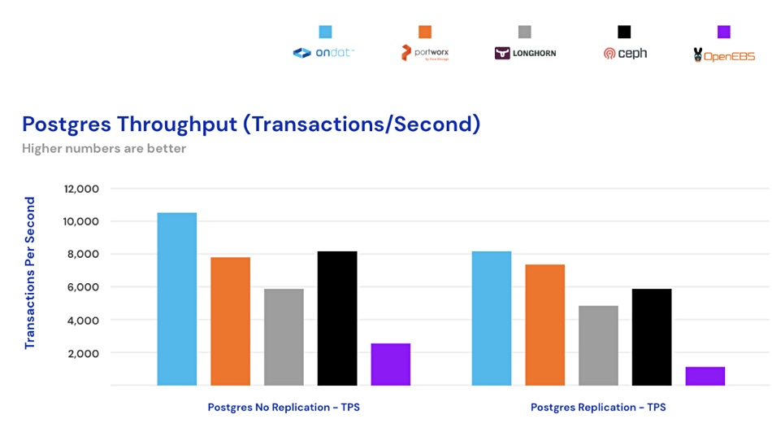

[家](https://blocksandfiles.com/) [集装箱储存](https://blocksandfiles.com/category/container-storage/) Ondat 在容器存储测试中击败 Pure 的 Portworx

- [集装箱储存](https://blocksandfiles.com/category/container-storage/)
- [集装箱](https://blocksandfiles.com/category/containers/)
- [公有云](https://blocksandfiles.com/category/public-cloud/)

# Ondat 在容器存储测试中击败 Pure 的 Portworx

经过

 [克里斯·梅勒](https://blocksandfiles.com/author/chris-mellor/)

 \-

2022 年 12 月 15 日

当向三个数据库配置容器本机存储时，Ondat 在性能和延迟方面领先于 Pure 的 Portworx。

一项架构 IT 测试、针对 Kubernetes 的性能基准数据库平台和云原生存储解决方案，比较了五个容器存储提供商：[Ondat](https://blocksandfiles.com/2022/07/18/ondat-layoffs/)、[Portworx](https://blocksandfiles.com/2022/10/27/pure-storage-portworx/)、[OpenEBS/cStor](https://www.theregister.com/2017/10/10/containernative_storage_product_uses_google_container_scheduling_tech/)、Rancher Labs 的[Longhorn](https://blocksandfiles.com/2020/06/02/rancher-labs-kubernetes-storage/)和[Rook/Ceph](https://blocksandfiles.com/2021/03/05/data-storage-news-digest-container-storage/)。它着眼于性能一致性以及延迟和速度。

*克里斯埃文斯*

负责测试的首席分析师 Chris Evans 表示：“容器原生存储已经成为一种新的软件定义存储类别，其中数据存储的传统功能（弹性、数据保护、可扩展性）被内置到 Kubernetes 集群内运行的容器中。这使得部署能够使用本地存储资源，无论是本地解决方案中的物理存储还是公共云中的本机存储（包括 NVMe）。”

他继续说道：“公共云的效率低下会转化为额外的成本。这些成本随着系统规模的扩大而增加。因此，容器原生存储必须提供高性能、低延迟和最小开销，以最大限度地降低成本，同时保持数据完整性。”

<iframe id="google_ads_iframe_/6978/BlocksAndFiles_2" name="google_ads_iframe_/6978/BlocksAndFiles_2" title="第 3 方广告内容" width="300" height="250" scrolling="no" marginwidth="0" marginheight="0" frameborder="0" role="region" aria-label="广告" tabindex="0" data-load-complete="true" data-google-container-id="3" style="box-sizing: border-box; max-width: 100%; border: 0px; vertical-align: bottom;"></iframe>

测试是在安装了供应商软件的 Kubernetes 集群上进行的。每个测试的配置基于一台 Kubernetes 主服务器和三台 Kubernetes 数据服务器。测试台是四服务器配置：

- 配备 64GB DDR4-2400 DRAM 的戴尔 R640 服务器
- 双 Intel Xeon Silver 4108 CPU @1.80GHz
- 1块WD Gold NVMe SSD（960GB容量）数据盘
- 一对 136GB RAID-1 HDD（操作系统驱动器、硬件 RAID）
- 10GbE 网络
- Ubuntu 服务器 20.04、Kubernetes 1.22

使用 Postgres 进行测试时，数据显示 Ondat 的数据库事务吞吐量比 Portworx 快 32%。OpenEBS 是最慢的产品。Rook/Ceph 在非复制模式下使用 Postgres 击败了 Portworx，如下图所示：

Postgres 延迟图表显示了类似的供应商排名：

对 100 次写入和 1 次读取以及打开复制进行的 Redis 吞吐量测试表明，Portworx 在每秒操作数方面击败了 Ondat。然而，在没有复制和 70 写入/30 读取比率的重复测试中，Ondat 击败了 Portworx：

测试报告的结论是：“与本次测试中的所有竞争对手解决方案相比，Ondat 继续提供最高效的吞吐量和延迟性能。” [请在此处](http://www.ondat.io/benchmarking)获取副本并阅读更详细的结果 。Ondat[博客](https://www.ondat.io/blog/ondat-outpaces-other-container-native-storage-solutions)也讨论了该测试。

- 标签
- [翁达特](https://blocksandfiles.com/tag/ondat/)
- [波特沃克斯](https://blocksandfiles.com/tag/portworx/)