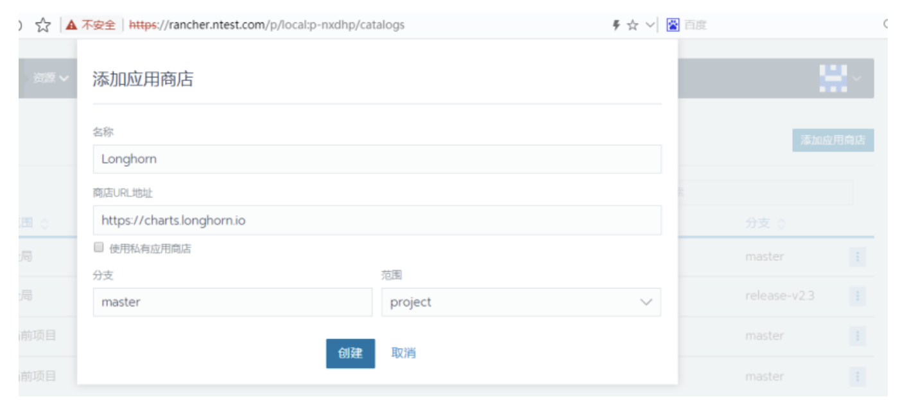

[边缘计算社区](http://aijishu.com/u/byjs)· 2022年12月02日· 北京市

# [云原生存储工具的选型和应用探讨](http://aijishu.com/a/1060000000371835)

[存储](http://aijishu.com/t/storage)

**Labs 导读**

随着云原生概念在业界的推广，传统应用部署的方式被容器化部署所取代。基于云原生的容器化部署和运维，给开发和运维人员带来DevOps快速部署和自动化运维等诸多便利的同时，对于基础架构服务也提出了更高的要求，其中存算分离就是保障云原生应用故障快速转移、算力负载均衡的基石。因此云原生存储的概念也在云原生的基础上应运而生，接下来本文将会逐步梳理云原生存储的概念、工具的选型，最后会选择一个代表性的云原生存储工具来演示如何使用。

> 作者：郭杨勇
>
> 单位：中国移动智慧家庭运营中心

# **1 云原生存储的概念**

云原生存储的概念来源于云原生应用，顾名思义：一个应用为了满足云原生特性的要求，其对存储所要求的特性是云原生存储的特性，而满足这些特性的存储方案，可以称其为倾向云原生的存储。


图1

如上图1所示，云原生应用对于存储的要求，可以概括为三方面：

- **敏捷化需求：**可以灵活的将块设备在不同节点进行快速的挂载切换；提供存储服务的问题自动修复能力，减少人为干预；提供更加灵活的卷大小配置能力。
- **监控需求：**提供更细粒度（目录）的监控能力；提供更多维度的监控指标，如读写时延、读写频率、IO分布等指标。
- **租户隔离需求：**让共享文件系统的不同租户之间实现文件系统级别的隔离效果；容器编排层实现基于名词空间、PSP策略的编排隔离能力，保证不同租户从应用部署侧即无法访问其他租户的存储卷服务。

满足以上需求的存储工具，又可以分为以下几类：

- **公有云存储：**基于公有云的对象存储、块存储、文件存储、数据库，在稳定性、性能、扩展性方面都能轻松满足业务需求。
- **商业化私有云存储：**很多云存储提供商都是在存储技术上深耕多年，具有优异的技术能力和运维能力，目前都已提供了云原生的支持。
- **自建云存储：**基于一些开源的架构，在自己的物理机系统搭建私有的云存储服务，如Ceph、GlusterFS等。
- **开源容器存储：**设计之初既充分考虑了存储与云原生编排系统的融合，具有很好的容器数据卷接入能力，Longhorn[1]、OpenEBS[2]。

以上满足云原生基本要求的存储方案中，公有云存储、商业化的私有云存储的部署位置和成本的限制，无法完全应用在私有云环境，而基于开源架构自建的云存储，可靠性不高，且维护成本高，还无法完全与云原生集群实现一体化运营。所以下文将重点介绍开源的容器化存储方案。

# **2 开源容器存储的技术路线**


图2

如上图2所示，目前比较主流的开源容器存储解决方案，主要包括：

- **基于云原生社区重新造轮子--原生方案：**基于容器化和k8s的应用场景，单独开发一套比较轻量的分布式存储系统。典型的开源项目有Longhorn、OpenEBS。
- **移植传统的分布式存储--移植方案：**基于传统的分布式存储框架，进行容器化和k8s的编排，移植到k8s集群中部署。典型的开源项目有rook+ceph[3]、heketi+glusterfs[4]、minio[5]。

笔者所在的项目对开源容器存储方案进行初步调研后认为minio仅可以提供对象存储服务，无法进行磁盘挂载，而heketi+gluster的开源项目已停止维护，所以首先将minio和heketi+gluster的方案排除。

# **3 开源容器存储的主要工具介绍**

**3.1 Longhorn云原生存储**

Longhorn最早由Rancher社区创建和开发，完全使用容器和微服务实现分布式块存储。Longhorn为每个块设备卷创建一个专用的存储控制器，并在跨多个节点上存储的多个副本同步复制该卷。存储控制器和副本本身使用Kubernetes进行编排。

Longhorn设计有两层：数据平面(data plane)和控制平面(control plane)。Longhorn Engine是存储控制器对应数据平面，Longhorn Manager对应控制平面。

- **控制引擎：**负责在Kubernetes集群中创建和管理卷，并处理来自UI或Kubernetes卷插件的API调用。当Longhorn Manager被要求创建一个卷时，它会在该卷所连接的节点上创建一个Longhorn Engine实例。
- **数据引擎：**始终在与使用Longhorn volume的Pod相同的节点中运行。它跨存储在多个节点上的多个副本同步复制卷。引擎(Engine)和副本(replicas)使用Kubernetes进行编排。

**3.2 OpenEBS云原生存储**

OpenEBS是kubernetes下与容器原生和容器附加存储类型相关的开源项目之一，由CloudByte最早研发，并开源到CNCF。基于GO语言进行开发，通过为每个工作负载指定专用的存储控制器，OpenEBS遵循容器附加存储或CAS的原则，允许操作员和管理员根据工作量动态调整卷的大小。

OpenEbs分为了控制面板和数据面板，其中：

- **控制面板：**包含了节点组件和集群组件两类pod，其中NDM(Node Disk Manager)负责识别和管理每个节点上的磁盘；m-apiserver暴露了存储REST API，并承担了大部分的卷策略处理和管理。Provisioner实现了K8s中PVC同m-apiserver的交互。NDM Operator用户控制NDM的初始化和生命周期管理。
- **数据面板：**分为cStor、Jiva、LocalPV三种不同的pod与业务pod伴生存在。其中Jiva实际上就是使用的Longhorn引擎；而LocalPV就是K8S的本地PV模式，副本无法复制，故障无法转移。

**3.3 Rook+Ceph容器化存储**

Rook本身并不是一个分布式存储系统，而是利用Kubernetes平台的强大功能，通过Kubernetes Operator为每个存储提供商提供服务。它将分布式存储系统转变为自我管理、自我扩展、自我修复的存储服务。

Ceph是圣克鲁兹加利福尼亚大学的sage weil在2003年开发的，也是他的博士项目的一部分。初始原型是大约4万行c++代码的ceph文件系统，2006年遵循LGPL协议进行开源。

Ceph架构主要有两个核心模块：监视器(MON)、存储器(OSD)。此外还包括了一个基于aws s3的对象存储网关RadosGW；块存储、文件存储相关的系统插件。其中：

- **监视器：**用于保存并更新集群的结构、状态信息，负责控制块存储和文件存储的元数据信息。默认为三个副本的选举集群。
- **存储器：**用于存储数据、数据自动校验、数据容量自平衡；定时向监视器上报心跳，并对外提供数据的写入和读取API。

Rook+Ceph的组合解决方案是目前比较成熟的一套Ceph容器化部署移植方案，Rook在其中主要完成Ceph集群的初始化和状态挂你、Kubernetes对接的工作，真正的存储业务逻辑都还是由容器化运行的Ceph集群来实现。

**3.4 开源容器化存储项目特性的横向比较**

在笔者的测试环境依次对以上三个开源容器化存储工具的功能和性能测试情况来看，三者的比较情况如下表1所示：


表1

笔者所在项目综合考虑了三者的优缺点、磁盘性能损耗和维护复杂度后，认为Longhorn不支持条带化的缺点可以通过挂载Linux卷组的方式予以规避，所以最终选择使用**Longhorn**。

# **4 Longhorn的安装和使用**

为每个节点安装ISCSI（小型计算机网络接口）守护进程，如果集群节点都已安装，则无需此操作。

```
yum install -y iscsi-initiator-utils && systemctl enable --now iscsid.
```

如下图6，将Longhorn仓库添加到rancher应用商店当中，这样就可以在rancher的应用商店列表中看到Longhorn应用了。



图6

如下图7和8，在rancher的应用商店列表中选择Longhorn并安装，就可以在这里预设longhorn的域名、默认路径、默认副本数等。


图8

所有组件安装完成后，通过上一步设定的Longhorn域名，就可以打开主页的UI，进行存储路径、自动备份、劵分配和挂载等操作了。


图9

用户除了通过上图9的页面去创建PVC之外，也可以直接在rancher页面的PVC创建页面中选择使用Longhorn作为StorageClass，如下图10所示。


# **5 总结**

到这里，就完成了云原生存储工具选型和应用的初步探讨，虽然笔者的项目出于易维护性和成本的考虑最终选择了Longhorn，但Rook+Ceph和OpenEBS两套方案，在特定条件下，还是具备其使用价值的。而有条件的项目，使用共有云或购买商业的私有云存储也都是不错的选项。

> 作者： 移动Labs
> 来源：[边缘计算社区](http://aijishu.com/link?target=https%3A%2F%2Fmp.weixin.qq.com%2Fs%2FQoVlOe01hGWSYEKS8wfsKw) 

**推荐阅读**

- [超异构融合：边缘计算腾飞的契机](https://aijishu.com/a/1060000000370875)
- [全球6G产业及政策进展研究](https://aijishu.com/a/1060000000365731)
- [2022年端边云协同的AI视觉产业研究报告](https://aijishu.com/a/1060000000364065)
- [隐私计算概述](https://aijishu.com/a/1060000000363721)