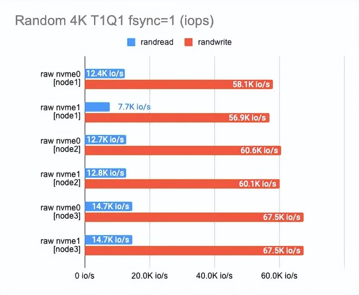
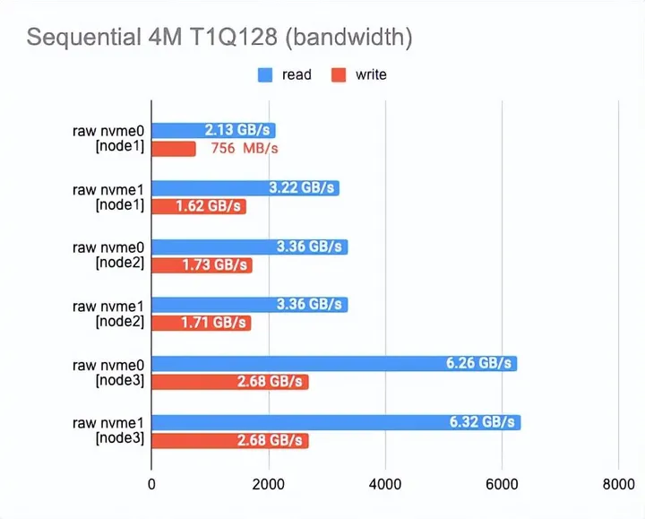
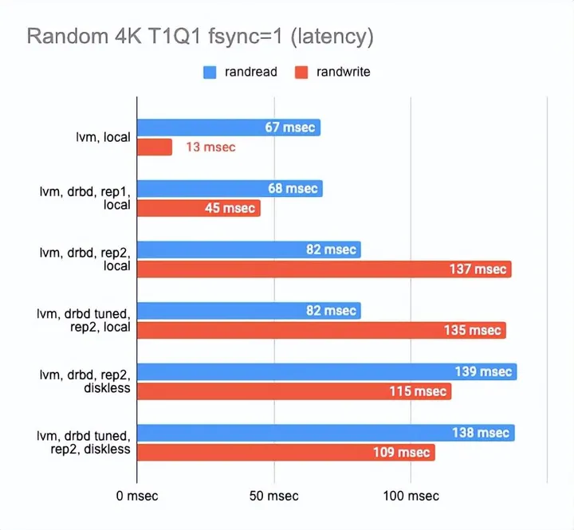
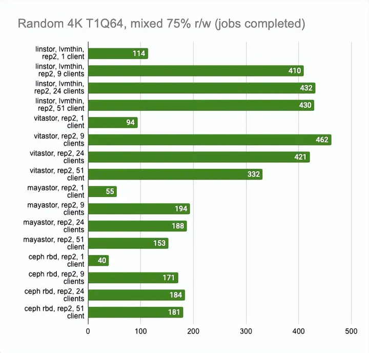

# Kubernetes 中 Ceph、LINSTOR、Mayastor 和 Vitastor 存储性能对比

[](https://www.zhihu.com/org/xin-tai-yun-fu-72)

[新钛云服](https://www.zhihu.com/org/xin-tai-yun-fu-72)

云和安全管理服务专家

已关注

10 人赞同了该文章


通常情况下，我们需要为 Kubernetes 平台找到一种易于使用、可靠的块存储。

因此，本文将对几个开源存储解决方案进行基准测试，以了解它们在各种条件下的性能。本次对比也是在不同硬件配置条件下对DRBD([https://en.wikipedia.org/wiki/Distributed_Replicated_Block_Device](https://link.zhihu.com/?target=https%3A//en.wikipedia.org/wiki/Distributed_Replicated_Block_Device)) 进行测试以及与 Ceph ([https://ceph.io/en/](https://link.zhihu.com/?target=https%3A//ceph.io/en/)) 的测试结果比较。

然而，软件定义存储市场在不断发展和演变。新的项目不断的涌现，包括最近发布的 Mayastor ([https://github.com/openebs/mayastor](https://link.zhihu.com/?target=https%3A//github.com/openebs/mayastor)) 和 Vitastor ([https://vitastor.io/](https://link.zhihu.com/?target=https%3A//vitastor.io/)) 。本文也包含了这两种新兴存储。


## **测试环境**

### **01硬件**

- **服务器**：三台AX61服务器。
- **CPU**：AMD Ryzen 9 3900 (24) @ 3.100GHz
- **内存**：Micron 32GB DDR4-3200 ECC UDIMM 2Rx8 CL22 (four modules per server)
- **磁盘**：SAMSUNG MZQLB1T9HAJR-00007 1.92 TB (two per server).
- **网络**：10G (Intel 82599ES); 1G (Intel I210)


### **02核心软件**

- **操作系统：** Ubuntu 20.04.3 LTS（Focal Fossa）；
- **内核：** 5.4.0-54-generic。


### **03主要软件版本**

- **DRBD**：9.1.4 (linstor-server v1.17.0);
- **Ceph**：16.2.7 (rook v1.8.2);
- **Mayastor**：1.0.0；
- **Vitastor**：0.6.12 (kernel 5.13.0-27-generic);
- **ZFS：** 0.8.3；
- **LVM**：2.03.07


### **04测试块信息**

- **虚拟卷大小**：100G（在单个客户端测试中）；10G（在多个客户端的测试中）；
- **DRBD 同步协议**：C（完全同步），启用 **bitmap**。


## **基准测试**

基准测试分几个步骤进行：

1. 测试“原始”NVMe 驱动器的性能；
2. 测试后端开销（LVM vs LVMThin vs ZFS）；
3. 测试 DRBD 开销；
4. 与其他集群文件系统比较；
5. 通过千兆网络进行基准测试；
6. 压力测试。

下面是本文提供的一些使用 fio 测试的命令：

```text
fio -name=randwrite_fsync -ioengine=libaio -direct=1 -randrepeat=0 -rw=randwrite -bs=4k -numjobs=1 -iodepth=1 -fsync=1
fio -name=randwrite_jobs4 -ioengine=libaio -direct=1 -randrepeat=0 -rw=randwrite -bs=4k -numjobs=4 -iodepth=128 -group_reporting
fio -name=randwrite -ioengine=libaio -direct=1 -randrepeat=0 -rw=randwrite -bs=4k -numjobs=1 -iodepth=128
fio -name=write -ioengine=libaio -direct=1 -randrepeat=0 -rw=write -bs=4M -numjobs=1 -iodepth=16
fio -name=randread_fsync -ioengine=libaio -direct=1 -randrepeat=0 -rw=randread -bs=4k -numjobs=1 -iodepth=1 -fsync=1
fio -name=randread_jobs4 -ioengine=libaio -direct=1 -randrepeat=0 -rw=randread -bs=4k -numjobs=4 -iodepth=128 -group_reporting
fio -name=randread -ioengine=libaio -direct=1 -randrepeat=0 -rw=randread -bs=4k -numjobs=1 -iodepth=128
fio -name=read -ioengine=libaio -direct=1 -randrepeat=0 -rw=read -bs=4M -numjobs=1 -iodepth=16
```


针对上述测试命令，这篇文章([https://yourcmc.ru/wiki/Ceph_performance](https://link.zhihu.com/?target=https%3A//yourcmc.ru/wiki/Ceph_performance)) 也详细介绍了下，简述如下：

> *为什么在基准测试中这些命令？毕竟，有很多参数会影响磁盘性能，例如：*
> *块大小；*
> 模式——读、写或各种混合读/写模式；
> *并行度——队列深度和线程数，换句话说，并行 I/O 请求的数量；*
> *测试时间；*
> *初始磁盘状态——空、线性填充、随机填充和在特定时间段内随机写入；*
> *数据分布——例如，10%的热数据和90%的冷数据或热数据位于某个地方（例如，在磁盘的开头）；*
> *其他混合测试模式，例如，同时使用不同块大小的基准测试。*
> *结果还可以以不同级别的详细信息呈现 - 除了单纯的平均操作数或每秒兆字节数之外，您还可以提供曲线图、直方图、百分位数等。这些都有助于了解当前测试情况。*
> *基准测试也伴随着一些问题。例如，一些服务器 SSD 厂商认为我们必须通过随机覆盖磁盘至少两次来填充转换表来进行预处理，然后再进行测试。相反，我相信它会将 SSD 置于现实生活中很少遇到的极端条件下。*
> *其他人说你应该绘制延迟与每秒操作数的关系图，但在我们看来这也有点奇怪，因为这意味着你绘制的是 F1(q) 与 F2(q) 而不是“q”的关系图本身。*
> *简而言之，基准测试可能是一个持久的过程。获得完整的结果可能需要几天时间。这通常是像 3dnews 这样的资源在他们的 SSD 评论中所做的。但我们不想花费几天的时间。我们需要一个能让我们快速评估性能的测试。*
> *因此，我们排除了一些“极端”模式，检查其中的磁盘，并假装其他结果介于这些“极端”之间，形成某种取决于参数的平滑函数。这些模式中的每一种也对应于一个有效的用例，这也很方便：*
> *主要使用线性或大块访问的应用程序：对于此类应用程序，关键特征是线性 I/O 速度（以兆字节/秒为单位）。因此，第一个测试模式是线性读/写，具有 4 MB 块和 16-32 操作的中等队列深度。测试结果应以 MB/s 为单位。*
> *使用随机小块访问并支持并行性的应用程序。这导致我们使用 4 KB 随机 I/O 模式，队列深度至少为 128 个操作。4 KB 是大多数文件系统和 DBMS 的标准块大小。如果单个线程无法在测试期间使驱动器饱和，则应使用多个 (2-4-8) CPU 线程。测试结果应包括 iops（每秒 I/O 操作数），但不包括延迟。延迟在这个测试中没有意义，因为它可以通过增加队列深度任意增加——延迟与 iops 直接相关，公式为 latency=queue/iops。*
> *使用随机小块访问且不支持并行性的应用程序。此类应用程序比您想象的要多；关于写入，所有事务性 DBMS 都是一个值得注意的例子。这导致我们进行队列深度为 1 的 4 KB 随机 I/O 测试，对于写入，在每次操作后进行 fsync 以防止磁盘或存储系统通过将数据写入易失性缓存来“作弊”。结果应包括 iops 或延迟，但不能同时包括两者，因为正如我们之前所说，它们彼此直接相关。


基于这些信息，本文提供了一个脚本 (
[https://gist.github.com/kvaps/e36b82826fb8e36d0362c7f4033948d0](https://link.zhihu.com/?target=https%3A//gist.github.com/kvaps/e36b82826fb8e36d0362c7f4033948d0)) 来运行每个测试，然后收集并解析获得的数据。

请注意，以下所有图表均基于上面列出的八项测试。每个测试只运行一分钟。当然，这些时间不足以完全探索所有的细微之处，但对于不同解决方案的一般比较来说已经足够了。


### **01测试“原始”NVMe 性能**

任何基准测试都应该从基础磁盘本身的测试开始。

这是查看我们在性能上损失了多少的起点。

根据测试结果，您可以看到我们使用的磁盘在性能上有所不同——这（可能）是由于它们的老化。








### **02测试后端开销**

现在我们获取到了 NVMe 本身的性能，下面我们需要测量每个后端的性能。众所周知，DRBD 可以在任意块设备之上工作，甚至可以在原始未分区磁盘之上工作。

然而，自 DRBD9 发布以来，为每个虚拟机或容器使用专用设备的想法已成为主流，因为它有助于扩展并减少系统故障的影响。逻辑卷管理器使批量准备大小合适的新卷变得更加容易。此外，它还支持各种新的功能，如实时调整大小、快照、重复数据删除等。

**LINSTOR** (
[https://linbit.com/linstor/](https://link.zhihu.com/?target=https%3A//linbit.com/linstor/)) 支持不同的后端，包括 LVM、LVMThin 和 ZFS。它们将在下面进行测试。为了进行测试，我们使用了可用的最快磁盘（在节点 3 上）并测量了它们的性能。下面是结果：


如上所见，与 LVMThin 和 ZFS 相比，经典 LVM 几乎没有开销，但它支持的功能并不多。

如果我们要进行快照，我们必须使用 LVMThin 或 ZFS，因为它们支持 COW ([https://en.wikipedia.org/wiki/Copy-on-write](https://link.zhihu.com/?target=https%3A//en.wikipedia.org/wiki/Copy-on-write))并且可以在不影响性能的情况下拍摄快照。

LVMThin 的顺序读/写操作很好，但是随机读/写操作有很多不足之处。如果整个卷都用零填充（因此，磁盘空间得到预分配）并达到“原始”磁盘性能的一半，则性能结果会更好。

ZFS 结果明显更差。我们试图通过调整块大小来调整它。不幸的是，它对结果几乎没有影响（我们测试了 512、4K、32K 和 512K 块大小；默认值为 8K）。较小的块大小略微提高了性能，但延迟也显着增加。更大的块大小增加了顺序读写速度，但这不是我们的目标。

然后我们决定将 ZFS 搁置一旁，并尝试使用 LVMThin 进行同样的操作。las，更改块大小对测试结果几乎没有影响。

**最终，我们选择了默认设置的 LVM 或 LVMThin。**

LINSTOR 可以使用 LUKS 加密卷，我们很好奇这种加密在性能损失方面的成本是多少。事实证明，对 LUKS 的影响很小：对于偶尔的随机读/写或顺序操作，性能几乎没有变化，而对于一系列随机操作，性能仅减半。您可以在图表中看到：


### **03测试DRBD开销**

在后端确认下来后，我们开始确定 DRBD 副本开销。我们测试了每个可用的后端，但我们在这里只将 LVM 作为主要示例。

使用以下三种配置进行 DRBD 基准测试：1 个副本（纯 DRBD 开销）、两个本地副本和两个带有远程无盘客户端的副本。

以下是结果：





该图显示 DRBD 显著降低了随机读/写速度，使顺序操作几乎没有开销。

启用二个副本会稍微降低操作速度并增加没有并行性的测试的延迟。

**但这很有意义：我们同时写入两个副本并等待每个副本的操作完成。**

在无盘客户端的情况下，两个副本都在远程服务器上，因此客户端需要连接到它们，因此速度下降和延迟增加。

此时可以得出以下结论：

- 在两个副本的情况下，其中一个在本地，与 “raw” 设备相比，性能下降了三倍，而延迟增加了一倍（实际上这只是 CPU 的开销）。
- 在两个副本和一个远程无盘客户端的情况下，性能下降了四倍或更多，而延迟加倍。

DRBD 调整对最终结果几乎没有影响，所以在后续测试中没有使用它。


### **04与其他集群文件系统的比较**

看起来有很多因素会导致太多的性能损失，所以在这一点上，我们决定将 DRBD 与其他解决方案进行比较。一共有三个：Ceph RBD、Mayastor 和实验性存储 Vitastor。

为了公平起见，我们决定使用速度较慢的后端 LVMThin，它支持 COW 和快照创建，就像 Mayastor 以外的许多其他集群文件系统一样。

这是我得到的：


结果让我吃惊。

Local Mayastor在随机写操作上排名第一，Vitastor排名第二，其次是local DRBD、Ceph、diskless DRBD。

本地 DRBD 在读取测试中表现最好，结果良好且延迟最低。


### **05千兆网络基准测试**

我还想知道每种解决方案在千兆网络上的表现如何：


如上所见，所有四种解决方案都完美地利用了千兆以太网通道。然而，结果还有很多不足之处。Mayastor 的表现比其他人一点。DRBD 在读方面非常出色，但写作速度依然是很糟糕。


### **06压力测试**

现在是最重要的部分：压力测试。上述测试旨在了解存储能力。对于这一部分，我们将尝试模拟真实环境的负载，看看每个解决方案如何处理它。

我们将使用具有 75% 的随机读取和 25% 的随机写入操作的标准 r/w 测试，并运行它的多个副本。


```text
fio -name=test -filename=/dev/xvda -ioengine=libaio -direct=1 -rw=randrw -rwmixread=75 -bs=4k -numjobs=1 -iodepth=64 -size=4G
```


我们将设置 15 分钟的时间限制，看看在这段时间内完成了多少测试，然后将编译通用统计数据。

LINSTOR 和 Mayastor 比其他解决方案领先一步，因为它们建议设置volumeBindingMode: WaitForFirstConsumer，从而在我们的 Pod 最终所在的同一节点上配置卷。我们决定禁用此功能以比较类似环境中的解决方案。

Ceph 还配置为每个驱动器运行两个 OSD 并设置更多 pg (512)。





*最后两张图显示了节点上的总资源消耗，但这个信息很难客观，所以不要想当然。如需更详细的分析，我建议查看 Grafana 图。*

Grafna 对应的图表如下：

- LINSTOR (LVMThin)：([https://kvaps.github.io/images/posts/Comparing-Ceph-LINSTOR-Mayastor-and-Vitastor-storage-performance-in-Kubernetes/linstor_lvmthin.html](https://link.zhihu.com/?target=https%3A//kvaps.github.io/images/posts/Comparing-Ceph-LINSTOR-Mayastor-and-Vitastor-storage-performance-in-Kubernetes/linstor_lvmthin.html));
- Vitastor1：([https://kvaps.github.io/images/posts/Comparing-Ceph-LINSTOR-Mayastor-and-Vitastor-storage-performance-in-Kubernetes/vitastor1.html](https://link.zhihu.com/?target=https%3A//kvaps.github.io/images/posts/Comparing-Ceph-LINSTOR-Mayastor-and-Vitastor-storage-performance-in-Kubernetes/vitastor1.html));
- Vitastor2：([https://kvaps.github.io/images/posts/Comparing-Ceph-LINSTOR-Mayastor-and-Vitastor-storage-performance-in-Kubernetes/vitastor2.html](https://link.zhihu.com/?target=https%3A//kvaps.github.io/images/posts/Comparing-Ceph-LINSTOR-Mayastor-and-Vitastor-storage-performance-in-Kubernetes/vitastor2.html));
- Mayastor：([https://kvaps.github.io/images/posts/Comparing-Ceph-LINSTOR-Mayastor-and-Vitastor-storage-performance-in-Kubernetes/mayastor.html](https://link.zhihu.com/?target=https%3A//kvaps.github.io/images/posts/Comparing-Ceph-LINSTOR-Mayastor-and-Vitastor-storage-performance-in-Kubernetes/mayastor.html));
- Ceph：([https://kvaps.github.io/images/posts/Comparing-Ceph-LINSTOR-Mayastor-and-Vitastor-storage-performance-in-Kubernetes/ceph.html](https://link.zhihu.com/?target=https%3A//kvaps.github.io/images/posts/Comparing-Ceph-LINSTOR-Mayastor-and-Vitastor-storage-performance-in-Kubernetes/ceph.html)).

即使有大量客户端读写，LINSTOR 也始终显现出很好的结果；Vitastor 几乎同样出色。

Mayastor 和 Ceph 紧随其后。此外，正如 Grafana 图表清楚地显示的那样，Ceph 消耗了更多的 RAM 和 CPU 资源。

在这里，我们必须指出，Mayastor 目前不支持 COW 和快照，因此您可以放心地将它与具有 LVM 后端的 LINSTOR 进行比较：


Grafana 图形：

- Mayastor：([https://kvaps.github.io/images/posts/Comparing-Ceph-LINSTOR-Mayastor-and-Vitastor-storage-performance-in-Kubernetes/mayastor.html](https://link.zhihu.com/?target=https%3A//kvaps.github.io/images/posts/Comparing-Ceph-LINSTOR-Mayastor-and-Vitastor-storage-performance-in-Kubernetes/mayastor.html));
- Linstor (LVM)：([https://kvaps.github.io/images/posts/Comparing-Ceph-LINSTOR-Mayastor-and-Vitastor-storage-performance-in-Kubernetes/linstor_lvm.html](https://link.zhihu.com/?target=https%3A//kvaps.github.io/images/posts/Comparing-Ceph-LINSTOR-Mayastor-and-Vitastor-storage-performance-in-Kubernetes/linstor_lvm.html)).

LINSTOR 对 24 个本地客户端的测试结果相当奇怪——集群可能正忙于做其他事情。但总体趋势很明显：LINSTOR + LVM 配置明显优于 Mayastor。Mayastor 的优点在于它具有较低的 CPU 平均负载。

另一方面，我们可以启用volumeBindingMode: WaitForFirstConsumer并查看测试结果有多少变化。请注意，在这种模式下，至少有一个副本是本地的，即它与 Pod 运行在同一个地方：


Grafna 图形：

- Mayastor (local)：([https://kvaps.github.io/images/posts/Comparing-Ceph-LINSTOR-Mayastor-and-Vitastor-storage-performance-in-Kubernetes/mayastor_local.html](https://link.zhihu.com/?target=https%3A//kvaps.github.io/images/posts/Comparing-Ceph-LINSTOR-Mayastor-and-Vitastor-storage-performance-in-Kubernetes/mayastor_local.html));
- LINSTOR (LVM local)：([https://kvaps.github.io/images/posts/Comparing-Ceph-LINSTOR-Mayastor-and-Vitastor-storage-performance-in-Kubernetes/linstor_lvm_local.html](https://link.zhihu.com/?target=https%3A//kvaps.github.io/images/posts/Comparing-Ceph-LINSTOR-Mayastor-and-Vitastor-storage-performance-in-Kubernetes/linstor_lvm_local.html)).


## **简单总结**

根据基准测试结果，基于当前的配置信息：

- **LINSTOR 是最快的存储解决方案之一。**
- Vitastor 紧随其后，后者（如果考虑其类似 Ceph 的架构）看起来很有前途。例如，这将允许在所有集群节点之间分配单个块设备的负载。
- Mayastor 性能也不错，但目前它的功能比较少。如果客户端数量很多，同等配置的 LINSTOR 会更快。
- Ceph 消耗比较多的硬件资源（通常看这些可能会是瓶颈）。目前，开发人员正在开发一个新的 **Crimson** ([https://www.youtube.com/watch?v=YxbT5MneEL0](https://link.zhihu.com/?target=https%3A//www.youtube.com/watch%3Fv%3DYxbT5MneEL0)) 后端——当它发布时，我们希望在这方面会有所改善。

对于我们的案例，LINSTOR 被选为最成熟的生产就绪解决方案。


原文：[https://blog.palark.com/kubernetes-storage-performance-linstor-ceph-mayastor-vitastor/](https://link.zhihu.com/?target=https%3A//blog.palark.com/kubernetes-storage-performance-linstor-ceph-mayastor-vitastor/)

发布于 2023-02-16 09:48・IP 属地上海

Kubernetes

Docker

Ceph