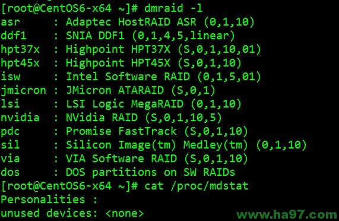

2012-6

19

## [（总结）硬RAID、软RAID的区别详解](http://www.ha97.com/4753.html)

发表于: [Linux](http://www.ha97.com/category/linux), [Security](http://www.ha97.com/category/security), [个人日记](http://www.ha97.com/category/个人日记) | 作者: [博客教主](http://www.ha97.com/author/admin)

标签: [区别](http://www.ha97.com/tag/区别),[总结](http://www.ha97.com/tag/总结),[硬RAID](http://www.ha97.com/tag/硬raid),[详解](http://www.ha97.com/tag/详解),[软RAID](http://www.ha97.com/tag/软raid)

**PS：今天有童鞋问RAID相关的问题，总结记录一下，本人建议在生产环境中就用硬RAID，别用软RAID，除非特殊需求。一般在生产环境中RAID0、1、5、6、10用得最广泛。web服务器或者应用服务器，可以用RAID0或RAID1，重要的数据库服务器建议用RAID5或RAID10。**

**什么是RAID?**

RAID是英文Redundant Array of Independent Disks的缩写，翻译成中文即为独立磁盘冗余阵列，或简称磁盘阵列。简单的说，RAID是一种把多块独立的硬盘（物理硬盘）按不同方式组合起来形成一个硬盘组（逻辑硬盘），从而提供比单个硬盘更高的存储性能和提供数据冗余的技术。组成磁盘阵列的不同方式成为RAID级别（RAID Levels）。

**为什么我们采用RAID?**

那些需要在硬盘上保存大量数据的人(例如 一个普通的管理人员) ，采用 RAID 技术将会很方便。采用 RAID 的主要原因是:

· 增强了速度
· 扩容了存储能力(以及更多的便利)
· 可高效恢复磁盘

**硬RAID与软RAID的区别：**

硬RAID：通过用硬件来实现RAID功能的就是硬RAID，比如：各种RAID卡，还有主板集成能够做的RAID都是硬RAID。

软RAID：通过用操作系统来完成RAID功能的就是软RAID，比如：在Linux操作系统下，用3块硬盘做的RAID5。

补充：RAID 也有全软、半软半硬与全硬之分，全软RAID 就是指RAID 的所有功能都是操作系统（OS）与CPU 来完成，没有第三方的控制/处理（业界称其为RAID 协处理器――RAID Co-Processor ）与I/O 芯片。这样，有关RAID 的所有任务的处理都由CPU 来完成，可想而知这是效率最低的一种RAID 。半软半硬RAID 则主要缺乏自己的I/O 处理芯片，所以这方面的工作仍要由CPU 与驱动程序来完成。而且，半软半硬RAID 所采用的RAID 控制/处理芯片的能力一般都比较弱，不能支持高的RAID 等级。全硬的RAID 则全面具备了自己的RAID 控制/处理与I/O 处理芯片，甚至还有阵列缓冲（Array Buffer ），对CPU 的占用率以及整体性能是这三种类型中最优势的，但设备成本也是三种类型中最高的。

**一、性能**

这可能是最重要的一个方面，用RAID就是为了提高性能。从理论上说，使用RAID0可以获得使用单硬盘双倍的速度，用软／硬RAID0都可以接近这个速度。使用软RAID的CPU占用率要高一些，所以在性能上，硬RAID要领先。

**二、稳定性**

做RAID是为了追求性能，所以一般使用7.2k转或者10k、15k转的硬盘。而市面上主流7.2k硬盘的发热量普遍较大，同时在机箱里放上两块，散热就已经是个问题，更何况是三块。毕竟稳定压倒一切，要是硬盘被烧毁就得不偿失了。况且，有些机箱根本放不下三块硬盘。因此使用硬RAID的稳定性要高一些。

**三、兼容性**

目前主流的服务器新版操作系统基本都支持软RAID，但是如果操作系统出了问题，软RAID就挂了。硬RAID的兼容性要好很多，万一系统出了问题，做系统维护、数据恢复也方便多了。

**四、安全性**

软RAID安全性不好，当有一块硬盘损坏时，它不能实现重建的功能，而且它的局限性也很在，而硬RAID有硬盘丢失时，它可以实现重建，以及如果RAID卡损坏时，它可以通过更换RAID卡，实现不丢失数据的功能。

**各种RAID的优缺点和各自需要的硬盘数量**

**Raid 0：一块硬盘或者以上就可做raid0**
优势：数据读取写入最快，最大优势提高硬盘容量，比如3快80G的硬盘做raid0 可用总容量为240G。速度是一样。
缺点：无冗余能力，一块硬盘损坏，数据全无。
建议：做raid0 可以提供更好的容量以及性能，推荐对数据安全性要求不高的使用。

**Raid 1：至少2快硬盘可做raid1
**优势：镜像，数据安全强，2快硬盘做raid一块正常运行，另外一块镜像备份数据，保障数据的安全。一块坏了，另外一块硬盘也有完整的数据，保障运行。
缺点：性能提示不明显，做raid1之后硬盘使用率为50%.
建议：对数据安全性比较看着，性能没有太高要求的人使用。

**Raid5:至少需要3块硬盘raid5**
优势：以上优势，raid5兼顾。任意N-1快硬盘都有完整的数据。
缺点：只允许单盘故障，一盘出现故障得尽快处理。有盘坏情况下，raid5 IO/CPU性能狂跌，此时性能烂到无以复加。
建议：盘不多，对数据安全性和性能提示都有要求，raid5是个不错选择，鉴于出问题的性能，盘多可考虑riad10

**Raid6:至少需要4块硬盘做raid6**
优势：raid6是再raid5的基础上为了加强数据保护而设计的。可允许损坏2块硬盘。
可用容量：C=(N-2)×D       C=可用容量 N=磁盘数量 D=单个磁盘容量。
比如4块1T硬盘做raid6可用容量是：(4-2)×1000GB=2000GB=2T
缺点：性能提升方面不明显
建议：对数据安全性要求高，性能要求不高的可选择。

**Raid10:至少需要4快硬盘。raid10是2快硬盘组成raid1，2组raid1组成raid0，所以必须需要4块硬盘。**
优势：兼顾安全性和速度。基础4盘的情况下，raid10允许对柜盘2块故障，随着硬盘数量的提示，容错量也会相对应提升。这是raid5无法做到的。
缺点：对盘的数量要求稍高，磁盘使用率为一半。
建议：硬盘数量足够的情况，建议riad10.

**题外话：raid5 VS raid10**
只看盘的数量的话，raid5的写性能不逊于raid10.
4盘的情况下，raid10提供2盘的写性能，raid5提供3盘
但，raid5的校检体质，导致额外的I0和CPU使用。

不过raid最重要的指标是可靠性：
4盘的raid5,只允许单盘故障，
raid10,允许对柜盘2块g故障，可靠性高于raid5,且raid10 可随盘上升提高容错，raid就不行，而且IO和CPU的额外开销还涂增，从可靠性和冗余角度，达到同样的可靠性,raid10写能力高于raid5.

特殊情况下：有坏盘，无热备
radi5 CPU和IO性能狂跌。因为数据不完整，在某特殊软件下，实现即时重构数据进驻内存，保障业务运行，但此生raid5的性能已经烂到无以复加。
raid10 是条带化+镜像，坏盘影响读性能，不影响写性能，而且无需重构。此时的raid10完爆raid5.

 

**主板集成RAID与外插RAID卡RAID的区别：**

**一、 性能**

主板集成的RAID，它的性能以及它的速度是通过主板的CPU与内存来实现的，它会占有主板一定的带宽，会影响整机的性能，而外插RAID卡，它本身由自己的CPU和内存，所以它的数据处理大部分都会由自己处理，不会影响主板上的CPU与内存速度，总体看来，外插的RAID卡的RAID要比主板集成的RAID快得多。

**二、 安全性**

主板集成的RAID它的安全性不能够得到保证，比如：我们用P8SCT主板做一个SATA RAID，不论你做RAID几，它是通过更改主板的BIOS选项做成的，所以一旦主板损坏、主板的CMOS电池掉电、无意更改了主板BIOS的设置都会带来RAID的丢失，通过主板做成的RAID，一旦丢失，将会不能恢复，后果是非常严重的，而外插的RAID卡做成的RAID就不会因为主板损坏、主板的CMOS电池掉电等现象对数据造成影响，所以外插的RAID卡，它的安全性远远大于主板集成的。

查看你的硬件支持哪些RAID设备的命令：
`dmraid -l`
查看多重磁盘信息：
`cat /proc/mdstat`

**结论：在选择用那种RAID形式时，首先根据客户的需求，整机的价位以及这台机器客户最终用于做什么，几种情况而定。硬Raid通过raid卡进行数据交换，占用系统I/O极小，数据的交换与运算都是通过RAID卡来完成的。而软RAID是通过软件模拟RAID子系统来完成数据交换与运算的，需要占用系统I/O，占用系统资源大。本人建议大部分情况使用硬RAID，别用软RAID，除非有特殊情况需要使用软RAID。**

关于RAID各个级别的原理和图解请参考维基百科如下链接，解说得很好！
http://zh.wikipedia.org/wiki/RAID
http://en.wikipedia.org/wiki/RAID

[永久链接](http://www.ha97.com/4753.html) : http://www.ha97.com/4753.html