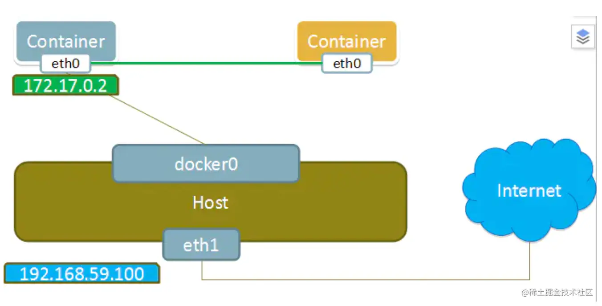

# 详解Kubernetes网络原理

[Honest1y](https://juejin.cn/user/694547081075149/posts)

2021-05-173,212阅读18分钟

专栏： 

Kubernetes

## 1 前言

在`kubernetes`中要保证容器之间网络互通，网络至关重要。而`kubernetes`本身并没有自己实现容器网络，而是通过插件化的方式自由接入进来。在容器网络接入进来需要满足如下基本原则:

- pod无论运行在任何节点都可以互相直接通信，而不需要借助NAT地址转换实现。
- node与pod可以互相通信，在不限制的前提下，pod可以访问任意网络。
- pod拥有独立的网络栈，pod看到自己的地址和外部看见的地址应该是一样的，并且同个pod内所有的容器共享同个网络栈。

## 2 容器网络基础

### 2.1 host模式

容器和宿主机共享Network namespace


### 2.2 container模式

容器和另外一个容器共享Network namespace。 kubernetes中的pod就是多个容器共享一个Network namespace。



### 2.3 none模式

容器有独立的Network namespace，但并没有对其进行任何网络设置，如分配veth pair 和网桥连接，配置IP等。


### 2.4 bridge模式

当Docker进程启动时，会在主机上创建一个名为docker0的虚拟网桥，此主机上启动的Docker容器会连接到这个虚拟网桥上。虚拟网桥的工作方式和物理交换机类似，这样主机上的所有容器就通过交换机连在了一个二层网络中。

从docker0子网中分配一个IP给容器使用，并设置docker0的IP地址为容器的默认网关。


## 3 同主机网络通信

我们可以简单把他们理解成两台主机，主机之间通过网线连接起来，如果要多台主机通信，我们通过交换机就可以实现彼此互通，在linux中，我们可以通过网桥来转发数据。

在容器中，以上的实现是通过docker0网桥，凡是连接到docker0的容器，就可以通过它来进行通信。要想容器能够连接到docker0网桥，我们也需要类似网线的虚拟设备Veth Pair来把容器连接到网桥上。

我们启动一个容器：

```shell
shell
复制代码$ docker run -d --name net_test alpine:latest /bin/sh
```

然后查看网卡设备：

```python
python复制代码$ docker exec -it net_test /bin/sh
/ # ifconfig
eth0      Link encap:Ethernet  HWaddr 02:42:AC:11:00:02
          inet addr:172.17.0.2  Bcast:172.17.255.255  Mask:255.255.0.0
          UP BROADCAST RUNNING MULTICAST  MTU:1500  Metric:1
          RX packets:14 errors:0 dropped:0 overruns:0 frame:0
          TX packets:0 errors:0 dropped:0 overruns:0 carrier:0
          collisions:0 txqueuelen:0
          RX bytes:1172 (1.1 KiB)  TX bytes:0 (0.0 B)

lo        Link encap:Local Loopback
          inet addr:127.0.0.1  Mask:255.0.0.0
          UP LOOPBACK RUNNING  MTU:65536  Metric:1
          RX packets:0 errors:0 dropped:0 overruns:0 frame:0
          TX packets:0 errors:0 dropped:0 overruns:0 carrier:0
          collisions:0 txqueuelen:1000
          RX bytes:0 (0.0 B)  TX bytes:0 (0.0 B)

/ # route -n
Kernel IP routing table
Destination     Gateway         Genmask         Flags Metric Ref    Use Iface
0.0.0.0         172.17.0.1      0.0.0.0         UG    0      0        0 eth0
172.17.0.0      0.0.0.0         255.255.0.0     U     0      0        0 eth0
```

可以看到其中有一张`eth0`的网卡，它就是veth peer其中的一端的虚拟网卡。然后通过`route -n `查看容器中的路由表，eth0也正是默认路由出口。所有对172.17.0.0/16网段的请求都会从eth0出去。 我们再来看Veth peer的另一端，我们查看宿主机的网络设备：

```yaml
yaml复制代码# ifconfig
docker0: flags=4163<UP,BROADCAST,RUNNING,MULTICAST>  mtu 1500
        inet 172.17.0.1  netmask 255.255.0.0  broadcast 172.17.255.255
        inet6 fe80::42:6aff:fe46:93d2  prefixlen 64  scopeid 0x20<link>
        ether 02:42:6a:46:93:d2  txqueuelen 0  (Ethernet)
        RX packets 0  bytes 0 (0.0 B)
        RX errors 0  dropped 0  overruns 0  frame 0
        TX packets 8  bytes 656 (656.0 B)
        TX errors 0  dropped 0 overruns 0  carrier 0  collisions 0

eth0: flags=4163<UP,BROADCAST,RUNNING,MULTICAST>  mtu 1500
        inet 10.100.0.2  netmask 255.255.255.0  broadcast 10.100.0.255
        inet6 fe80::5400:2ff:fea3:4b44  prefixlen 64  scopeid 0x20<link>
        ether 56:00:02:a3:4b:44  txqueuelen 1000  (Ethernet)
        RX packets 7788093  bytes 9899954680 (9.2 GiB)
        RX errors 0  dropped 0  overruns 0  frame 0
        TX packets 5512037  bytes 9512685850 (8.8 GiB)
        TX errors 0  dropped 0 overruns 0  carrier 0  collisions 0

lo: flags=73<UP,LOOPBACK,RUNNING>  mtu 65536
        inet 127.0.0.1  netmask 255.0.0.0
        inet6 ::1  prefixlen 128  scopeid 0x10<host>
        loop  txqueuelen 1000  (Local Loopback)
        RX packets 32  bytes 2592 (2.5 KiB)
        RX errors 0  dropped 0  overruns 0  frame 0
        TX packets 32  bytes 2592 (2.5 KiB)
        TX errors 0  dropped 0 overruns 0  carrier 0  collisions 0

veth20b3dac: flags=4163<UP,BROADCAST,RUNNING,MULTICAST>  mtu 1500
        inet6 fe80::30e2:9cff:fe45:329  prefixlen 64  scopeid 0x20<link>
        ether 32:e2:9c:45:03:29  txqueuelen 0  (Ethernet)
        RX packets 0  bytes 0 (0.0 B)
        RX errors 0  dropped 0  overruns 0  frame 0
        TX packets 8  bytes 656 (656.0 B)
        TX errors 0  dropped 0 overruns 0  carrier 0  collisions 0
```

我们可以看到，容器对应的Veth peer 另一端是宿主机上的一块虚拟网卡叫`veth20b3dac`，并且可以通过brctl 查看网桥信息看到这张网卡是在docker0上。

```yaml
yaml复制代码# brctl show
docker0		8000.02426a4693d2	no		veth20b3dac
```

然后我们再启动一个容器，从第一个容器是否能ping通第二个容器。

```python
python复制代码$ docker run -d --name net_test_2 -it alpine:latest /bin/sh
$ docker exec -it net_test_2 /bin/sh
/ # ping 172.17.0.3
PING 172.17.0.3 (172.17.0.3): 56 data bytes
64 bytes from 172.17.0.3: seq=0 ttl=64 time=0.291 ms
64 bytes from 172.17.0.3: seq=1 ttl=64 time=0.129 ms
64 bytes from 172.17.0.3: seq=2 ttl=64 time=0.142 ms
64 bytes from 172.17.0.3: seq=3 ttl=64 time=0.169 ms
64 bytes from 172.17.0.3: seq=4 ttl=64 time=0.194 ms
^C
--- 172.17.0.3 ping statistics ---
5 packets transmitted, 5 packets received, 0% packet loss
round-trip min/avg/max = 0.129/0.185/0.291 ms
```

可以看到，能够ping通，其原理就是我们ping 目标IP172.17.0.3时，会匹配到我们的路由表第二条规则，网关为0.0.0.0，这就意味着是一条直连路由，通过二层转发到目的地。要通过二层网络到达172.17.0.3，我们需要知道它的Mac地址，此时就需要第一个容器发送一个ARP广播，来通过IP地址查找Mac。此时Veth peer另外一段是docker0网桥，它会广播到所有连接它的veth peer 虚拟网卡去，然后正确的虚拟网卡收到后会响应这个ARP报文，然后网桥再回给第一个容器。

以上就是同宿主机不同容器通过docker0通信，如下图所示:  默认情况下，通过network namespace限制的容器进程，本质上是通过Veth peer设备和宿主机网桥的方式，实现了不同 `network namespace` 的数据交换。

与之类似地，当你在一台宿主机上，访问该宿主机上的容器的 IP 地址时，这个请求的数据包，也是先根据路由规则到达 docker0 网桥，然后被转发到对应的 Veth Pair 设备，最后出现在容器里。

## 4 跨主机网络通信

在 Docker 的默认配置下，不同宿主机上的容器通过 IP 地址进行互相访问是根本做不到的。为了解决这个问题，社区中出现了很多网络方案。同时k8s为了更好的控制网络的接入，推出了CNI即容器网络的API接口。

实际上CNI的容器网络通信流程跟前面的基础网络一样，只是CNI维护了一个单独的网桥来代替 docker0。这个网桥的名字就叫作：CNI 网桥，它在宿主机上的设备名称默认是：cni0。cni的设计思想，就是：Kubernetes 在启动 Infra 容器之后，就可以直接调用 CNI 网络插件，为这个 Infra 容器的 Network Namespace，配置符合预期的网络栈。

CNI插件三种网络实现模式：


- overlay （基于隧道）模式是基于隧道技术实现的，整个容器网络和主机网络独立，容器之间跨主机通信时将整个容器网络封装到底层网络中，然后到达目标机器后再解封装传递到目标容器。不依赖与底层网络的实现。实现的插件有flannel(UDP、vxlan)、calico(IPIP)等等
- 三层路由模式（基于路由）中容器和主机也属于不通的网段，他们容器互通主要是基于路由表打通，无需在主机之间建立隧道封包。但是限制条件必须依赖大二层同个局域网内。实现的插件有flannel(host-gw)、calico(BGP)等等
- underlay网络是底层网络，负责互联互通。 容器网络和主机网络依然分属不同的网段，但是彼此处于同一层网络，处于相同的地位。整个网络三层互通，没有大二层的限制，但是需要强依赖底层网络的实现支持.实现的插件有calico(BGP)等等

### 4.1 Flannel

#### 4.1.1 Flannel简介

Kubernetes系统上Pod网络的实现依赖于第三方插件，而Flannel是由CoreOS主推的目前比较主流的容器网络解决方案，CNI插件有两种功能：网络配置和网络策略，由于flannel比较简单，并不支持网络策略，flannel项目自身只是一个框架，真正提供网络功能的是它的后端实现，目前，Flannel支持三种不同后端实现，分别是：

- UDP
- VXLAN
- host-gw

UDP是Flannel项目最早支持的一种方式，是**性能最差的方式**，目前已被废弃。

用的最多的是`VXLAN`和`host-gw`模式的部署。

#### 4.1.2 VXLan

flannel运行后，在各Node宿主机多了一个网络接口:

```ini
ini复制代码[root@master ~]# ifconfig flannel.1
flannel.1: flags=4163<UP,BROADCAST,RUNNING,MULTICAST>  mtu 1450
        inet 10.244.0.0  netmask 255.255.255.255  broadcast 10.244.0.0
        ether 7e:df:88:39:f8:41  txqueuelen 0  (Ethernet)
        RX packets 4999534  bytes 1644495535 (1.5 GiB)
        RX errors 0  dropped 0  overruns 0  frame 0
        TX packets 5003648  bytes 438332880 (418.0 MiB)
        TX errors 0  dropped 1 overruns 0  carrier 0  collisions 0

[root@node-02 ~]# ifconfig flannel.1
flannel.1: flags=4163<UP,BROADCAST,RUNNING,MULTICAST>  mtu 1450
        inet 10.244.1.0  netmask 255.255.255.255  broadcast 10.244.1.0
        ether 26:7c:5d:33:b5:cc  txqueuelen 0  (Ethernet)
        RX packets 561013  bytes 58177715 (55.4 MiB)
        RX errors 0  dropped 0  overruns 0  frame 0
        TX packets 513179  bytes 106201855 (101.2 MiB)
        TX errors 0  dropped 1 overruns 0  carrier 0  collisions 0
```

从上面的结果可以知道：

1. flannel默认就是VXLAN模式，即Overlay Network。
2. flanneld创建了一个flannel.1接口，它是专门用来封装隧道协议的，默认分给集群的Pod网段为10.244.0.0/16。
3. flannel给master节点配置的Pod网络为10.244.0.0段，给node-02节点配置的Pod网络为10.244.1.0段，如果有更多的节点，以此类推。

启动一个副本为3的nginx容器：

```css
css
复制代码[root@master ~]# kubectl create deployment nginx --image=nginx --replicas=3
sql复制代码[root@master ~]# kubectl get po -o wide
NAME                     READY   STATUS    RESTARTS   AGE   IP           NODE      NOMINATED NODE   READINESS GATES
nginx-5b946576d4-6kftk   1/1     Running   0          35s   10.244.2.8   node-03   <none>           <none>
nginx-5b946576d4-b8bqc   1/1     Running   0          35s   10.244.1.5   node-02   <none>           <none>
nginx-5b946576d4-cwmmp   1/1     Running   0          35s   10.244.1.6   node-02   <none>           <none>
```

其中，两个Pod运行在节点node-02上，其中一个Pod配置的IP为10.244.1.5，

现在，在此node查看网络接口

```ini
ini复制代码[root@node-02 ~]# ifconfig cni0
cni0: flags=4163<UP,BROADCAST,RUNNING,MULTICAST>  mtu 1450
        inet 10.244.1.1  netmask 255.255.255.0  broadcast 10.244.1.255
        inet6 fe80::a816:67ff:fee2:6e8f  prefixlen 64  scopeid 0x20<link>
        ether aa:16:67:e2:6e:8f  txqueuelen 1000  (Ethernet)
        RX packets 2  bytes 56 (56.0 B)
        RX errors 0  dropped 0  overruns 0  frame 0
        TX packets 5  bytes 446 (446.0 B)
        TX errors 0  dropped 0 overruns 0  carrier 0  collisions 0
```

当有容器运行后，节点之上多了个虚拟接口cni0，其IP为10.244.1.1，它是由flanneld创建的一个虚拟网桥叫cni0，在Pod本地通信使用。

flanneld为每个Pod创建一对veth虚拟设备，一端放在容器接口上，一端放在cni0桥上。

使用brctl查看该网桥：

```perl
perl复制代码[root@node-02 ~]# brctl show cni0
bridge name	bridge id		STP enabled	interfaces
cni0		8000.aa1667e26e8f	no		vethc7b43a1d
							            vethf6777127
							            #有两个容器的网络接口挂在了cni0网桥之上。
```

测试正常访问：

```ini
ini复制代码# 在宿主机测试
[root@master ~]# ping 10.244.1.5
PING 10.244.1.5 (10.244.1.5) 56(84) bytes of data.
64 bytes from 10.244.1.5: icmp_seq=1 ttl=63 time=1.67 ms
64 bytes from 10.244.1.5: icmp_seq=2 ttl=63 time=1.04 ms
64 bytes from 10.244.1.5: icmp_seq=3 ttl=63 time=1.21 ms
```

在现有的flannel VXLAN网络中，两台主机上的pod间通信，肯定是可以的，如下两pod：

```python
python复制代码# 进入pod测试
# ping 10.244.1.5    
PING 10.244.1.5 (10.244.1.5): 56 data bytes
64 bytes from 10.244.1.5: icmp_seq=0 ttl=62 time=2.379 ms
64 bytes from 10.244.1.5: icmp_seq=1 ttl=62 time=1.370 ms
64 bytes from 10.244.1.5: icmp_seq=2 ttl=62 time=1.064 ms
64 bytes from 10.244.1.5: icmp_seq=3 ttl=62 time=1.483 ms
```

那么容器跨主机是如何通信的呢，查看路由信息：

```csharp
csharp复制代码[root@master ~]# ip route show
10.244.1.0/24 via 10.244.1.0 dev flannel.1 onlink 
10.244.2.0/24 via 10.244.2.0 dev flannel.1 onlink 
```

去往10.244.1.0/24网络的[数据](https://link.juejin.cn/?target=http%3A%2F%2Fwww.fly63.com%2F)包发给本机的flannel.1接口，即进入二层隧道，然后封装VXLAN包，到达目标Node后，由目标Node上的flannel.1解封装。

一旦Node启动并加入Flannel网络之后，其它Node上的flanneld就会添加一条类似这样的路由规则，这就是默认的VXLAN网络。

因为是在master上ping别人的，所以master是封装过VXLAN包的，抓包：

```shell
shell复制代码[root@node-02 ~]# tcpdump -i eth0 -nn host 10.234.2.13
tcpdump: verbose output suppressed, use -v or -vv for full protocol decode
listening on eth0, link-type EN10MB (Ethernet), capture size 262144 bytes
15:40:40.502259 IP 10.234.2.13.60088 > 10.234.2.12.8472: OTV, flags [I] (0x08), overlay 0, instance 1
IP 10.244.2.8 > 10.244.1.5: ICMP echo request, id 24, seq 19, length 64
15:40:40.502543 IP 10.234.2.12.37793 > 10.234.2.13.8472: OTV, flags [I] (0x08), overlay 0, instance 1
IP 10.244.1.5 > 10.244.2.8: ICMP echo reply, id 24, seq 19, length 64
15:40:41.503471 IP 10.234.2.13.60088 > 10.234.2.12.8472: OTV, flags [I] (0x08), overlay 0, instance 1
IP 10.244.2.8 > 10.244.1.5: ICMP echo request, id 24, seq 20, length 64
```

VXLAN是Linux内核本身支持的一种网络虚拟化技术，是内核的一个模块，在内核态实现封装解封装，构建出覆盖网络，其实就是一个由各宿主机上的Flannel.1设备组成的虚拟二层网络。

由于VXLAN由于额外的封包解包，导致其性能较差，所以Flannel就有了host-gw模式，即把宿主机当作网关，除了本地路由之外没有额外开销，性能和calico差不多，由于没有叠加来实现报文转发，这样会导致路由表庞大。因为一个节点对应一个网络，也就对应一条路由条目。

host-gw虽然VXLAN网络性能要强很多，但是种方式有个缺陷：**要求各物理节点必须在同一个二层网络中**。物理节点必须在同一网段中。这样会使得一个网段中的主机量会非常多，万一发一个广播报文就会产生干扰。在私有云场景下，宿主机不在同一网段是很常见的状态，所以就不能使用host-gw了。

VXLAN还有另外一种功能，VXLAN也支持类似host-gw的玩法，如果两个节点在同一网段时使用host-gw通信，如果不在同一网段中，即当前pod所在节点与目标pod所在节点中间有路由器，就使用VXLAN这种方式，使用叠加网络。

结合了Host-gw和VXLAN，这就是VXLAN的**Directrouting模式**

因此Flannel的VXLAN模式有两种：

1. VXLAN： 原生的VXLAN，即扩展的虚拟LAN
2. Directrouting：直接路由型

#### 4.1.3 Directrouting

修改下载的kube-flannel.yml，将flannel的configmap对象改为：

```yaml
yaml复制代码net-conf.json: |
    {
      "Network": "10.244.0.0/16",  #默认网段
      "Backend": {
        "Type": "VXLAN",  # 注意格式
        "Directrouting": true
      }
    }
```

重新部署

```shell
shell复制代码[root@master flannel]# kubectl delete -f kube-flannel.yaml 
podsecuritypolicy.policy "psp.flannel.unprivileged" deleted
clusterrole.rbac.authorization.k8s.io "flannel" deleted
clusterrolebinding.rbac.authorization.k8s.io "flannel" deleted
serviceaccount "flannel" deleted
configmap "kube-flannel-cfg" deleted
daemonset.apps "kube-flannel-ds" deleted


[root@master flannel]# kubectl create -f kube-flannel.yaml 
podsecuritypolicy.policy/psp.flannel.unprivileged created
clusterrole.rbac.authorization.k8s.io/flannel created
clusterrolebinding.rbac.authorization.k8s.io/flannel created
serviceaccount/flannel created
configmap/kube-flannel-cfg created
daemonset.apps/kube-flannel-ds created
```

> 删除重新部署需要删除原来的Flannel，所以应该在一开始就把Flannel规划好

再次查看路由

```sql
sql复制代码[root@master flannel]# ip route show
default via 10.234.2.254 dev eth0  proto static  metric 100 
10.234.2.0/24 dev eth0  proto kernel  scope link  src 10.234.2.11  metric 100 
10.244.1.0/24 via 10.234.2.12 dev eth0 
10.244.2.0/24 via 10.234.2.13 dev eth0 
172.17.0.0/16 dev docker0  proto kernel  scope link  src 172.17.0.1 
```

去往10.244.1.0/24网络的下一跳是10.234.2.12，从本机的物理接口eth0出去。这就是Directrouting。如果两个节点跨网段，则flannel自动降级为VXLAN模式。

```bash
bash复制代码[root@node-02 ~]# tcpdump -i eth0 -nn icmp
tcpdump: verbose output suppressed, use -v or -vv for full protocol decode
listening on eth0, link-type EN10MB (Ethernet), capture size 262144 bytes
15:51:19.324976 IP 10.244.2.8 > 10.244.1.5: ICMP echo request, id 25, seq 98, length 64
15:51:19.325209 IP 10.244.1.5 > 10.244.2.8: ICMP echo reply, id 25, seq 98, length 64
15:51:20.326665 IP 10.244.2.8 > 10.244.1.5: ICMP echo request, id 25, seq 99, length 64
15:51:20.326926 IP 10.244.1.5 > 10.244.2.8: ICMP echo reply, id 25, seq 99, length 64
15:51:21.327844 IP 10.244.2.8 > 10.244.1.5: ICMP echo request, id 25, seq 100, length 64
15:51:21.328020 IP 10.244.1.5 > 10.244.2.8: ICMP echo reply, id 25, seq 100, length 64
15:51:22.334799 IP 10.244.2.8 > 10.244.1.5: ICMP echo request, id 25, seq 101, length 64
15:51:22.335042 IP 10.244.1.5 > 10.244.2.8: ICMP echo reply, id 25, seq 101, length 64
```

通过抓包可以看到，现在在pod中进行互ping，是从物理网卡eth0进出的，这就是directrouting，这种性能比默认vxlan高。

#### 4.1.4 Host-gw

 如图可以看到当node1上container-1要发数据给node2上的container2时,会匹配到如下的路由表规则:

```
复制代码10.244.1.0/24 via 10.168.0.3 dev eth0
```

表示前往目标网段10.244.1.0/24的IP包，需要经过本机eth0出去发往的下一跳ip地址为10.168.0.3(node2).然后到达10.168.0.3以后再通过路由表转发cni网桥，进而进入到container2。

以上可以看到host-gw工作原理，其实就是在每个node节点配置到每个pod网段的下一跳为pod网段所在的node节点IP，pod网段和node节点ip的映射关系，flannel保存在etcd或者k8s中。flannel只需要watch 这些数据的变化来动态更新路由表即可。

这种网络模式最大的好处就是避免了额外的封包和解包带来的网络性能损耗。缺点我们也能看见主要就是容器ip包通过下一跳出去时，必须要二层通信封装成数据帧发送到下一跳。如果不在同个二层局域网，那么就要交给三层网关，而此时网关是不知道目标容器网络的(也可以静态在每个网关配置pod网段路由)。所以flannel host-gw必须要求集群宿主机是二层互通的。

而为了解决二层互通的限制性，calico提供的网络方案就可以更好的实现,calico 大三层网络模式与flannel 提供的类似,也会在每台宿主机添加如下格式的路由规则:

```xml
xml
复制代码<目标容器IP网段> via <网关的IP地址> dev eth0
```

其中网关的IP地址不通场景有不同的意思,如果宿主机是二层可达那么就是目的容器所在的宿主机的IP地址，如果是三层不同局域网那么就是本机宿主机的网关IP(交换机或者路由器地址)。

不同于flannel通过k8s或者etcd存储的数据来维护本机路由信息的做法，calico是通过BGP动态路由协议来分发整个集群路由信息。

BGP全称是 Border Gateway Protocol边界网关协议,linxu原生支持的、专门用于在大规模数据中心为不同的自治系统之间传递路由信息。只要记住BGP简单理解其实就是实现大规模网络中节点路由信息同步共享的一种协议。而BGP这种协议就能代替flannel 维护主机路由表功能。

### 4.2 Calico

#### 4.2.1 Calico简介

Calico是一个纯三层的虚拟网络，它没有复用docker的docker0网桥，而是自己实现的， `calico网络不对数据包进行额外封装，不需要NAT和端口映射，扩展性和性能都很好`。Calico网络提供了DockerDNS服务， 容器之间可以通过hostname访问，Calico在每一个计算节点利用LinuxKernel实现了一个高效的vRouter（虚拟路由）来负责数据转发，它会为每个容器分配一个ip，每个节点都是路由，把不同host的容器连接起来，从而实现跨主机间容器通信。而每个vRouter通过BGP协议（边界网关协议）负责把自己节点的路由信息向整个Calico网络内传播——小规模部署可以直接互联，大规模下可通过指定的BGProute reflector来完成；Calico基于iptables还提供了丰富而灵活的网络策略，保证通过各个节点上的ACLs来提供多租户隔离、安全组以及其他可达性限制等功能。

calico 主要由三个部分组成:

- calico cni插件: 主要负责与kubernetes对接，供kubelet调用使用。
- felix: 负责维护宿主机上的路由规则、FIB转发信息库等。
- BIRD: 负责分发路由规则，类似路由器。
- confd: 配置管理组件。

#### 4.2.2 IPIP

把一个IP数据包又套在一个IP包里，即把IP层封装到IP层的一个 tunnel，它的作用其实基本上就相当于一个基于IP层的网桥，一般来说，普通的网桥是基于mac层的，根本不需要IP，而这个ipip则是通过两端的路由做一个tunnel，把两个本来不通的网络通过点对点连接起来；

calico以ipip模式部署完毕后，node上会有一个tunl0的网卡设备，这是ipip做隧道封装用的,也是一种overlay模式的网络。当我们把节点下线，calico容器都停止后，这个设备依然还在，执行 rmmodipip命令可以将它删除。

#### 4.2.3 BGP

bgp工作模式和flannel的host-gw模式几乎一样

bird是bgd的客户端，与集群中其它节点的bird进行通信，以便于交换各自的路由信息

随着节点数量N的增加，这些路由规则将会以指数级的规模快速增长，给集群本身网络带来巨大压力，官方建议小于100个节点

限制：和flannel的host-gw限制一样，要求物理机在二层是连能的，不能跨网段

## 5 总结

以上就是kubernetes 常用的几种网络方案了，在公有云场景下一般用云厂商提供的或者使用flannel host-gw这种更简单，而私有物理机房环境中，Calico项目更加适合。根据自己的实际场景，再选择合适的网络方案。

标签：

[Kubernetes](https://juejin.cn/tag/Kubernetes)