# Kubernetes 网络插件（CNI）超过 10Gbit/s 的基准测试结果

 [zuozewei](https://bbs.huaweicloud.com/community/usersnew/id_1626682078895094) 发表于 2021/12/19 10:29:04

 

 3.7k+ 0 1

【摘要】 在使用或创建 CNI 插件时，开发者主要使用三种解决方案：Calico、Flannel 和 WeaveNet。另外，Canal、Kube-router、Romana、JuniperContrail 和 TungstenFabric 方案也有一些有趣的特点。 那么重点来了！这么多 CNI 之间有什么区别？哪个性能最好？哪个性能最弱？

前言测试环境MTU 的影响CNI benchmark : Raw data资源Pod to PodPod-to-ServiceNetwork PoliciesCNI 加密性能资源小结汇总MTU/加密效果性能资源建议作者建议个人心得

## 前言

众所周知，虽然容器提供了应用程序打包，Kubernetes 提供了用简单的容器化组件编写大型复杂应用程序的能力，但这两种技术缺乏在其特定堆栈之外进行通信的常用方法。

在部署 Kubernetes 环境时，我们一般要求网络遵循以下规则：

- 所有 Pod 都可以在没有 NAT 的情况下相互通信；
- 所有节点都可以在没有 NAT 的情况下与两个方向的 Pod 进行通信；
- 容器接收到的 IP 与外部组件接收到的 IP 相同。

对此，开发者有两种类型的网络可进行设置：

- Kubernetes 默认网络；
- CNI 及其插件。

Kubernetes 默认网络：此解决方案的方法是创建具有 IP 范围的虚拟网桥，然后在每个主机上手动添加主机之间的路由。使用 Google 或 Amazon 云解决方案，可以进行手动配置。但是这个方法的弊端是当开发者不能完全坚持配置下去时，管理配置将变得十分困难。

CNI 及其插件：第二个解决方案是使用容器网络接口（CNI）和网络插件。此方法可以自动生成基本配置，让网络的创建和管理变得更加容易。如今，CNI 也成为网络供应商、项目与 Kubernetes 集成的标准方法。

> *注：2016 年 CoreOS 发布了 CNI。2017 年 5 月， CNI 被 CNCF 技术监督委员会投票决定接受为托管项目。

在使用或创建 CNI 插件时，开发者主要使用三种解决方案：Calico、Flannel 和 WeaveNet。另外，Canal、Kube-router、Romana、JuniperContrail 和 TungstenFabric 方案也有一些有趣的特点。

那么重点来了！这么多 CNI 之间有什么区别？哪个性能最好？哪个性能最弱？

本文参考自 Benchmark results of Kubernetes network plugins (CNI) over 10Gbit/s network (Updated: August 2020)，主要用来记录阅读的心得分享，详细全文请点选上述链接观看。

## 测试环境

本篇文章的环境基于下列版本：

- Kubernetes: 1.19
- Ubuntu: 18.04
- 受测CNI:
  - Antrea v.0.9.1
  - Calico v3.16
  - Canal v3.16 (Flannel network + Calico Network Policies)
  - Cilium 1.8.2
  - Flannel 0.12.0
  - Kube-router latest (2020–08–25)
  - WeaveNet 2.7.0

内容是 2020 8月份时进行的实测结果

该文用到的所有测试工具全部都开源并放到 Github上，对其有兴趣的可以到这边观看内容 [benchmark-k8s-cni-2020-08](https://github.com/InfraBuilder/benchmark-k8s-cni-2020-08) 或是阅读本文的第一大章节，有介绍一些工具的使用。

## MTU 的影响

文章中针对三款CNI (Calico, Canal, WeaveNet) 测试看看检测 MTU 的功能基于 TCP/UDP 下的性能如何：
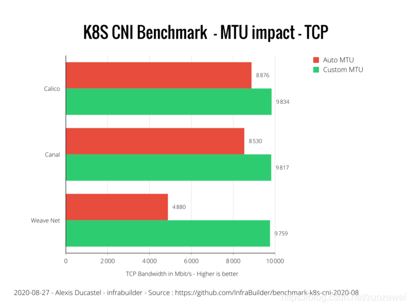

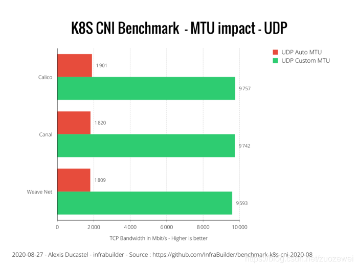
从上述的结果中可以看到 Auto MTU 的性能都非常差，原因并不是 Auto MTU 没有效，而是因为这些 CNI 目前根本没有支持 Auto MTU 的做法，而 Calico 直到 3.7 版本才正式支持 Auto MTU 这个功能，而且根据作者的测试其功能良好。

作者认为对于这种需要设定 Jumbo frames 的环境下，如果没有 Auto MTU 的话，管理员则需要手动去设定这些 MTU，所以非常希望每个 CNI 能够去细化 Auto MTU 的功能来自动检测并且设定，减少管理员需要人工介入的需求。

至于其他的 CNI 为什么没有测试，因为他们都有实际 Auto-MTU 的功能：

- Antrea
- Cilium
- Flannel
- Kube-OVN

其中 Kube-router 这边作者标示为None,估计可能是根本不能设定 MTU。

## CNI benchmark : Raw data

这章节主要会用来对比这些在正确 MTU 设定下不同 CNI 之间的性能。

### 资源

原文中是用 CPU(%) 以及 Memory (MB) 来画图，數字愈低代表使用量愈低：
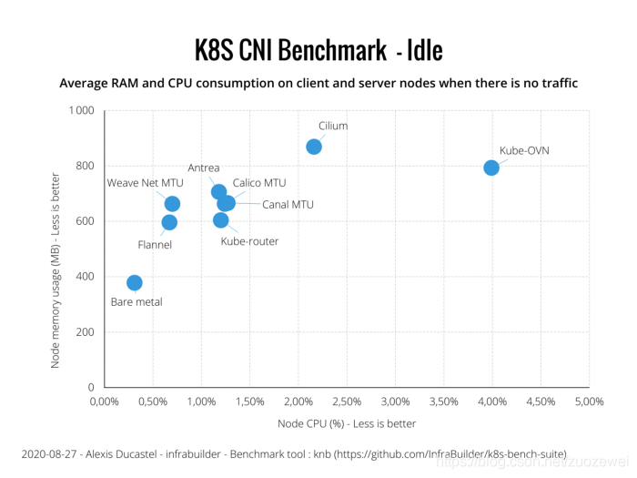
这上面可以观察到：

- Weave Net/Flannel 使用的效率最低，
- Cilium 资源使用量偏高
- Kube-OVN 资源使用量最高

剩下的资源使用量都差不多，我认为可以算是同一个等级

> Kube-OVN > Cilium > 剩下全部> WeaveNet/Flannel

### Pod to Pod

接下来看一下 Pod to Pod ，这边的方式是直接用 Pod 的 IP 来连接，并不是任何用 Service 这种方式。

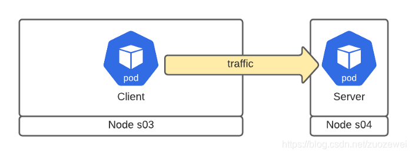

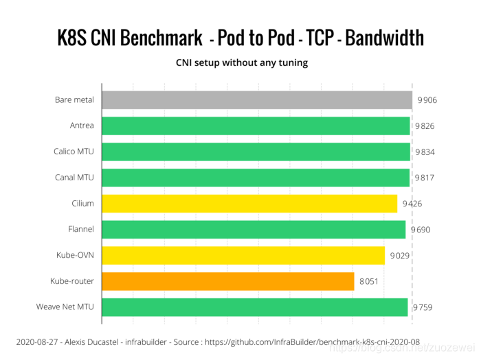
从上面的数据可以观察到：

- Kube-router 的数据最差
- Kube-OVN 也没有很好，大概就 9Gb/s 左右
- Cilium 大概介于9.5Gb/s
- 剩下的都 CNI 性能跟裸机都不会差太多

接下来观察一下这个测试中，不同 CNI 的资源消耗量，原文中是用 CPU(%) 以及 Memory (MB) 来画图，數字愈低代表使用量越低：
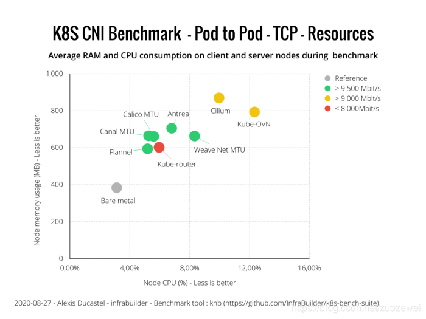
从上面的结论观察，我认为跟空闲的情况差不多，唯一的差异就是 Weavenet 从最少使用量的 CNI 变成第三高

> Kube-OVN > Cilium > WeaveNet > 剩下全部

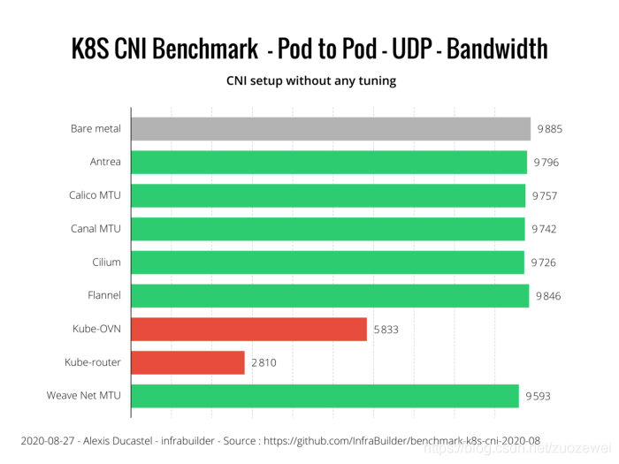
从上面的数据可以观察到：

- Kube-router 的数据最差，连 3Gb/s 都不到，非常惨，不到 30% 的性能
- Kube-OVN 也很不好，大概只有 6Gb/s
- 剩下的都 CNI 性能跟裸机都不会差太多

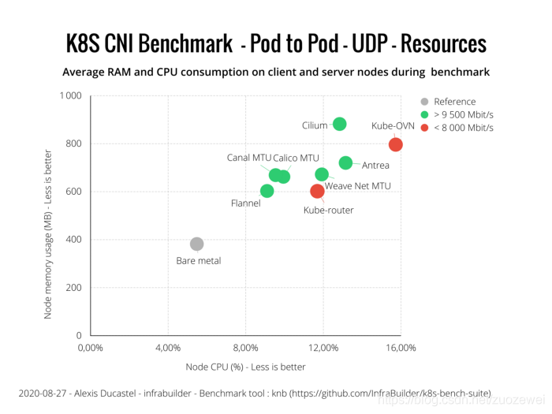
从上面的结论观察，跟空闲对比起来比较有一些变化：

- Kube-OVN 永远都是使用资源第一名
- Cilium 还是第二名
- 第三名则是 WeaveNet/Antrea/Kube-Router

剩下的等级差不多

> Kube-OVN > Cilium > WeaveNet/Antrea/Kube-Router > Calico/Canal/Flannel > 裸机

### Pod-to-Service

这个情况下则是探讨透过 Service 来连接目标 Pod，也是基于TCP/UDP 来测试，其 中Service 则是基于ClusterIP 的设定才测试。
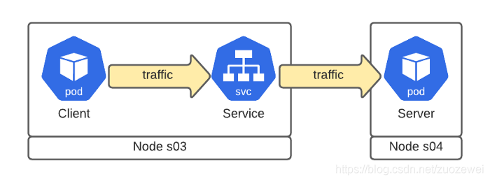

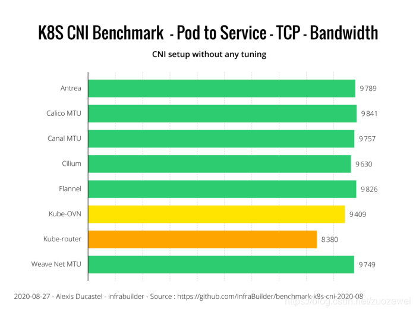
从上面的数据可以观察到：

- Kube-router 的数据最差, 大概只剩下 85% 性能
- Kube-OVN 还行，大概95%
- 剩下的都 CNI 性能都差不多， 97% ±1%。

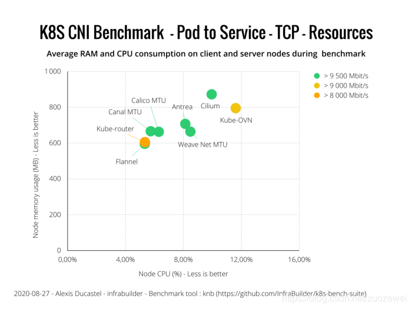
从上面的结论观察，跟空闲比较起来比较有一些变化：

- Kube-OVN 永远都是使用资源第一名
- Cilium 还是第二名
- 第三名则是 WeaveNet/Antrea

剩下的等级差不多

> Kube-OVN > Cilium > WeaveNet/Antrea > Kube-Router/Calico/Canal/Flannel > 裸机

相对于 Pod to Pod 的情况来看， Pod to Service 中 Antrea 的性能消耗更高，从第四名跃升到第三名。

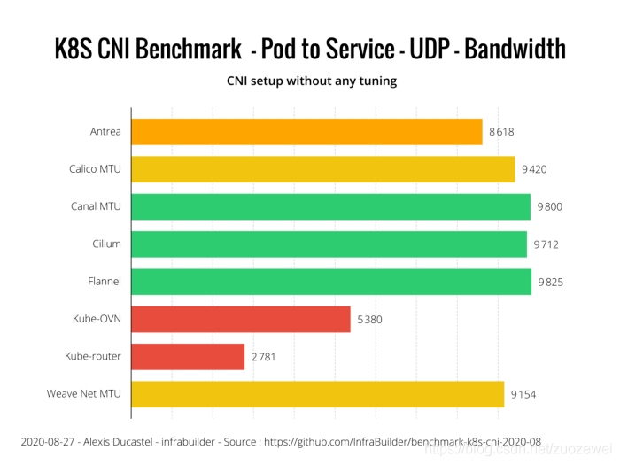

从上面的数据可以观察到：

- Kube-router 的数据最差，连 3Gb/s 都不到，非常惨，不到 30% 的性能
- Kube-OVN 也很不好，大概只有 5Gb/s
- Antrea 的性能也不好了，大概只有 8.6 Gb/s
- Calico 以及 WeaveNet 的性能也都降到 95% 以下，不到 9.5Gb/s
- 剩下的都 CNI 性能都差不多(Canal/Cilium/Flannel)
  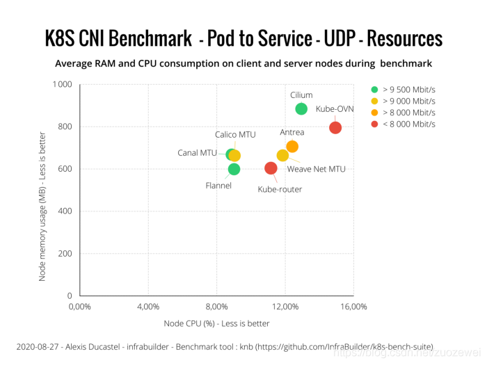
  从上面的结论观察，跟空闲比较起来比较有一些变化
- Kube-OVN 跟 Cilium 两个各有千秋，一个 CPU 用比较多，一个则是内存比较多
- Antrea/WeaveNet/Kube-router 三者消耗的层级差不多
- Calico/Canal/Flannel 三者差不多

> Kube-OVN/Cilium > WeaveNet/Antrea/Kube-Router > Calico/Canal/Flannel

### Network Policies

这边没有任何的数据测试，除了Flannel 外，剩下的CNI 都有实现 Ingress/Egress (往内/往外) 的 Network Policies，很棒!

## CNI 加密

测试的 CNI 解决方案中，只有四套有支持加密的部分，分别是：

- Antrea (IPSec)
- Calico (wireguard)
- Cilium (IPSec)
- WeaveNet (IPSec)

### 性能

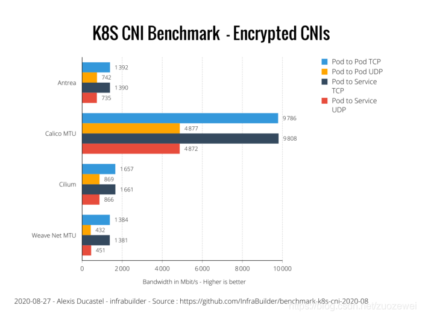
这边可以观察到：

- TCP 的性能远胜于 UDP
- 使用 wireguard 的性能完全辗压 IPSec 技术的其他 CNI
- 三个都使用 IPSec 的CNI，其中 WeaveNet 性能是其中最差的，而 Cilium 则是性能最好的

### 资源

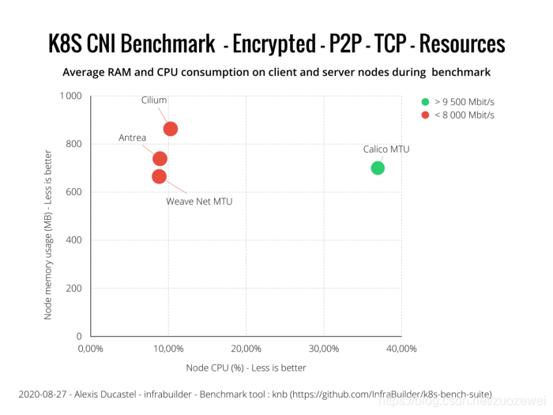
从上面的结论观察，跟空闲比较起来比较有一些变化：

- Calico 使用的资源最多
- 剩下三者差不多

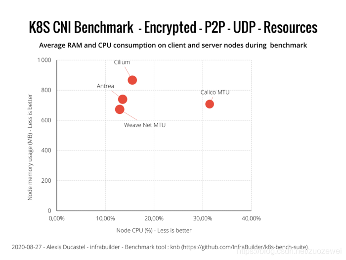
从上面的结论观察，跟空闲比较起来比较有一些变化：

- Calico 使用的资源最多
- 剩下三者差不多

### 小结

这边可以观察到其结果与 Pod-to-Pod 是差不多的，因此结论完全一致：

- TCP 的性能远胜于 UDP
- 使用 wireguard 的性能完全辗压IPSec 技术的其他CNI
- 三个都使用 IPSec 的 CNI，其中WeaveNet 性能是其中最差的，而 Cilium 则是最好的

## 汇总

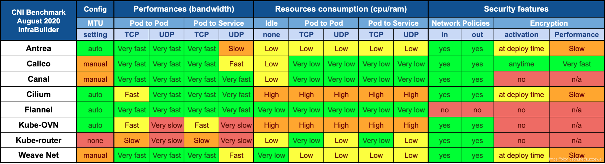

根据上述的全部来源，我们可以绘制数张总结表格，性能的部分采用相对比较，对原始数字有兴趣的可以参考其公开的 Github 专案。

评比标准: 好>普通>不好

### MTU/加密效果

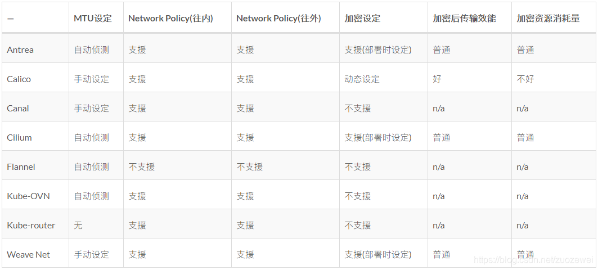

### 性能

这边使用一些缩写

- P2P -> Pod to Pod
- P2S -> Pod to Service

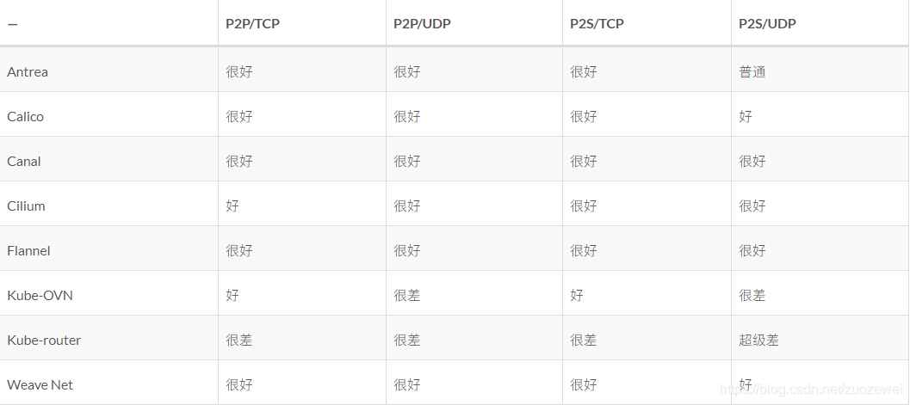

### 资源

这边使用一些缩写

- P2P -> Pod to Pod
- P2S -> Pod to Service

同时评比的概念是使用的资源多寡，采用相对等级

超高>有点高>普通>少

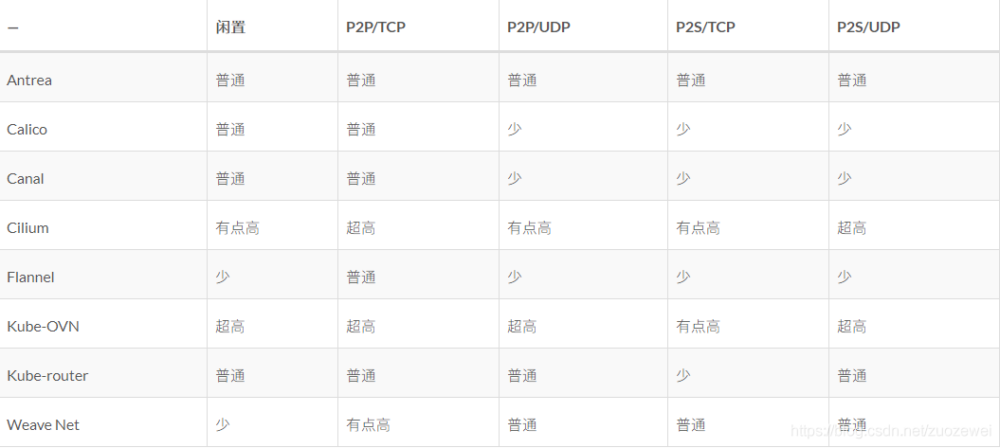
透过图表可以观察到：

- Kube-OVN 不但资源吃很多，性能还很不好
- Canal/Calico/Flannel 三者的运算资源使用量都不多，且性能都很好
- Kube-Router 的性能都很差，资源使用方便也不是特别出色
- WeaveNet 与Cilium 性能都不差，但是 Cilium 吃的资源很高，可说跟 Kube-OVN 同等级，而 WeaveNet 用到的资源少

## 建议

### 作者建议

- 需要一个 CNI 来容纳额外的小型节点集群，或者不在乎安全性。可以考虑然后使用 Flannel，这几乎是最轻的稳定CNI。
  （它也是最古老的之一。根据传说，它是由 Homo-Kubernautus 或 Homo-Containorus 发明的）。你可能对出色的k3s项目感兴趣！
- 当一个标准群集需要CNI，好的，Calico 是您的选择，如果需要，请不要忘记调整 MTU。您可以使用网络策略，轻松启用/禁用加密等。
- 当一个（非常）大型集群需要一个CNI，该基准测试不能反映大型集群的行为。因为我们没有数百台具有10Gbit/s 连接性的服务器。因此，最好的选择是至少使用 Calico 和 Cilium 在您的节点上运行自定义的基准测试。

### 个人心得

- 这次的测试对比我认为其实能看到的东西有限，主要是不同的 CNI 所搭配的解决方案不同，目标要配合的情况也不同，虽然从图表中可以看到 Kube-OVN 的综合评比最差，但是其要用的场景本身就不太一样，单纯用最原始的性能互打来判别优劣其实不太对；
- 如果今天要选择网络 CNI 的时候，可以看到性能跟资源方面， Flannel/Calico/Canal 几乎等级都差不多，而且 Calico 还支援加密与 Network Policy 等功能；
- 此外，目前 Flannel 也从 Kubeadm 的官方教学页面中移除，因为太多问题且维护者没有要修复。所以我认为如果没有特别使用情境需求的话，可以考虑使用 Calico；
- Cilium 对于安全性以及 load-balancing 方面也有别的功能，就如同第一点所提到，不同的场景有不同的需求，有些功能是独占的。

参考资料：

- [1]：Benchmark results of Kubernetes network plugins (CNI) over 10Gbit/s network (Updated: August 2020)