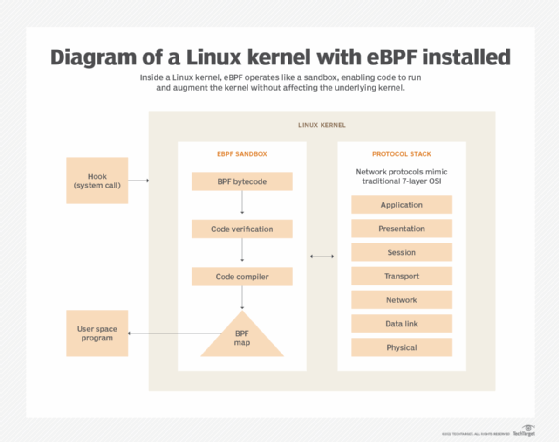

# 使用 Cilium 和 eBPF 提高 Kubernetes 网络性能

<iframe id="google_ads_iframe_/3618/sitops/TUTORIAL_2" name="google_ads_iframe_/3618/sitops/TUTORIAL_2" title="第 3 方广告内容" width="300" height="250" scrolling="no" marginwidth="0" marginheight="0" frameborder="0" role="region" aria-label="广告" tabindex="0" data-load-complete="true" data-google-container-id="3" data-gtm-yt-inspected-45516328_67="true" data-gtm-yt-inspected-107="true" data-gtm-yt-inspected-111="true" style="border: 0px; vertical-align: bottom;"></iframe>

## 了解 Cilium Kubernetes 插件和 eBPF 框架如何提高网络效率和安全性，然后使用示例代码逐步在 K3s 集群上安装 Cilium。


经过

- [Chris Tozzi，](https://www.techtarget.com/contributor/Chris-Tozzi) Fixate IO

发布日期：**2023 年 5 月 8 日**

Kubernetes 生态系统非常复杂，Kubernetes 网络也不例外。但 Kubernetes 的 Cilium 插件可以降低这种复杂性，提供基于 eBPF 内核机制的安全、可扩展的方法。

<iframe id="google_ads_iframe_/3618/sitops/TUTORIAL_3" name="google_ads_iframe_/3618/sitops/TUTORIAL_3" title="第 3 方广告内容" width="300" height="600" scrolling="no" marginwidth="0" marginheight="0" frameborder="0" role="region" aria-label="广告" tabindex="0" data-load-complete="true" data-google-container-id="4" data-gtm-yt-inspected-45516328_67="true" data-gtm-yt-inspected-107="true" data-gtm-yt-inspected-111="true" style="border: 0px; vertical-align: bottom;"></iframe>

传统上，监控、保护和管理 Kubernetes 中的网络涉及[运行资源匮乏的 sidecar 容器](https://www.techtarget.com/searchapparchitecture/tip/The-reasons-to-use-or-not-use-sidecars-in-Kubernetes)。这种策略效率低下，并且限制了 Kubernetes Pod 和节点的网络连接状态的可见性。

使用 Cilium 可以更好地实现 Kubernetes 网络，Cilium 是 Kubernetes 的容器网络接口 (CNI) 插件，它依赖高效[的 eBPF 技术](https://www.techtarget.com/searchitoperations/tip/An-introduction-to-eBPF-and-where-it-shines)在 Linux 内核内运行程序。探索 Cilium 的优点和局限性，然后通过分步演练将其安装在 Kubernetes 上。

### 为什么使用 Cilium 和 eBPF 进行 Kubernetes 网络

Cilium 是一个[开源](https://cilium.io/)CNI 插件，为 Kubernetes 提供网络、安全和监控功能。与许多类似的工具不同，Cilium 在底层使用 eBPF 来访问管理 Kubernetes 环境所需的数据和控制，从而提高效率和可见性。

#### 更高的效率

eBPF 机制允许程序直接在 Linux 内核内部运行。这些程序运行非常高效，因为它们在内核空间而不是传统上运行监控和安全软件的用户空间中运行。

大多数其他 Kubernetes 网络工具依赖 sidecar 容器来托管软件代理，这些代理在它们监视的节点上作为用户空间应用程序运行。与 Cilium 相比，这会导致更高的资源消耗和更低的可见性级别，Cilium 使用 eBPF 来完成监控和管理 Kubernetes 集群内网络所需的[繁重工作。](https://www.techtarget.com/searchitoperations/news/252483517/Linux-kernel-utility-could-solve-Kubernetes-networking-woes)



由于eBPF可以运行沙盒程序而不影响内核本身，因此可以显着提高效率。

#### 更好地了解 Kubernetes 工作负载

与传统的 Kubernetes 网络软件相比，管理 Kubernetes 网络和内核中的其他功能还可以更好地了解基于 Kubernetes 的工作负载。

由于 Kubernetes 集群内节点上发生的所有进程和事件对节点内核都是可见的，因此使用 eBPF 的管理员几乎可以捕获他们想要的有关工作负载的任何数据。与传统的[网络监控工具](https://www.techtarget.com/searchnetworking/feature/How-to-select-the-best-network-monitoring-tool)相比，这提高了可见性，传统的网络监控工具通常仅限于基本的网络日志和指标，而不是有关网络操作的内核级详细信息。

### Cilium 对 Kubernetes 网络的限制

也就是说，一些用户可能不希望或无法使用 Cilium 和 eBPF 来管理 Kubernetes 中的网络。

实际上，eBPF 目前仅适用于 Linux。尽管 Microsoft为 Windows[实现了](https://cloudblogs.microsoft.com/opensource/2022/02/22/getting-linux-based-ebpf-programs-to-run-with-ebpf-for-windows/)有限的 eBPF 功能，但它仅支持某些工作负载，对于生产环境来说还不是一个现实的选择。因此，Cilium 对于那些在 Kubernetes 集群内运行基于 Windows 的节点的人来说没有用。

此外，对于 Linux 用户，eBPF[需要](https://docs.cilium.io/en/v1.13/operations/system_requirements/)内核版本 4.19.57 或更高版本（截至发布时）。运行早期版本 Linux 的 Kubernetes 节点将无法从 Cilium 和 eBPF 中受益。

#### 纤毛替代品

Calico 是另一个也支持 eBPF 的 Kubernetes 网络工具。然而，与 Cilium 不同的是，Calico 使基于 eBPF 的监控成为可选的。该工具还可以使用传统方法收集 Kubernetes 网络数据。

由于 Cilium 是专门为 eBPF 设计的，因此如果您知道想要使用 eBPF 观察 Kubernetes 网络操作，那么它是一个不错的选择。另一方面，如果您想使用 eBPF 之外的其他方法来监控网络，或者您的某些节点与 eBPF 不兼容（例如，因为它们运行的是较旧的内核版本），那么 Calico 可能是最好的选择。

#### 没有 Cilium 可以使用 eBPF 吗？

可以在没有 Cilium 的情况下使用 eBPF。然而，要做到这一点，您需要从头开始编写 eBPF 程序，这既困难又耗时。

Cilium 允许您将基于 eBPF 的网络监控和管理工具部署到集群中。另外，大多数 Cilium 的 eBPF 工具都是预先配置的。您可以开箱即用，无需[编写或部署自定义 eBPF 程序](https://www.techtarget.com/searchitoperations/tip/Take-advantage-of-eBPFs-monitoring-capabilities-on-Linux)。

<iframe id="ytplayer-0" src="https://www.youtube.com/embed/JomsxTeB1bg?autoplay=0&amp;modestbranding=1&amp;rel=0&amp;widget_referrer=https://www.techtarget.com/searchitoperations/tutorial/Improve-Kubernetes-network-performance-with-Cilium-and-eBPF&amp;enablejsapi=1&amp;origin=https://www.techtarget.com" type="text/html" height="360" width="640" frameborder="0" data-gtm-yt-inspected-45516328_67="true" title="面向 IT 管理员的 Kubernetes 网络教程" data-gtm-yt-inspected-107="true" data-gtm-yt-inspected-111="true" style="top: 0px; left: 0px; width: 640px; height: 360px; max-width: none; max-height: 360px;"></iframe>

### 如何为 Kubernetes 安装 Cilium

在 Kubernetes 上安装 Cilium 的过程会有所不同，具体取决于您使用的 Kubernetes 发行版。有关特定于发行版的详细信息，请参阅 Cilium[文档](https://docs.cilium.io/en/stable/gettingstarted/k8s-install-default/)。

[本教程将引导您完成在 Ubuntu 版本 22.04 上托管的本地 K3s 集群](https://www.techtarget.com/searchitoperations/tutorial/How-to-set-up-a-K3s-cluster)上的 Cilium 安装。

#### 第 1 步：安装 Cilium CLI 工具

在安装 Cilium 本身之前，请使用以下代码安装 Cilium CLI 工具。

```
CILIUM_CLI_VERSION=$(curl -s https://raw.githubusercontent.com/cilium/cilium-cli/master/stable.txt) 
CLI_ARCH=amd64
if [ "$(uname -m)" = "aarch64" ]; 然后 CLI_ARCH=arm64; 菲
curl -L --fail --remote-name-all https://github.com/cilium/cilium-cli/releases/download/${CILIUM_CLI_VERSION}/cilium-linux-${CLI_ARCH}.tar.gz{, .sha256sum}
sha256sum --检查 cilium-linux-${CLI_ARCH}.tar.gz.sha256sum
sudo tar xzvfC cilium-linux-${CLI_ARCH}.tar.gz /usr/local/bin
rm cilium-linux-${CLI_ARCH}.tar.gz{,.sha256sum}
```

该工具现在应该可以在 /usr/local/bin/cilium 中找到。

#### 第2步：安装Cilium

下一步是安装 Cilium 本身。

为了确保 Cilium 正常工作，请在启动集群之前禁用对其他 Kubernetes 网络插件的支持。使用以下命令启动 K3s 集群，无需其他网络插件。

```
卷曲-sfL https://get.k3s.io | INSTALL_K3S_EXEC='--flannel-backend=none --disable-network-policy' sh -
```

您现在可以使用cilium install命令安装 Cilium 。

如果出现“找不到命令”错误，您很可能需要显式指定 Cilium 二进制文件的路径。

```
/usr/local/bin/cilium 安装
```

使用cilium status --wait命令检查 Cilium 是否已成功安装。

#### 第 3 步：将 Cilium 与 Hubble 结合使用

至此，Cilium 已安装在您的集群中。但为了充分利用其网络和安全功能，您需要安装 Hubble，这是一个在 Cilium 和 eBPF 之上运行的可观测[平台。](https://docs.cilium.io/en/v1.13/gettingstarted/hubble/)

使用cilium hubble enable命令设置 Hubble 。Hubble 还提供了自己的 CLI 工具，您可以使用以下代码安装该工具。

```
导出 HUBBLE_VERSION=$(curl -s https://raw.githubusercontent.com/cilium/hubble/master/stable.txt)
HUBBLE_ARCH=amd64
if [ "$(uname -m)" = "aarch64" ]; 然后 HUBBLE_ARCH=arm64; 菲
curl -L --fail --remote-name-all https://github.com/cilium/hubble/releases/download/$HUBBLE_VERSION/hubble-linux-${HUBBLE_ARCH}.tar.gz{,.sha256sum}
sha256sum --检查 hubble-linux-${HUBBLE_ARCH}.tar.gz.sha256sum
sudo tar xzvfC hubble-linux-${HUBBLE_ARCH}.tar.gz /usr/local/bin
rm hubble-linux-${HUBBLE_ARCH}.tar.gz{,.sha256sum}
```

Hubble 启动并运行后，您可以开始在命令行中或通过 Hubble 提供的可选的基于 Web 的 UI 监控 Kubernetes 网络。