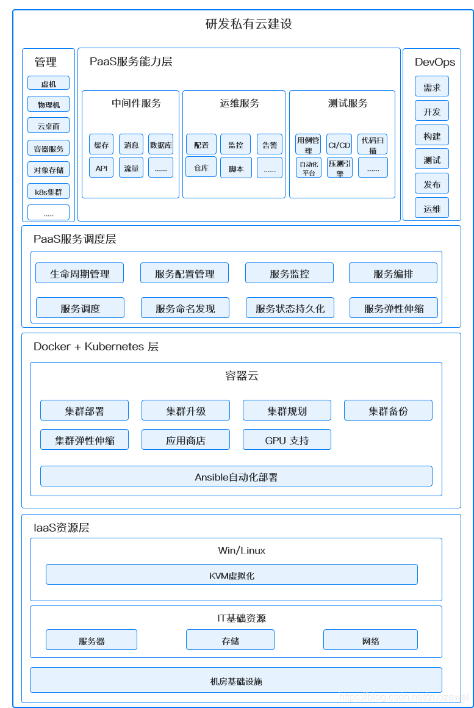
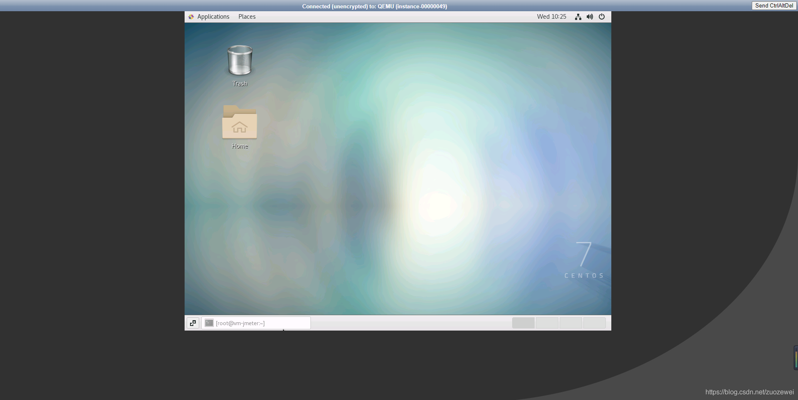

# 浅谈基于 OpenStack 和 k8s 轻量研发私有云建设

 [zuozewei](https://bbs.huaweicloud.com/community/usersnew/id_1626682078895094) 发表于 2021/07/19 17:42:46

 

 7.7k+ 0 3

【摘要】 在容器时代，不能只看 k8s 本身，对于企业内的基础设施，“向上”和“向下”的融合和兼容问题也很关键。“向上”是面向业务场景为用户提供对接，因为容器并不能直接服务于业务，它还涉及到如何部署应用、服务治理、调度等诸多层面。“向下”，即容器与基础设施相结合的问题，这里更多的是兼容资源类型、更强大的隔离性、更高的资源使用效率等都是关键问题；

背景面临的挑战功能简介核心优势核心设施平台（IaaS云）基础服务平台（PaaS云）技术落地整体架构技术选型IaaS云技术PaaS云技术实践的过程OpenStack & CloudStackKVM & VMWareCentOS & UbuntuOpenStack & k8s拥抱开源面临的困难云原生架构带来的挑战私有云建设路线私有云的容量评估全栈监控k8s集群规模k8s集群计算资源压力引擎其它运行效果展示基础服务平台（IaaS云）登录认证高效管理物理资源（计算、网络、存储）1.2、轻松管理系统镜像web桌面集群管理 Web UI基础服务平台（PaaS云）DevOps流水线负载均衡代码仓库敏捷研发管理调用链监控服务注册服务监控日志聚合API文档配置管理制品仓库容器仓库静态代码扫描可视化微服务管理压力引擎资源监控服务可视化监控自定义告警经验心得未来展望

## 背景

建设公司研发私有云，为研发部门提供安全、可靠、高效的基础资源、数据存储服务、DevOps 流水线以及运维自动化服务等。

## 面临的挑战

- 运维：高效管理基础设施资源、监控报警完善且易用；
- 产品：弹性扩容、资源随时可用；
- 研发整体：提升资源利用率、提高产品交付效能，降低成本。

## 功能简介

### 核心优势

- 任务调度：为集群系统中的任务提供调度服务，自动将服务按资源需求分配到资源限制的计算节点;
- 资源隔离：为产品提供管控与服务节点隔离能力，保证研发应用跟管控服务不互相产生影响;
- 高可用能力：自动监控服务的运行，根据运行情况对失效的服务进行自动重启恢复;
- 网络互联互通能力：提供统一的IP地址分配和网络互通能力;
- 统一编排管理能力：结合 gitlab 和 k8s 对输出的产品进行统一的编排管理;
- 公共产品组件为团队提供了统一部署、验证、授权、调度和管控能力，为私有云服务提供基础性的支撑。

### 核心设施平台（IaaS云）

- 提供计算、网络、存储等核心资源设备的虚拟化；
  - 支持不同操作系统，包括主流的 win 和 Linux 系统；
  - 提供主要包括三种服务：云主机、云网络、云硬盘；
  - 提供可视化 Web UI。
- 提供 k8s 集群（容器云）规划、部署和运营；
  - 支持多种计算、存储和网络方案；
  - 集成 Ansible 运维自动化工具；
  - 支持在线环境和离线环境部署；
  - 提供可视化 Web UI。

### 基础服务平台（PaaS云）

- 提供数据存储、应用服务、DevOps、运维管理等服务；
- 数据存储类：支持常见 NFS 、Ceph RBD、Local Volume 等；
- 应用服务类：自愈和自动伸缩、调度和发布、负载均衡、消息队列、容器引擎、调用链监控、Metrics 监控、日志聚合、服务安全、API管理、弹性和容错、配置管理等；
- DevOps：敏捷研发管理、持续交付流水线、代码扫描、代码仓库、制品仓库、容器仓库、压测引擎等；
- 运维管理：日志监控、资源监控、消息告警等。

## 技术落地

### 整体架构

### 技术选型

#### IaaS云技术

| 技术               | 说明                      | 官网                                                         |
| ------------------ | ------------------------- | :----------------------------------------------------------- |
| OpenStack Nova     | 云主机                    | https://www.openstack.org/software/releases/victoria/components/nova |
| OpenStack keystone | 认证中心                  | https://www.openstack.org/software/releases/victoria/components/keystone |
| OpenStack Glance   | 磁盘镜像                  | https://www.openstack.org/software/releases/victoria/components/glance |
| OpenStack Neutron  | 云网络                    | https://www.openstack.org/software/releases/victoria/components/neutron |
| OpenStack Cinder   | 云硬盘                    | https://www.openstack.org/software/releases/victoria/components/cinder |
| OpenStack Horizon  | 可视化UI                  | https://www.openstack.org/software/releases/victoria/components/horizon |
| KubeOperator       | 规划、部署和运营 k8s 集群 | https://github.com/KubeOperator/KubeOperator                 |
| NFS                | 网络存储                  | http://nfs.sourceforge.net                                   |
| Ceph               | 分布式存储                | https://ceph.com                                             |

#### PaaS云技术

| 技术                 | 说明                                                         | 官网                                                         |
| -------------------- | ------------------------------------------------------------ | :----------------------------------------------------------- |
| kubernetes(k8s)      | 容器云                                                       | https://kubernetes.io                                        |
| helm                 | k8s 包管理器                                                 | https://helm.sh                                              |
| Docker               | 应用容器引擎                                                 | https://www.docker.com                                       |
| Weave Scope          | k8s 可视化监控工具                                           | https://www.weave.works                                      |
| Spring Cloud         | 微服务框架                                                   | https://spring.io/projects/spring-cloud                      |
| Spring Cloud Alibaba | 微服务框架                                                   | https://github.com/alibaba/spring-cloud-alibaba              |
| Spring Boot          | 容器+ MVC 框架                                               | https://spring.io/projects/spring-boot                       |
| Knife4j              | 文档生产工具                                                 | https://github.com/xiaoymin/swagger-bootstrap-ui             |
| Elasticsearch        | 搜索引擎                                                     | https://github.com/elastic/elasticsearch                     |
| RabbitMq             | 消息队列                                                     | https://www.rabbitmq.com                                     |
| Redis                | 分布式缓存                                                   | https://redis.io                                             |
| MongoDb              | NoSql数据库                                                  | https://www.mongodb.com                                      |
| LogStash             | 应用日志收集                                                 | https://github.com/logstash/logstash-logback-encoder         |
| Jenkins              | DevOps 调度工具                                              | https://github.com/jenkinsci/jenkins                         |
| Promethues           | 资源监控系统                                                 | https://prometheus.io                                        |
| Grafana              | 监控可视化看板                                               | https://grafana.com                                          |
| harbor               | Docker 镜像仓库                                              | https://github.com/goharbor/harbor-helm                      |
| SkyWalking           | 分布式追踪、服务网格遥测分析、度量聚合和可视化一体化解决方案 | http://skywalking.apache.org                                 |
| Kibana               | 日志可视化看板                                               | https://www.elastic.co/cn/downloads/kibana                   |
| Fluentd              | 容器日志收集                                                 | https://github.com/kubernetes/kubernetes/tree/master/cluster/addons/fluentd-elasticsearch |
| Gitlab               | 代码仓库                                                     | https://about.gitlab.com                                     |
| Nexus3 OSS           | 制品仓库                                                     | https://www.sonatype.com                                     |
| SonarQube            | 静态代码扫描                                                 | https://www.sonarqube.org                                    |
| YouTrack             | 敏捷研发管理                                                 | https://www.jetbrains.com/youtrack                           |
| Jmeter               | 压测引擎                                                     | https://jmeter.apache.org                                    |
| Kuboard              | 微服务管理工具                                               | https://github.com/eip-work/kuboard-press                    |

### 实践的过程

#### OpenStack & CloudStack

作为两大主流开源云平台，OpenStack 和 CloudStack 各具优势。
CloudStack 是从 cloud.com 公司的产品转向开源，从产品化方面来说，本身是个比较成熟的产品，安装和部署都很方便，且提供了完整的升级流程，可以便于将来和社区保持同步。然而随着社区版本的不断更新和兼容各家产品，CloudStack 也逐渐变得庞大。以目前公司搭建私有云落地方案而言，很多功能无用且显得多余。
OpenStack 目前已经成为了大家选择云计算技术落地框架的事实标准，优势在于其插件化的框架，因为技术框架允许自由的选择可用插件，私有云落地方案中，可以只选择需要的组件进行安装。因为框架允许插入不同组件，所以 OpenStack 社区也获得了更多厂商的支持，社区活跃度也比较高。在企业实施落地方案的时候，可以有更多的选择余地，对遇到的问题，也有了更多更快的响应。
考虑到如果将来公司还需要进一步开发所需要的组件，并且需要对云平台进行针对性的调优，例如虚拟机的 IO、CPU 绑定等操作，而不只是依赖于开源社区的版本，OpenStack 的框架则是更好的选择。CloudStack 如果进行二次开发，代码未合并入社区版本的时候，升级则需要再次 merge 代码，重复工作比较多。OpenStack 则可以做成插件，在升级 OpenStack 版本的时候，保持插件的可用。
但是由于 OpenStack 的产品化复杂度较高，搭建落地到将来的升级，以及后续的二次开发，都需要进行不少的开发和测试人力投入。对于非互联网公司来说，咱们并没有比较成熟的运维团队和研发团队，开发和测试在人力资源成本方面计算都很紧张，所以对于有公有云需求还是直接购买大厂的云服务即可。
最终的在开源方案选择上，更倾向于 OpenStack。

#### KVM & VMWare

OpenStack 原生对 KVM 支持更加完善。
KVM 也是比较成熟的虚拟化平台，于 2006 年写入 Linux 内核，且在 Redhat 6 以后，转向对 KVM 的支持而非之前大力推广 Xen 的虚拟化方案。
VMware 是商业软件，在虚拟化平台中，目前应该属于 IO 和稳定性都最优化的方案。OpenStack 中，因为 VMware 本身提供了相应的 driver，对 VMware 的支持也比较成熟。
最终放弃 VMware 的原因，是因为其授权比较昂贵。
目前选择的方案，以 KVM 为主。

#### CentOS & Ubuntu

OpenStack 社区 对 Ubuntu 支持比较完善，Ubuntu 更新速度快，内核版本比较新，可以支持更高版本的KVM，对OpenStack使用者来说，Ubuntu 可以提供更好的性能。
就系统的稳定性而言，CentOS 来自 Redhat 商业版本的重新编译，稳定性和系统优化以及兼容性方面，CentOS 有着比较完善的测试和发型流程。CentOS 7 以后，也换用了 Linux 3.x 内核版本。
鉴于系统可靠性的选择和之前公司的技术积累，还是选用 CentOS 系列，比 Ubuntu 管理更为方便。

#### OpenStack & k8s

OpenStack 主要是面向资源分配，虚拟机创出来了就基本没有责任了，至于服务高可用，自动伸缩，监控等这类的功能完全由应用方来处理，平台不提供支持，适合传统的部署模式，对应用而言和物理机时代没有区别；
而 k8s 容器云主要面向的是服务，强调服务能力，具有弹性与高可用保障，而不是简单地提供 IT 资源。对应的，应用服务也要使用云原生的理念来进行改造拆分，以更好地利用 k8s 提供的平台能力。
**就咱们公司而言目前还需要 OpenStack，因为很多老系统没有容器化，所以到了现实环境下就要妥协**。

但是无论是 OpenStack 还是 k8s 上手技术门槛较高，最痛苦的事情，莫过于看它的架构。

不信？好，扔个 OpenStack 架构图给你看：

我还是用一个简单的图吧，看得更明白些。如下：

k8s 架构图如下：

看上去比 OpenStack 的架构图稍微好点，不过从技术上来说也是比较复杂的。

#### 拥抱开源面临的困难

云计算发展到今天，无论是在技术、服务层面，还是在商业层面都已经相对比较成熟。当前绝大多数初创公司在基础设施上的策略一定是公有云，已经极少再有自建或托管 IDC 的情况，所以不会存在是否上云这样的纠结。
但是对于我们这样体量的公司，全部上云，就必须要考虑得更全面：考虑基础设施的变化，业务的平稳过度，运维模式的转变，成本管控的调整，以及众多的细节问题。

虽然需要比较和考虑的因素非常多，主要从人员能力、技术掌控、未来发展等方面进行说明。
人的因素是放在第一位的，企业中一般是业务开发应用及基础架构运维人员（比如系统、网络管理等），采用开源的方案的话，如果仅仅是在开发、测试环境去试着安装、使用是没有问题的，但是当准备在生产上进行实施部署，并且后续为了进一步提升开源平台化的能力（比如生产遇到问题需要分析、内部系统集成、进行前端定制、跟随社区优化/升级等），会发现这些均需要能力较强的既懂开发也懂基础架构的人员团队时候就寸步难行了。

越是底层的技术，技术门槛就越高、越复杂，也越离不开高端人才的投入。比如硬件资源虚拟化，就需要有懂内核、懂网络、懂 OpenStack、懂 k8s、懂分布式存储如 Ceph 等等的专业人才。但是真正精通的人却不多，加上要搞定整套解决方案，还需要一个完整的团队，这就难上加难，在团队组建上面临更大的困难。人才紧缺，就意味着人力成本会很高，这个就是技术投入的隐性成本。而且因为技术门槛高，一旦发生人员流动，那么，对于原有技术平台来说，无人能把控的风险就会更高。这一点往往会是最大的隐性管理成本所在。

当然，在人才招揽上，我们可以加大人力成本投入，招聘最优秀的人才。但是作为像咱们这样以更加聚焦于业务，以业务发展为生命线的公司，我们更期望能够在业务上取得创新和发展，而不是在技术上取得多么非凡的成就（这一点与公司的发展诉求是不一致的）。所以这就从根本上决定了，我们不会无限度地投入，或投入非常大的成本在这些基础技术的研究上。

所以从未来发展来看，**私有云（存量+测试&开发）与公有云（生产+增量）方案是适合我们的方向**，开源方案和商业方案会长时间存在，这是受每个公司的技术战略定位决定的。而对于大多数企业来说，以实现功能服务前端业务为主的技术战略，则选择上更应该倾向于选择商业方案。

#### 云原生架构带来的挑战

大致来说，在部署应用程序的方式上，我们现在主要经历了三个时代：

- 传统部署时代：早期企业直接将应用程序部署在物理机上。由于物理机上不能为应用程序定义资源使用边界，我们也就很难合理地分配计算资源。例如：如果多个应用程序运行在同一台物理机上，可能发生这样的情况：其中的一个应用程序消耗了大多数的计算资源，导致其他应用程序不能正常运行。应对此问题的一种解决办法是，将每一个应用程序运行在不同的物理机上。然而，这种做法无法大规模实施，因为资源利用率很低，且企业维护更多物理机的成本昂贵。
- 虚拟化部署时代：针对上述问题，虚拟化技术应运而生。用户可以在单台物理机的CPU上运行多个虚拟机，虚拟化技术使得应用程序被虚拟机相互分隔开，限制了应用程序之间的非法访问，进而提供了一定程度的安全性。虚拟化技术提高了物理机的资源利用率，可以更容易地安装或更新应用程序，降低了硬件成本，因此可以更好地规模化实施。每一个虚拟机可以认为是被虚拟化的物理机之上的一台完整的机器，其中运行了一台机器的所有组件，包括虚拟机自身的操作系统。
- 容器化部署时代：容器与虚拟机类似，但是降低了隔离层级，共享了操作系统。因此，容器可以认为是轻量级的。与虚拟机相似，每个容器拥有自己的文件系统、CPU、内存、进程空间等。运行应用程序所需要的资源都被容器包装，并和底层基础架构解耦。容器化的应用程序可以跨云服务商、跨Linux操作系统发行版进行部署。借助容器技术呈现了一个优雅的抽象场景：让开发所需要的灵活性、开放性和运维所关注的标准化、自动化达成相对平衡。容器镜像迅速成为了应用分发的 **工业标准**。

前面我们说了，我们公司目前正处于 **「虚拟化部署时代」 到 「容器化部署时代」的过渡阶段**，那么它必然带来了更高的要求：

- 敏捷地创建和部署应用程序：相较于创建虚拟机，创建容器更加容易和快速；
- 高度自动化的软件交付：可以更快更频繁地构建、部署的、并且轻松地回滚；
- 分离开发和运维的关注点：在开发构建阶段可以部署到多种基础设施上，将部署阶段需要关注的内容聚焦在如何提供基础设施以及如何使用的过程中。降低了开发和运维的耦合度；
- 可监控性：不仅可以查看操作系统级别的资源监控信息，还可以查看应用程序健康状态以及 k8s 集群的监控信息;
- 开发、测试、生产不同阶段的环境一致性：在开发环境的容器与测试、生产环境中运行的容器一致;
- 跨云服务商、跨操作系统的可移植性：容器支持运行在 Ubuntu、RHEL、CentOS 等不同的操作系统发行版上，可以运行在私有云、也可以支持阿里云等不同的云供应商的环境中；
- 以应用程序为中心的管理：虚拟机时代的考虑的问题是在虚拟硬件上运行一个操作系统，而容器化时代，问题的焦点则是在操作系统的逻辑资源上运行一个应用程序；
- 松耦合、分布式、弹性、无约束的微服务：满足更小的、独立的微服务，可以动态部署和管理；
- 资源隔离：支持多租户，确保应用程序性能不受干扰；
- 资源利用：需要满足资源高效、高密度利用。

针对上述更高诉求，我们在建设私有云的过程中需要重点考虑并逐一落地。

#### 私有云建设路线

私有云建设很少有一步到位的，往往最开始的阶段是满足最基础的需求，例如计算虚拟化，存储虚拟化，然后网络虚拟化，然后容器，监控，大数据，编排，数据库，等等公共应用。
其实，这个和云计算的分层也是有很大关系的。从 IaaS 到 PaaS，再到 SaaS，层层递进。研发云的建设，往往也是遵循这个规律。在实践中，可能会有一些交集。
通常都是分几期的。第一期为试点项目，第二期根据一期结果形成规范，标准，成为新开发应用的标准平台。第三期逐渐将老应用迁移到私有云上。

对于私有云实施：

- 通常来讲私有云基础设施只被公司研发团队使用，支持单租户即可；
- 一般使用 4 个网：管理网、业务网（vxlan）、带外网、存储网；
- 使用不同子网

#### 私有云的容量评估

私有云的容量需要根据公司业务来评估，以一般行业来说，都有 web 区，有 app，有 db。需要根据运行在私有云上的业务的多少，来统计所需要的资源的多少。例如，web区需要 nginx，需要考虑 HA 和 LB，那么就需要 2 台以上；如果多个业务共享 nginx，那么就需要多个 nginx 集群来分担压力。

OpenStack Celimeter 模块专门用来拥挤CPU，内存，网络的使用量，可以统计出使用云资源，相对传统环境节省了多少资源。
至于成本和效率的平衡，一般在私有云建设初期很难做到。设备的购置，部署，人员的配置等等都是一笔不小的开支；私有云真正的优势体现在后期的使用中。
容量如何评估，这个肯定是没有普适标准的了。容量通常从三方面考虑：计算能力、存储容量、网络带宽。这三方面可以说也是数据中心最基本的三大核心要素了，我们都知道，云计算是以规模取胜的，这个规模如何决定？究竟是 20 节点，50 节点，还是 100+ 节点，这个得根据你自己的业务需求来考虑了，在小规模情况下，为了高可用，如果可用容量评估是 N，那你就按 2N 来计算，私有云一般不会像达到公有云那种规模，所以通常也不可能达到很多大佬口中的虚机随便挂，真挂了你宿主机资源没有了，咋整？
至于成本，的看你的方案了，我们是采用开源自建，如果是与厂商合作共建，合作情况下如何分工，哪些外包出去，这个得仔细考虑。通常，如果人力资源有限，技术实力有限，那就由承包给厂商来实施吧，不然到后面也是个烂摊子。但是，全部外部给厂商的不足也是明显的，一不小心就被人家锁定，每年烧钱的跑不掉的了，尤其是项目上马后，停也停不下来了。

#### 全栈监控

首先我们要了解监控的必要性，如果没有监控数据，运维侧无从谈起，没有数据，那么如何去度量一个指标呢？
所以，在建设研发私有云尽量搭建一套适合的监控体系是必要的。
而从监控分类来说，常见的是以下几种：

| 类别        | 主要内容                  | 使用场景 |
| ----------- | ------------------------- | -------- |
| Metrics监控 | 计数器，时序数值          | 监控告警 |
| 日志监控    | 离散事件，结构化/非结构化 | 调试发现 |
| 调用链监控  | 调用链                    | 调试发现 |
| 健康检查    | 探活                      | 监控告警 |
| 告警系统    | 监控告警                  | 监控告警 |

Metrics 监控主要包括核心业务指标监控和资源监控，核心业务指标监控主要方式还是埋点，目前这块我们基本是空白。至于资源监控，我们集成云原生的开源监控系统 Prometheus 可以 cover 大部分的需求。
日志监控这块包括应用日志和平台日志的聚合，这块目前的技术比较成熟，基本是集成成熟 ELK & EFk 开源方案解决。
健康检查方面，在 k8s 容器云层提供存活和就绪探针，另外，在微服务框架也提供了应用监控中心，可以很方便进行监控。
告警系统是每个监控系统的必备功能，Prometheus 支持丰富的告警规则和方式，常见的邮件、钉钉、微信等都支持。
这里特别提一下调用链监控，这个在目前的微服务系统里面是必可少的组件，分布式追踪、服务网格遥测分析、度量聚合和可视化还是挺好用的，这里我们选择了 Skywalking，具体考量可以参考下表：

| 对比项            | CAT                                     | Zipkin                     | Pinpoint                 | Skywalking                 |
| ----------------- | --------------------------------------- | -------------------------- | ------------------------ | -------------------------- |
| 调用链可视化      | 有                                      | 有                         | 有                       | 有                         |
| 报表              | 非常丰富                                | 少                         | 中                       | 中                         |
| ServerMap         | 简单依赖图                              | 简单                       | 好                       | 好                         |
| 埋点方式          | 侵入                                    | 侵入                       | 不侵入字节码增强         | 不侵入字节码增强           |
| 性能损耗          | 高                                      | 高                         | 高                       | 低                         |
| Hearbeat支持      | 有                                      | 无                         | 有                       | 有                         |
| Metric支持        | 有                                      | 无                         | 无                       | 有                         |
| Java/.Net支持     | 有                                      | 有                         | 只有Java                 | 有                         |
| Dashboard中文支持 | 好                                      | 无                         | 无                       | 好                         |
| 社区支持          | 好，文档较丰富，作者在携程点评          | 好，文档一般，暂无中文社区 | 一般，文档缺，无中文社区 | 好，文档丰富，中文社区活跃 |
| 调国内案例        | 携程、点评、陆金所                      | 京东、阿里不开源           | 暂无                     | 很多                       |
| 源头祖先          | eBayCAL~Centralized Application Logging | Google Dapper              | Google Dapper            | Google Dapper              |

综上所述，我们可以通过下图来简单概况全栈监控这块的设计：

#### k8s集群规模

在实践中，大家经常问到的一个问题是我们公司应该选择一个还是多个 k8s 集群？

- 一个大一统的的平台，支持多种应用负载、环境和多租户隔离；
- 或者，一组以应用为中心的小集群，支持不同应用和环境的生命周期管理。

我们可以比较一下这两种选择：

|                               | 单一大集群                         | 多个应用为中心集群                         | 备注                                                         |
| ----------------------------- | ---------------------------------- | ------------------------------------------ | :----------------------------------------------------------- |
| 特点                          | 支持多种应用负载、环境和多租户隔离 | 支持不同应用和环境的生命周期管理           |                                                              |
| 硬多租（安全、资源强隔离）    | 复杂                               | 简单                                       |                                                              |
| 混合调度多种类型资源 (GPU等 ) | 复杂                               | 简单                                       |                                                              |
| 集群管理复杂性                | 较低                               | 较高(自建)                                 |                                                              |
| 节点管理开销                  | 较高                               | 较低                                       |                                                              |
| 集群生命周期的灵活性          | 困难                               | 简单（不同集群可以有不同的版本和伸缩策略） |                                                              |
| 规模化引入的复杂性            | 复杂                               | 简单                                       |                                                              |
| 节点管理开销                  | 较低                               | 较高                                       |                                                              |
| 操作系统额外开销              | 较低                               | 较高                                       |                                                              |
| 节点调度复杂性（如 NUMA）     | 较高                               | 较低                                       | 部署密度增加之后，需要更加合理的资源调度来保障应用 SLA       |
| 节点稳定性                    | 较低                               | 较高                                       | 随着部署密度增加，节点自身的稳定性也会随之下降               |
| 节点失效爆炸半径              | 较大                               | 较小                                       | 一个大规格实例失效，会影响更多的应用容器。也需要预留更多的资源进行宕机迁移 |
| Master 组件压力               | 较小                               | 较大                                       | Worker 节点数量是影响 Master 节点容量规划和稳定性的因素之一。k8s 1.13 版本引入的 NodeLease 功能让节点数量对 Master 组件的压力降低很多 |

默认情况下，kubelet 使用 CFS 配额 来执行 pod 的 CPU 约束。当节点上运行了很多 CPU 密集的应用时，工作负载可能会迁移到不同的 CPU 核，工作负载的会受到 CPU 缓存亲和性以及调度延迟的影响。当使用大规格实例类型时，节点的 CPU 数量较多，现有的 Java，Golang 等应用在多 CPU 共享的场景，性能会出现明显下降。所有对于大规格实例，需要对CPU管理策略进行配置，利用 CPU set 进行资源分配。

此外一个重要的考虑因素就是 NUMA 支持。在 NUMA 开启的物理机实例或者大规格实例上，如果处理不当，内存访问吞吐可能会比优化方式降低了30%。Topology 管理器可以开启 NUMA 感知 https://kubernetes.io/docs/tasks/administer-cluster/topology-manager/ 。但是目前 k8s 对 NUMA 的支持比较简单，还无法充分发挥 NUMA 的性能。

选择后者典型的场景是：

- 开发、测试环境使用不同的集群；
- 不同的部门使用不同的集群进行隔离；
- 不同的应用使用不同的集群；
- 不同版本的 k8s 集群。

采用以多个小集群的主要原因在于爆炸半径比较小，可以有效提升系统的可用性。同时通过集群也可以比较好地进行资源隔离。管理、运维复杂性的增加是采用多个小集群的一个不足之处。

值得一提的是源自 `Google Borg` 的理念，Kubernetes 的愿景是成为 Data Center Operating System，而且 Kubernetes 也提供了 RBAC、namespace 等管理能力，支持多用户共享一个集群，并实现资源限制。 但是这些更多是 “软多租” 能力，不能实现不同租户之间的强隔离。在多租户最佳实践中，我们可以有如下的一些建议：

- 数据平面：可以通过 PSP (PodSecurityPolicy) 提升容器的隔离性；利用 Network Policy 提升应用之间网络隔离性；可以通过将 nodes 和 namespace 绑定在一起，来提升 namespace 之间资源的隔离。
- 控制平面：Kubernetes 的控制平面包括 master 组件 API Server, Scheduler, etcd 等，系统 addon 如CoreDNS, Ingress Controller 等，以及用户的扩展，如第三方的CRD (Customer Resource Definition) controller。这些组件大多不具备良好的租户之间的安全、资源和故障隔离能力。一个错误的CRD contoller 实现有可能打挂一个集群的 API Server。

目前而言，Kubernetes 对硬隔离的支持存在很多局限性，同时社区也在积极探索一些方向。

另一个需要考虑的方案是 Kubernetes 自身的可扩展性，我们知道一个 Kubernetes 集群的规模在保障稳定性的前提下受限于多个维度，一般而言 Kubernetes 集群小于 5000 节点。云厂商 Kubernetes 规模化上有丰富的经验，但是对于绝大多数公司而言，是无法解决超大集群的运维和定制化复杂性的。

另外值得一提的是可以利用 Istio 服务网格轻松实现对多个 k8s 集群的应用的统一路由管理。

#### k8s集群计算资源

k8s 集群计算资源考量可以参考下表：

|              | 物理机 | 云主机 | 自行准备的虚机 |
| ------------ | ------ | ------ | -------------- |
| I/O损耗      | 低     | 稍微   | 高             |
| 成本         | 中     | 低     | 高             |
| 额外资源开销 | 低     | 中     | 高             |
| 灵活度       | 高     | 低     | 低             |

- 传统虚拟化技术 I/O 损耗较大；对于 I/O 密集型应用，物理机相比传统虚拟机有更好的性能表现；
- 在物理机上部署有更少的额外资源开销（如虚拟化管理、虚拟机操作系统等）；可以有更高的部署密度，从而降低基础设施成本；
- 在物理机上可以更加灵活地选择网络、存储等设备和软件应用生态。

一般而言建议：

- 对性能极其敏感的应用，如高性能计算，物理机是较好的选择；
- 云主机支持热迁移，可以有效降低运维成本；
- 在工作实践，我们会为 k8s 集群划分静态资源池和弹性资源池。通常而言，固定资源池可以根据需要选择物理机或者云主机实例。弹性资源池建议根据应用负载使用合适规格的云主机实例来优化成本、避免浪费，提升弹性供给保障。

#### 压力引擎

在压力引擎这块，目前还是倾向选择开源压测工具一哥：Jmeter。

Jmeter 容器云的设计如下：

目前常规 Jmeter 存在的问题：

- 并发数超过单节点承载能力时，多节点环境配置、维护复杂；
- 默认配置下无法并行运行多个测试，需要更改配置启动额外进程；
- 难以支持云环境下测试资源的弹性伸缩需求。

Jmeter 容器云带来的改变：

- 压测执行节点一键安装；
- 多个项目、多个测试可并行使用同一个测试资源池（多租户），提高资源利用率；
- 对接 k8s HPA 根据并发数自动启动、释放压测执行节点，可以做到自动伸缩容。

#### 其它

这个过程中其实还有许许多多的技术细节可以拿来展开说，但是鉴于文章篇幅有限就不在本文一一列举了，有机会的话可以另开一篇详细阐述。

## 运行效果展示

### 基础服务平台（IaaS云）

#### 登录认证

这里我们对默认的首页定制成了阿里云首页的风格：

#### 高效管理物理资源（计算、网络、存储）

可视化UI的方式一键创建云主机：

支持简单编辑云网络：

很容易的挂载云硬盘：

#### 1.2、轻松管理系统镜像

定制的操作系统可以轻松上传：

#### web桌面

支持 web VNC 访问桌面：

#### 集群管理 Web UI

傻瓜式的创建 k8s 集群，并支持集群扩展：

### 基础服务平台（PaaS云）

#### DevOps流水线

基于 Kubernetes 的容器编排和管理能力，整合 DevOps 工具链、微服务和应用框架，来帮助研发团队实现敏捷化的应用交付和自动化的运营管理：

#### 负载均衡

集成 Ingress 授权入站连接到达集群服务的规则集合，提供七层负载均衡能力，配置提供外部可访问的 URL、负载均衡、SSL、基于名称的虚拟主机等。作为集群流量接入层，提供高可靠性：

#### 代码仓库

基于 Git 的项目管理平台。提供网页版和客户端版接口，提供给用户空间存储 git 仓储，保存用户的一些数据文档或者代码等数据。一个开源的分布式版本控制系统，用于处理项目中的版本迭代问题：

#### 敏捷研发管理

实现缺陷和问题跟踪；提供高效方式规划、可视化和管理研发工作，同时为 Scrum 和 Kanban 流程提供支持；支持多个可共享的仪表板；支持任务时间管理：

#### 调用链监控

提供微服务分布式追踪、服务网格遥测分析、度量聚合和可视化一体化解决方案：

#### 服务注册

提供了一组简单易用的特性集，快速实现动态服务发现和服务监控检查。

#### 服务监控

SpringBoot 服务应用可以通过 Actuator 来暴露应用运行过程中的各项指标，Spring Boot Admin 通过这些指标来监控 SpringBoot 应用，通过图形化界面呈现出来：

#### 日志聚合

ELK 即 Elasticsearch、Logstash、Kibana，组合起来搭建日志聚合系统：

#### API文档

微服务聚合 Swagger 文档，支持在线接口调试：

#### 配置管理

动态配置服务可以让以中心化、外部化和动态化的方式管理所有环境的应用配置和服务配置：

#### 制品仓库

提供 maven 私服和二进制制品仓库：

#### 容器仓库

提供存储、管理和分发 Docker 镜像的企业级仓库：

#### 静态代码扫描

代码质量分析平台，便于管理代码的质量，可检查出项目代码的漏洞和潜在的逻辑问题。同时提供了丰富的插件，支持多种语言的检测：

#### 可视化微服务管理

可视化UI的方式管理应用和组件，降低了 k8s 容器云使用门槛：

web 在线编辑容器应用：

方便查看应用日志：

在线编辑配置文件：

#### 压力引擎

通过可视化看板收集压测结果：

#### 资源监控

k8s 集群资源监控：

服务器资源监控：

关系型数据库资源监控：

消息队列资源监控：

NoSQL 数据库资源监控：

k8s 集群数据库资源监控：

k8s 集群核心组件资源监控：

#### 服务可视化监控

应用服务拓扑展示：

#### 自定义告警

钉钉实时告警：

## 经验心得

- 基于开源，拥抱开源；
- 尽量使用成熟的第三方平台；
- 不重复造轮子；
- 技术栈和组件要适合研发团队技术能力及主流技术方向；
- KISS 原则(Keep It Simple and Stupid)；
- 尽量考虑 ROI（投入产出比）；
- 不断演进迎合公司业务发展、大公司方案不一定是适合的、避免为技术而技术；
- 任何方案不必最求大而全和完美，实践中不断完善和演进；
- 需求导向，借力开源，科学选型，快速集成，重视扩展，演进改善。

## 未来展望

- 在容器时代，不能只看 k8s 本身，对于企业内的基础设施，“向上”和“向下”的融合和兼容问题也很关键。“向上”是面向业务场景为用户提供对接，因为容器并不能直接服务于业务，它还涉及到如何部署应用、服务治理、调度等诸多层面。“向下”，即容器与基础设施相结合的问题，这里更多的是兼容资源类型、更强大的隔离性、更高的资源使用效率等都是关键问题；
- 云原生应用管理：当前，我们已有项目云原生应用管理在生产环境落地，未来我们需进一步扩大云原生应用的覆盖面，不断提升研发效率；
- 云原生架构落地：推进各个中间件、存储系统、大数据以及核心业务合作落地各个领域的云原生系统。

参考资料：

- [1]：阿里云原生架构白皮书
- [2]：基于OpenStack搭建公司私有云平台
- [3]：Kubernetes如何改变美团的云基础设施
- [4]：关于Kubernetes规划的灵魂n问

【版权声明】本文为华为云社区用户原创内容，转载时必须标注文章的来源（华为云社区）、文章链接、文章作者等基本信息， 否则作者和本社区有权追究责任。如果您发现本社区中有涉嫌抄袭的内容，欢迎发送邮件进行举报，并提供相关证据，一经查实，本社区将立刻删除涉嫌侵权内容，举报邮箱： [cloudbbs@huaweicloud.com](mailto:cloudbbs@huaweicloud.com)

[OpenStack](https://developer.huaweicloud.com/tags/200553/blog_1) [容器](https://developer.huaweicloud.com/tags/200455/blog_1) [虚拟私有云 VPC](https://developer.huaweicloud.com/tags/200576/blog_1) [运维](https://developer.huaweicloud.com/tags/200730/blog_1)