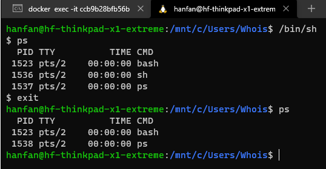

容器其实是一种沙盒技术。顾名思义，沙盒就是能够像一个集装箱一样，把你的应用“装”起来的技术。
这样，应用与应用之间，就因为有了边界而不至于相互干扰；
而被装进集装箱的应用，也可以被方便地搬来搬去，
这不就是 PaaS 最理想的状态嘛。

"程序"被执行起来，它就从磁盘上的二进制文件，变成了计算机内存中的数据、寄存器里的值、堆栈中的指令、被打开的文件，以及各种设备的状态信息的一个集合。
像这样一个程序运行起来后的计算机执行环境的总和，就是：进程

容器技术的核心功能，就是通过约束和修改进程的动态表现，从而为其创造出一个“边界”。

对于 Docker 等大多数 Linux 容器来说，Cgroups 技术是用来制造约束的主要手段，而 Namespace 技术则是用来修改进程视图的主要方法

在docker容器中执行ps命令，可以看到我们在 Docker 里最开始执行的 /bin/sh，
就是这个容器内部的第 1 号进程（PID=1），
而这个容器里一共只有两个进程在运行。
这就意味着，前面执行的 /bin/sh，以及我们刚刚执行的 ps，
已经被 Docker 隔离在了一个跟宿主机完全不同的世界当中

[](https://img2022.cnblogs.com/blog/1218485/202204/1218485-20220419170813896-1294402329.png)

在宿主机中执行/bin/sh如下，PID是1536

[](https://img2022.cnblogs.com/blog/1218485/202204/1218485-20220419170833414-1036078801.png)

这种机制，其实就是对被隔离应用的进程空间做了手脚，使得这些进程只能看到重新计算过的进程编号，比如 PID=1。
可实际上，他们在宿主机的操作系统里，还是原来的第 1536号进程。

这种技术，就是 Linux 里面的 Namespace 机制。
在 Linux 系统中创建进程的系统调用是 clone()，比如：


```php
 int pid = clone(main_function, stack_size, SIGCHLD, NULL); 
```

这个系统调用就会为我们创建一个新的进程，并且返回它的进程号 pid。

当我们用 clone() 系统调用创建一个新进程时，就可以在参数中指定 CLONE_NEWPID 参数，比如


```objectivec
int pid = clone(main_function, stack_size, CLONE_NEWPID | SIGCHLD, NULL); 
```

除了我们刚刚用到的 PID Namespace，Linux 操作系统还提供了 Mount、UTS、IPC、Network 和 User 这些 Namespace，用来对各种不同的进程上下文进行“障眼法”操作。
比如，Mount Namespace，用于让被隔离进程只看到当前 Namespace 里的挂载点信息；Network Namespace，用于让被隔离进程看到当前 Namespace 里的网络设备和配置。
就是 Linux 容器最基本的实现原理了。
所以说，**容器，其实是一种特殊的进程而已。**

[](https://img2022.cnblogs.com/blog/1218485/202204/1218485-20220419170854446-935217027.png)

在理解了 Namespace 的工作方式之后，你就会明白，跟真实存在的虚拟机不同，
在使用 Docker 的时候，并没有一个真正的“Docker 容器”运行在宿主机里面。
Docker 项目帮助用户启动的，还是原来的应用进程，
只不过在创建这些进程时，Docker 为它们加上了各种各样的 Namespace 参数。
这些进程就会觉得自己是各自 PID Namespace 里的第 1 号进程，
只能看到各自 Mount Namespace 里挂载的目录和文件，
只能访问到各自 Network Namespace 里的网络设备，
就仿佛运行在一个个“容器”里面。

基于 Linux Namespace 的隔离机制相比于虚拟化技术也有很多不足之处，其中最主要的问题就是：**隔离得不彻底**。
首先，既然容器只是运行在宿主机上的一种特殊的进程，那么多个容器之间使用的就还是同一个宿主机的操作系统内核。

在 Linux 内核中，有很多资源和对象是不能被 Namespace 化的，最典型的例子就是：时间。
如果在一个容器中修改了系统时间，那么整个宿主机的时间都会被修改。

Linux Cgroups 就是 Linux 内核中用来为进程设置资源限制的一个重要功能。Linux Cgroups 的全称是 Linux Control Group。它最主要的作用，就是限制一个进程组能够使用的资源上限，包括 CPU、内存、磁盘、网络带宽等等。

Cgroups 的每一个子系统都有其独有的资源限制能力，比如：
blkio，为​​​块​​​设​​​备​​​设​​​定​​​I/O 限​​​制，一般用于磁盘等设备；
cpuset，为进程分配单独的 CPU 核和对应的内存节点；
memory，为进程设定内存使用的限制。

Linux Cgroups 的设计还是比较易用的，简单粗暴地理解呢，它就是一个子系统目录加上一组资源限制文件的组合。
而对于 Docker 等 Linux 容器项目来说，它们只需要在每个子系统下面，为每个容器创建一个控制组（即创建一个新目录），然后在启动容器进程之后，把这个进程的 PID 填写到对应控制组的 tasks 文件中就可以了。
而至于在这些控制组下面的资源文件里填上什么值，就靠用户执行 docker run 时的参数指定了，比如这样一条命令：


```shell
$ docker run -it --cpu-period=100000 --cpu-quota=20000 ubuntu /bin/bash
```

在启动这个容器后，我们可以通过看 Cgroups 文件系统下，CPU 子系统中，
“docker”这个控制组里的资源限制文件的内容来确认：


```shell
$ cat /sys/fs/cgroup/cpu/docker/5d5c9f67d/cpu.cfs_period_us
 100000
$ cat /sys/fs/cgroup/cpu/docker/5d5c9f67d/cpu.cfs_quota_us 
20000
```

这就意味着这个 Docker 容器，只能使用到 20% 的 CPU 带宽。

容器是一个“单进程”模型

由于一个容器的本质就是一个进程，用户的应用进程实际上就是容器里 PID=1 的进程，也是其他后续创建的所有进程的父进程。
这就意味着，在一个容器中，你没办法同时运行两个不同的应用，除非你能事先找到一个公共的 PID=1 的程序来充当两个不同应用的父进程，
这也是为什么很多人都会用 systemd 或者 supervisord 这样的软件来代替应用本身作为容器的启动进程

Docker 项目来说，它最核心的原理实际上就是为待创建的用户进程：
启用 Linux Namespace 配置；
设置指定的 Cgroups 参数；
切换进程的根目录（Change Root）。

[](https://img2022.cnblogs.com/blog/1218485/202204/1218485-20220419171641736-222785404.png)

总结：

1、虚拟机 是硬件隔离，因为hypervisor 虚拟一系列硬件资源

2、容器是 进程级隔离，依靠NameSpace 机制实现进程间的隔离

3、容器的资源限制，依靠Linux Cgroups，它就是限制一个进程组能够使用的资源上限，包括 CPU、内存、磁盘、网络带宽等等。

4、容器只是运行在宿主机上的一种特殊的进程，那么多个容器之间使用的就还是同一个宿主机的操作系统内核。

5、通过exec在容器中执行启动的后台进程，实际不受docker控制（回收和生命周期），只有PID=1的受控制。

6、Namespace做隔离，Cgroups做限制，rootfs做文件系统