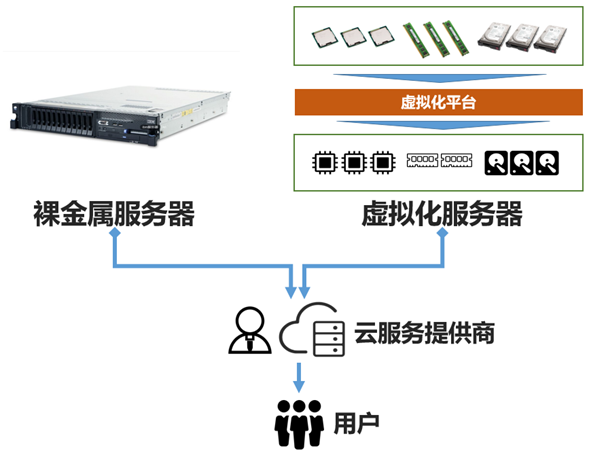
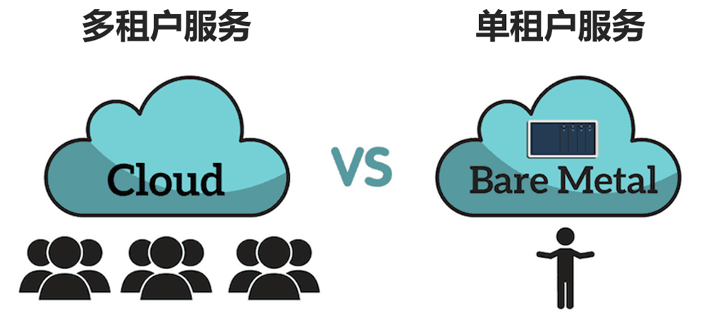
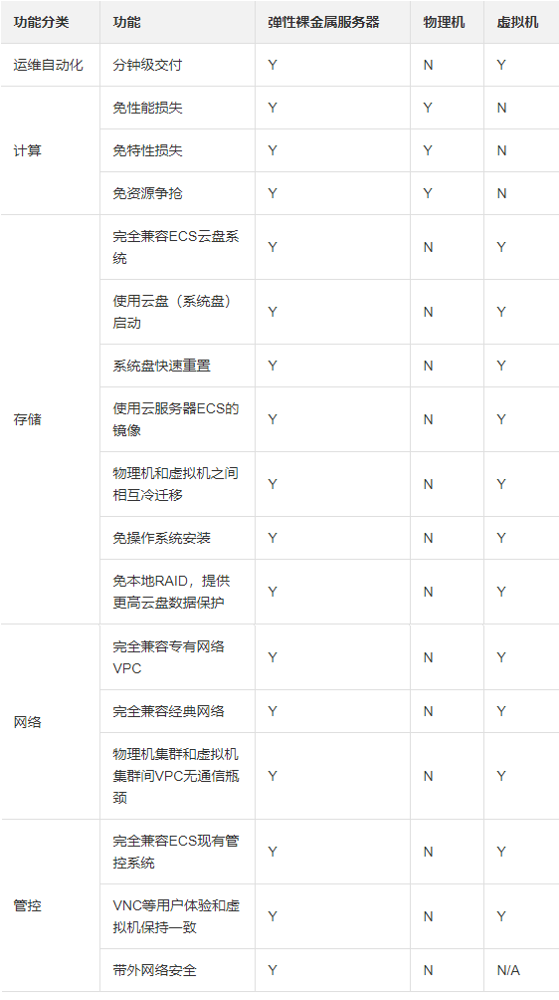

## 在裸金属服务器Bare Metal上Kubernetes

   公有云上的Kubernetes对于有可预测扩展需求的中小型应用来说是一个足够的解决方案。然而，对于那些寻求更多控制和稳定性能的组织来说，裸金属服务器云才是出路。容器编排工具通过为分布式应用提供灵活性、可移植性、速度和更容易的扩展来促进软件开发。作为协调领域事实上的领导者，Kubernetes得到了许多流行的云计算供应商的支持，他们提供可管理的Kubernetes服务。 虽然它们提供了一种部署和开始使用Kubernetes的简单方法，但管理的Kubernetes服务主要提供基于虚拟机的基础设施。虚拟机对供应商来说很方便，在许多情况下，为客户提供了良好的价值。然而，在裸金属服务器Bare Metal上部署Kubernetes有几个显著优势。

**裸金属服务器Kubernetes部署的好处**

1. 裸金属服务器Bare Metal简化了网络设置和管理

裸金属服务器Kubernetes部署消除了虚拟机配置中存在的管理程序。没有虚拟化层，设置网络就更容易了。

裸金属服务器的好处跨越了整个开发过程。没有虚拟化层，减少了系统的复杂性，使故障排除更容易。由于配置更精简，管理服务自动化和软件部署也更容易。

2. 裸金属服务器服务器对于高要求的工作负载和应用来说更具有成本效益

虚拟机云实例为具有可预测需求的中小型应用提供了一个廉价的解决方案。另一方面，更复杂的项目需要卓越的硬件和快速扩展的能力，可能会发现裸金属服务器更具有成本效益。同样的钱，BM配置往往比它们的虚拟机配置提供更多的动力。水平扩展是Kubernetes最重要的卖点之一。简化扩展的裸金属服务器配置可以促进采用这种协调平台的组织的业务增长。例如，采用第三代英特尔至强可扩展CPU的服务器提供了奇妙的内置扩展性，简化了基础设施管理。

3. 裸金属服务器提供更好的性能

从系统配置中去除管理程序的开销，有助于显著提高性能。应用程序可以直接访问CPU、RAM和其他硬件资源，大大降低了延迟，最大限度地提高了资源利用率。 没有管理程序税意味着对延迟敏感的工作负载有更好的性能，如媒体和财务的垂直应用。但这不仅仅是延迟的问题--任何需要强大硬件的应用和工作负载都能从直接访问裸金属服务器中受益。这包括用于3D渲染、科学和金融建模的GPU密集型应用以及对内存要求很高的数据库软件。 与虚拟化解决方案相比，促成裸金属服务器性能优越的另一个因素是，虚拟机与同一台物理机器上的其他虚拟机共享硬件。相邻的虚拟机会消耗资源，从而大大阻碍了性能。有了裸金属服务器，你的Kubernetes部署有专用资源可供支配。

4. 裸金属服务器配置在本质上更安全

由于是单租户环境，裸金属服务器提供了卓越的安全性。虚拟机配置中存在的 "嘈杂的邻居 "效应具有更高的潜在破坏风险。裸金属服务器管理员可以完全控制系统配置，从而降低了网络攻击的风险。 对于处理敏感信息并需要满足[HIPAA、GDPR](https://www.vistainfosec.com/blog/gdpr-and-hipaa-how-to-achieve-and-manage-both-compliance/)或任何其他行业法规的应用，强烈建议在裸金属服务器上部署Kubernetes。

5. 裸金属服务器允许你创建为特定工作负载优化的配置

虚拟机实例通常被托管在为适应一般工作负载的需要而设计的配置上。这意味着很少有高度具体的硬件配置。裸金属服务器配置是高度可定制的，可以进行优化，以支持特定的、苛刻的工作负载。

6. 裸金属服务器没有供应商工具的依赖性

管理的Kubernetes服务提供了一种消除与云原生应用程序的部署和管理有关的复杂性的方法。然而，对于需要扩展的组织来说，这可能是一个重大障碍。一旦公司的规模超过了他们的Kubernetes管理服务提供商所能提供的，由于代码的依赖性，迁移到另一个解决方案可能非常困难。

裸金属服务器上的Kubernetes使管理员能够完全控制底层硬件基础设施。它还使企业能够避免锁定供应商。

**企业内部裸金属服务器 VS 云端裸金属服务器**

裸金属服务器服务器可以部署在企业内部，管理员可以完全控制硬件、网络连接和冷却。然而，内部部署使扩展取决于可用于托管机器的物理空间的数量。此外，服务器的单一位置可能会导致地理上遥远的地方的性能问题。裸金属服务器云解决方案提供了几乎无限的可扩展性，同时提供专用服务器，其配置支持扩展。BMC的云计算方面允许你通过创建多个主节点并将其托管在具有战略意义的重要地点，轻松建立高可用性、容错的集群。BMC服务器的部署是快速的，应该只需要几分钟的时间，所以新的资源可以很容易和快速地添加到集群中。 

**云裸金属服务器 VS 物理机VS 虚拟机**

**配置裸金属服务器Kubernetes的最佳实践**

综上所述，以下是成功部署Kubernetes裸金属服务器Bare Metal的一些提示：

> 使用裸金属服务器Bare Metal云。它使扩展更容易，并消除了对大量物理资源的需求。
> 通过在客户的地理位置附近部署集群来降低延迟。
> 使用Kubernetes控制器，使基础设施管理更容易。
> 创建一个有弹性的系统，创建更小的节点，即使这意味着你将不得不增加节点的数量。
> 用SUSE Rancher等解决方案来自动部署。Rancher是一个流行的开源解决方案，用于管理Kubernetes，使集群的部署更容易。