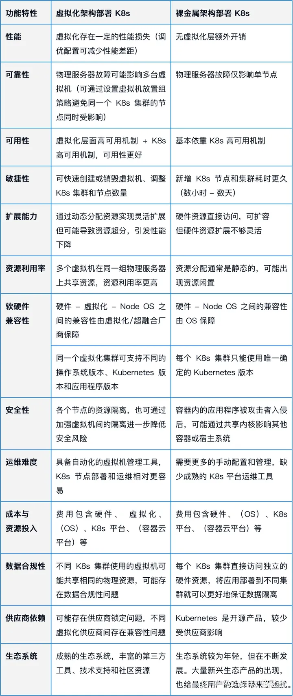

伴随着 IT 云化转型的逐步推进，越来越多的用户加入应用容器化改造的行列，并使用 Kubernetes（K8s）进行容器部署管理。然而，令不少用户感到困惑的是，由于大部分应用此前都部署在虚拟化或超融合环境，在进行容器化转型后，**企业应该继续沿用原有架构，还是有必要替换成“更契合容器”的裸金属服务器。**

在虚拟化（含超融合）和裸金属环境运行 K8s 有何区别？两者更适合支持哪些应用和使用场景？企业应如何进行选择？在这篇文章中，**我们将详细对比虚拟化和裸金属运行 K8s 的架构，**并从性能、可用性、扩展能力、资源投入等 13 个角度，全面解析两者对 K8s 的支持能力，为用户选择 K8s 部署环境提供参考。

## 架构对比

从上图可以看出，将 K8s 部署在虚拟化与裸金属环境，**最大区别在于有无虚拟化层**：虚拟化环境采用多台虚拟机支持 K8s 集群，而裸金属环境下 K8s 直接跑在物理服务器上。这样的架构差异具体体现在以下方面。

### **操作系统**

在虚拟化环境中，主机安装 Host OS 支持虚拟机运行，而虚拟机安装 Node OS 支持 K8s 集群运行。在同一个虚拟化集群上，可以通过不同的虚拟机支持不同的操作系统版本、K8s 版本和应用程序版本。

而裸金属服务器操作系统需要用户自行选配，该操作系统直接作为 Node OS 支持 K8s 集群，一台裸金属服务器只可支持一种操作系统，该操作系统为该服务器上运行的所有应用程序所共用。

### **资源访问方式**

虚拟化架构使用虚拟化层来管理和分配物理资源。一台物理服务器被分割成多个虚拟服务器，每个虚拟服务器可以运行不同的应用程序，多个虚拟机在同一组物理服务器上可共享资源，并可动态地请求和释放资源。

裸金属架构将物理资源直接暴露给应用程序，应用程序可以无需经过虚拟化层的处理，直接访问和管理这些资源。由于单个物理服务器仅承载一个 K8s 节点，物理服务器的所有资源均可供该节点使用。基于裸金属服务器的 K8s 集群资源分配通常是静态的，一个集群中的资源不能供给其他集群的应用使用，可能导致资源闲置。

通过架构层面的对比可以看出，相比虚拟化架构，裸金属支持 K8s 层级更少，**但不能笼统地理解为“使用裸金属部署 K8s 更简单”：**缺少虚拟化层在资源访问管理方面有利有弊，同时虚拟化环境对物理硬件和操作系统的兼容性支持更加灵活，这些都需要运维人员在前期部署时，结合 K8s 应用场景进行重点评估。

## 功能特性对比

基于架构上的差异，我们将对比虚拟化和裸金属环境在性能、可靠性、可用性、敏捷性、扩展能力等方面的能力，并针对一些重点特性展开深入讨论。

### **性能**

虚拟化和裸金属运行 K8s 在性能上的差距是很多用户关注的重点。虚拟化技术需要在宿主操作系统和虚拟机间进行资源调度，造成一定的性能损失，裸金属服务器则没有这种损失。**但这并不意味着，虚拟化环境难以支持性能要求高、数据量大的容器应用。**为虚拟机分配足够的资源并正确配置 CPU、内存和 I/O 调度策略，可以缩小与裸金属服务器上运行 Kubernetes 的性能差距。近期，SmartX 也将为读者带来更多虚拟化支持 K8s 性能表现的详细评测，敬请期待！

### **可靠性**

在虚拟化环境中，单个物理服务器上可能运行多个虚拟机。因此，当物理服务器出现故障时，可能会影响到多个虚拟机实例。不过，用户可以通过设置虚拟机放置组策略，将 K8s 集群使用的不同的虚拟机分布在不同的物理服务器上，避免单点故障问题。

另外，虽然裸金属服务器上单个物理服务器仅承载一个 K8s 节点，物理服务器故障的影响范围可能会更小，但这也取决于 K8s 集群的设计和部署方式。

### **可用性**

裸金属服务器一般依靠 K8s 自身提供的高可用机制，如：

- 自动检测并重新启动或重新调度失败的 Pod，根据负载需求动态增加或减少 Pod 实例数量。
- 内置的负载均衡功能，可以将流量分发到不同的 Pod 实例。
- 滚动更新和自动回滚。

虚拟化服务器在具备以上 K8s 高可用的同时，还可以利用虚拟化技术实现动态资源调度（DRS）、主动迁移、自动失败恢复（HA）等数据保护功能，进一步增强了 K8s 集群基础架构的可用性。

### **敏捷性**

虚拟化可以快速创建和销毁虚拟机，并可以为不同虚拟机快速设置不同的虚拟网络特性，因此可以从基础架构方面为 K8s 提供较高的敏捷度：集群中节点的增加/减少、集群数量的增加/减少，都可以在分钟级别完成。

而裸金属 K8s 节点的部署需要更长的时间：增加已有 K8s 集群中的节点，通常需要数小时的工作；而增加一个新的 K8s 集群，则通常需要数天的工作。不过，一旦部署完成，裸金属上 Pod 获得的敏捷度将与虚拟机上的相同。

### **扩展能力**

虚拟化和裸金属均可为 K8s 提供弹性扩展支持。在虚拟机上部署 K8s 集群时，可以较为灵活地将 K8s 节点虚拟机迁移至具有充足硬件资源（如 CPU、内存和磁盘空间）的宿主机上。在裸金属服务器上部署 K8s，由于集群可以直接访问硬件资源，因此在单一 K8s 集群内部进行资源请求和限制、负载均衡、资源配额等工作都很方便。

不过需要注意的是，两者的扩展能力均存在一定的限制。在虚拟化环境中，多个虚拟机共享宿主机资源，可能导致资源超分，虽然扩展更为敏捷，但需要用户注意扩展与系统性能之间的平衡。在裸金属环境中调整硬件资源或软件版本，则不如虚拟机灵活，因为这通常需要对物理设备进行手动操作（比如增加服务器数量或内存、硬盘数量、重装操作系统……）。另外，裸金属环境无法提供虚拟化环境中的弹性资源超分能力，因此在资源利用率方面可能不如虚拟化环境高。

### **资源利用率**

虚拟化环境在处理多种不同类型的工作负载时，资源利用率要高于裸金属服务器，因为允许多个虚拟机在同一组物理服务器上共享资源，虚拟机在需要时可动态地请求和释放资源，可以实现对物理资源的更有效利用。裸金属 K8s 虽然可以直接访问独立的硬件资源，但其资源分配通常是静态的，不同集群之间进行资源共享的难度大，可能导致资源闲置。

### **安全性**

在虚拟化环境中运行 K8s，可以实现对各个节点的资源隔离，包括 CPU、内存、磁盘和网络资源。这提供了更强大的安全性。虚拟机之间的隔离可以防止潜在的攻击者在成功入侵一个节点后轻易地获得对其他节点的访问权限。这可以降低安全风险，保护关键数据和应用程序。

裸金属 K8s 环境使用操作系统的内核功能（如 Linux 的 Cgroups 和 Namespaces）来为应用程序提供隔离。容器之间共享同一个内核，但每个容器都有自己的文件系统、网络栈和进程空间。这种隔离方式相对较弱，如果容器内的应用程序被攻击者成功入侵，攻击者可能更容易突破容器的隔离层并影响其他容器或宿主系统。不过，通过配置安全策略、使用增强型隔离技术（如 SELinux 和 AppArmor），可以降低这种风险；但这也使得运维工作更加复杂。

### **成本与资源投入**

由于不具备虚拟化，采用裸金属架构部署 K8s 时，企业只需承担裸金属服务器硬费用、OS 费用、K8s 平台费用、容器云平台费用等，节省了虚拟化的成本。不过，由于单个物理服务器仅承载一个 K8s 节点，裸金属 K8s 的投入成本与服务器数量和规格有直接联系。而裸金属服务器售价较高，且不支持按用量按需购买，当需要为不同用途的应用建设不同配置的 K8s 集群时，不同集群无法共用裸金属服务器，这种场景将增加服务器的数量，导致成本上升。

对于只需要建设一个专用 K8s 集群的场景，与在裸金属服务器上直接部署 K8s 相比，基于虚拟化环境的 K8s 集群的投入成本可能会更高，因为可能需要为这个集群专门购买虚拟化软件和管理工具，并学习使用方法。在需要同时部署多个 K8s 集群的场景，虽然在虚拟机上部署 K8s 需要增加一些虚拟化费用，但一个虚拟化集群可以同时服务于多个 K8s 集群，总投入可能并不会高于完全基于裸金属服务器的方案。对于用户同时需要虚拟化和容器化应用的情况，基于虚拟化构建 K8s 会比分别构建独立的资源池具备明显的成本优势。

## 总结：结合企业需求与使用场景选择合适的部署环境

从上面的对比可以看到，虚拟化和裸金属对 K8s 的支持能力在不同方面各有千秋。总体而言，**虚拟化环境对资源的整合和利用率更高，具有更强的横向扩展能力、集群生命周期管理能力、高可用功能和内核/存储/网络独立性，在提升运维效率的同时保护数据安全。而裸金属环境由于减少了虚拟化层开销，在性能与成本投入方面更具优势。**

企业的云化转型不是一个一蹴而就的过程，K8s 最合适的部署环境也不存在一个绝对的答案——是沿用虚拟化/超融合，还是整体转向裸金属/部署在混合环境/分阶段进行调整，这些都需要结合企业的实际情况、发展阶段和部署的应用需求综合考虑。以下是我们结合前文对比分析，为读者提供的一些评估维度与选择参考。SmartX 也会在后续内容中，对适用场景部分展开分析，欢迎读者持续关注。

另外值得一提的是，Gartner 在《Market Guide for Container Management》市场报告中指出，虽然一些企业已使用裸金属运行容器，但加入该行列的企业数量增长缓慢，主要原因依旧是现阶段缺少裸金属部署运维的支持工具。相反，同时支持虚拟化和容器的部署方案，如支持在 K8s 平台部署虚拟机，或将 K8s 与虚拟化环境集成，这样的方案正在成为主流。

近期，**SmartX 也正式发布了生产级 Kubernetes 构建与管理服务产品 SKS 1.0。**SKS 通过预集成 Kubernetes 常用插件，并整合业界领先的 SmartX 超融合产品组件（虚拟化、分布式存储、网络与安全等），帮助企业 IT 运维团队轻松部署和管理生产级 Kubernetes 集群，构建可承载虚拟化和容器应用的完整企业云基础架构。SKS 不仅具备虚拟化环境运行 K8s 在效率、扩展和安全方面的优势，还通过内置的 SmartX 生产级分布式存储 CSI 插件，为有状态应用提供高性能支持。

欲了解方案详情，请阅读：[SmartX 发布 SKS 1.0 ，一站式构建生产级 K8s 集群](https://link.zhihu.com/?target=https%3A//www.smartx.com/blog/2023/06/sks-release/)，或扫描下方二维码，一键获取**《SMTX Kubernetes 服务技术白皮书》**。

推荐阅读：

- [SmartX 发布 SKS 1.0 ，一站式构建生产级 K8s 集群](https://link.zhihu.com/?target=https%3A//www.smartx.com/blog/2023/06/sks-release/)
- [如何部署运维 K8s？我们整理了 3 份 Gartner 报告，得到这些建议](https://zhuanlan.zhihu.com/p/623130227)
- [选择 Kubernetes 管理平台应关注哪些功能特性？](https://zhuanlan.zhihu.com/p/614106060)
- [基础架构团队是否应该接管 Kubernetes 部署运维？怎样快速上手？](https://zhuanlan.zhihu.com/p/609129050)
- [国内首款 K8s 原生的企业级分布式存储 IOMesh 企业版正式发布](https://link.zhihu.com/?target=https%3A//www.smartx.com/blog/2023/06/iomesh-release/)
- [一文看懂 K8s 持久化存储、云原生存储、容器原生存储、K8s 原生存储有何区别](https://zhuanlan.zhihu.com/p/638422219)

参考文章：

1. Market Guide for Container Management， Gartner

发布于 2023-07-21 11:58・IP 属地北京

虚拟化

Kubernetes